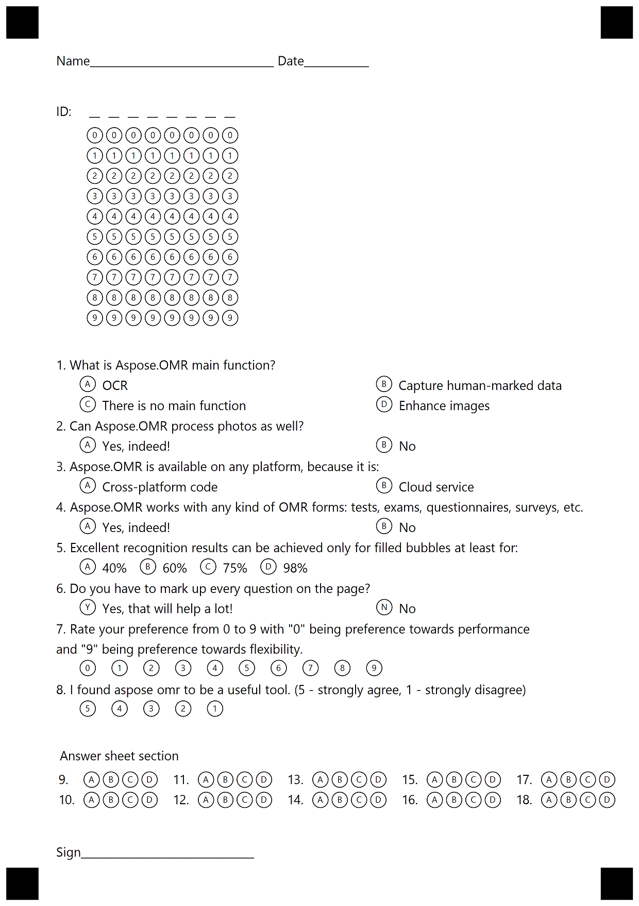

## **Create OMR Templates using ChoiceBox and AnswerSheet**

{} 

In the text markup, all element attribute names are preceded by <**\t**> symbol (tabulation)

{} 

The following is the text markup that is used in the example code snippet to generate the OMR template file.

````text
?text=Name__________________________________ Date____________

?grid=ID
	sections_count=8

#What is Aspose.OMR main function?
	() OCR	() Capture human-marked data
	() There is no main function	() Enhance images
#Can Aspose.OMR process not only scans, but also photos?
	() Yes, indeed!	() No
#Aspose.OMR is available on any platform, because it is:
	() Cross-platform code	() Cloud service
#Aspose.OMR works with any kind of OMR forms: tests, exams, questionnaires, surveys, etc.
	() Yes, indeed!	() No
#Excellent recognition results can be achieved only for filled bubbles at least for:
	() 40%	() 60%	() 75%	() 98%
#Does Aspose.OMR support bubbles mapping to any key names?
	() No	() Partially	() Yes, any key names
#Do you have to mark up every question on the page?
	(Yes) Yes, that will help a lot! (No) No
#Rate your preference from 0 to 9 with "0" being preference towards performance 
 and "9" being preference towards flexibility.
	(0) (1) (2) (3) (4) (5) (6) (7) (8) (9)
#I found aspose omr to be a useful tool. (5 - strongly agree, 1 - strongly disagree)
	(5) (4) (3) (2) (1)

?text=Answer sheet section

?answer_sheet=MainQuestions
	elements_count=10
	columns_count=5

?text=Sign________________________________

````


The following code snippet processes the sample text markup to generate the OMR template file and the image of the sheet.



The following is the image generated by the sample code.


## **Save output image as PDF**
By using Aspose.OMR for .NET, you may save the output images generated during the template generation as PDF. To achieve this, the API provides the GenerationResult.SaveAsPdf method. The following code snippet demonstrates the use of the GenerationResult.SaveAsPdf method to save the output image as PDF.

