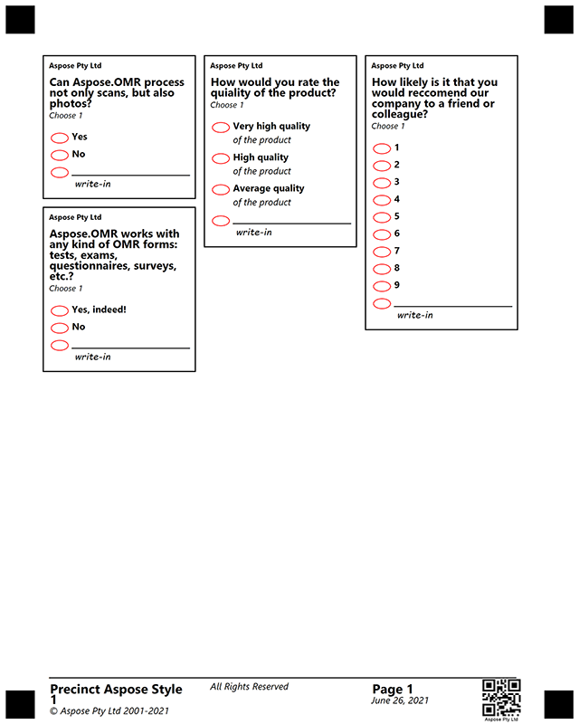

## **Introduction**
In this article, we provide example of creating a multi-column questionnaire.

{} 

It is important to note that each attribute is parsed successfully only if it starts with a **tabulation** symbol, not just spaces. If you notice strange behavior or errors, the first thing to check will be that all additional attributes in markup start with **\t**.

{} 

### **Example for creating multi-column questionnaire**

<details>
  <summary>Click to expand template</summary>

````text
?container=1-st
	columns_count=3
?block=Process
	column=1
	border=Square
	border_size=5
	border_color=Black
?paragraph=Process
?content=Aspose Pty Ltd
	font_style=Bold
	font_size=8
?content=Can Aspose.OMR process not only scans, but also photos?
	font_style=Bold
	font_size=12
?content=Choose 1
	font_style=Regular
	font_size=9	
&paragraph
?vertical_choicebox=Can Aspose.OMR process not only scans, but also photos?
?answer=Yes
?content=Yes
	font_style=Bold
	font_size=10
&answer
?answer=No
?content=No
	font_style=Bold
	font_size=10
&answer
&vertical_choicebox 	
&block
?block=Rate
	column=2
	border=Square
	border_size=5
	border_color=Black
?paragraph=Rate
?content=Aspose Pty Ltd
	font_style=Bold
	font_size=8
?content=How would you rate the quality of the product?
	font_style=Bold
	font_size=12
?content=Choose 1
	font_style=Regular
	font_size=9	
&paragraph
?vertical_choicebox=How would you rate the quality of the product:
?answer=5
?content=Very high quality
	font_style=Bold
	font_size=10
?content=of the product
	font_size=10
&answer
?answer=4
?content=High quality
	font_style=Bold
	font_size=10
?content=of the product
	font_size=10
&answer
?answer=3
?content=Average quality
	font_style=Bold
	font_size=10
?content=of the product
	font_size=10
&answer
&vertical_choicebox 	
&block
?block=Forms
	column=1
	border=Square
	border_size=5
	border_color=Black
?paragraph=Forms
?content=Aspose Pty Ltd
	font_style=Bold
	font_size=8
?content=Aspose.OMR works with any kind of OMR forms: tests, exams, questionnaires, surveys, etc.?
	font_style=Bold
	font_size=12
?content=Choose 1
	font_style=Regular
	font_size=9	
&paragraph
?vertical_choicebox=Aspose.OMR works with any kind of OMR forms: tests, exams, questionnaires, surveys, etc.?
?answer=Yes
?content=Yes, indeed!
	font_style=Bold
	font_size=10
&answer
?answer=No
?content=No
	font_style=Bold
	font_size=10
&answer
&vertical_choicebox 	
&block
?block=Recommend
	column=3
	border=Square
	border_size=5
	border_color=Black
?paragraph=Recommend
?content=Aspose Pty Ltd
	font_style=Bold
	font_size=8
?content=How likely is it that you would recommend our company to a friend or colleague?
	font_style=Bold
	font_size=12
?content=Choose 1
	font_style=Regular
	font_size=9	
&paragraph
?vertical_choicebox=How likely is it that you would recommend our company to a friend or colleague?
?answer=1
?content=1
	font_style=Bold
	font_size=10
&answer
?answer=2
?content=2
	font_style=Bold
	font_size=10
&answer
?answer=3
?content=3
	font_style=Bold
	font_size=10
&answer
?answer=4
?content=4
	font_style=Bold
	font_size=10
&answer
?answer=5
?content=5
	font_style=Bold
	font_size=10
&answer
?answer=6
?content=6
	font_style=Bold
	font_size=10
&answer
?answer=7
?content=7
	font_style=Bold
	font_size=10
&answer
?answer=8
?content=8
	font_style=Bold
	font_size=10
&answer
?answer=9
?content=9
	font_style=Bold
	font_size=10
&answer
&vertical_choicebox 	
&block
&container

?barcode=Test4
	value=Aspose Pty Ltd
	height=250
	codetext=true
	align = right
	Y=3030
	x=2100
?container=Footer
	columns_count=3
	type=footer
?block=1
	column=1
?paragraph=1
?content=Precinct Aspose Style 1
	font_style=Bold
	font_size=14
?content=© Aspose Pty Ltd 2001-2021
	font_style=Regular
	font_size=10
&paragraph
&block
?block=2
	column=2
?paragraph=2
?content=All Rights Reserved
	font_style=Regular
	font_size=10
&paragraph
&block
?block=3
	column=3
?paragraph=3
?content=Page 1
	font_style=Bold
	font_size=14
?content=June 26, 2021
	font_style=Regular
	font_size=10
&paragraph
&block
&container
````
</details>


**Result**

****


