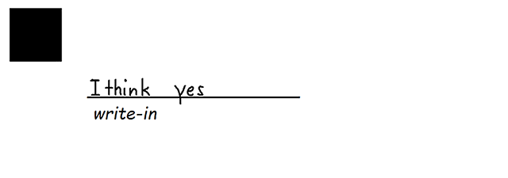

{} 

We have a lot of elements. 
This page helps you choose right elements to use in your template and get the best result!

{}


**<h1>What do you expect from your user?</h1>**

## **Read text**
For display of text we have multiple elements:
 - [Text](https://docs.aspose.com/omr/net/template-generation/txt/elements-description/#text-element) - best used for page-wide display. Align property control position of text inside whole page.
 - [Content](https://docs.aspose.com/omr/net/template-generation/txt/elements-description/#content-element) - best used inside [Block](https://docs.aspose.com/omr/net/template-generation/txt/elements-description/#block-element). Align property control position of text inside parent element(e.g.: Block\Paragraph);

## **Read question text and mark answer.**
"Does this article been helpful?" - "Yes" "No" "I don't know"
- Horizontal version - [Choicebox](https://docs.aspose.com/omr/net/template-generation/txt/elements-description/#choice-box-element).
- Vertical version - [VerticalChoicebox](https://docs.aspose.com/omr/net/template-generation/txt/elements-description/#verticalchoicebox-element).
- Table version - [Table](https://docs.aspose.com/omr/net/template-generation/txt/elements-description/table/) 
- CheckMarks instead of bubbles - [CheckBox](https://docs.aspose.com/omr/net/template-generation/txt/elements-description/#checkbox-element)

Very good for personal survey's or quality assurance.

**Recognition result**
```text
Element Name,Value,
Does this article been helpful?,"Yes"
```

## **Read question index and mark answer.**
- Same answer options for all question - [AnswerSheet](https://docs.aspose.com/omr/net/template-generation/txt/elements-description/#answer-sheet-element). 
Save a lot of space on paper. Very good for standardized tests.
- Different answers options for each question - [Grid](https://docs.aspose.com/omr/net/template-generation/txt/elements-description/#grid-element).
Very useful if you want to group answers by themes.
- You can create you own [Custom Answer Sheet](https://docs.aspose.com/omr/net/template-generation/txt/elements-description/custom-answer-sheet/).

**Recognition result**
```text
Element Name,Value,
"61.","B"
```

## **Read question text and mark answer(each answer have different numeric value).**
"How would you rate our service""Bad"(0) "Mediocre"(2) "Good"(5) "Excellent"(10) - try [ScoreGroup](https://docs.aspose.com/omr/net/template-generation/txt/elements-description/score/)
We'll draw each question and answers. You can show answer value or hide it.
You can group questions into groups to get overall value.

**Recognition result**
```text
Element Name,Value,
How would you rate our service?,"Good"
How would you rate our service?_total,"5"
```


## **Input handwritten text or insert signature**
- For signature's or name's in cursive - try [WriteIn](https://docs.aspose.com/omr/net/template-generation/txt/elements-description/#writein-element).
We'll create a placeholder for input and clip region of this element save it as image upon recognition.

- If you want to clip non-recognizable element(e.g.: [Image](https://docs.aspose.com/omr/net/template-generation/txt/elements-description/#image-element)) or create your own placeholder - try [Block](https://docs.aspose.com/omr/net/template-generation/txt/elements-description/#block-element)
We'll add special grouping element. Everything inside it will be clipped and saved as image upon recognition.
Don't forget to set block property *is_clipable* to *true*.

- If you know length of inputted text(e.g.: Date or Social Security Number) - you can help user by drawing cell for each symbols with [Content](https://docs.aspose.com/omr/net/template-generation/txt/elements-description/#content-element) where property *content_type*=*Cells*. It will draw cell around each symbol, including whitespace.

**Recognition result**

****


## **Compose value from different symbols**
You can get user to input complex values, without handwrite recognition.
Create [CompositeGrid](https://docs.aspose.com/omr/net/template-generation/txt/elements-description/composite-grid).
Define all possible symbols and each marked bubble will be summarized to answer.

**Recognition result**

```text
Element Name,Value,
1.,"-23.567"
2.,"2,500"
3.,"Fifth"
4.,"1.9"
5.,""zx""
```

## **Read barcode**
[Barcode](https://docs.aspose.com/omr/net/template-generation/txt/elements-description/#barcode-element) allow encoding(write) and decoding(read) of values. It's useful to store identification and can be updated programmatically to be individual for each template.


