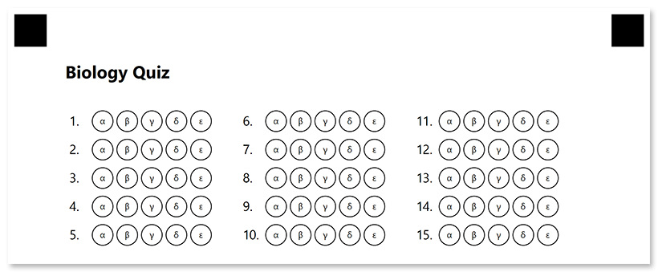

This element generates a numbered matrix of bubbles representing answers to a list of questions. Bubbles can be arranged in multiple columns to make more efficient use of space.

**AnswerSheet** is best suited for exam papers where you want to fit the maximum number of answers on a single page.

## Declaration

This element is declared as an object with `"element_type": "AnswerSheet"` property.

The total number of exam questions that the answer sheet corresponds to is specified in the **elements_count** property.

```json
{
	"element_type": "AnswerSheet",
	"elements_count": 100
}
```

### Required properties

Name | Type | Description
---- | ---- | -----------
**element_type** | string | Must be `"AnswerSheet"` (case-insensitive).
**elements_count** | integer | The total number of exam questions that the answer sheet corresponds to.

{}

If set the value of **elements_count** parameter to `0`, **AnswerSheet** element will not be rendered.

{}

### Optional properties

Name | Type | Default value | Description
---- | ---- | ------------- | -----------
**name** | string | _n/a_ | Used as an element's identifier in recognition results and as a reminder of the element's purpose in template source; for example, "_Biology Quiz_".<br />This text is not displayed on the form.
**columns_count** | integer | 4 | The number of columns to arrange lines into. Use multiple columns to make the answer sheet more compact.
**answers_count** | integer | 4 | The total number of bubbles (answers) for each question.<br />You can only set the same number of answers for all questions. If the number of answers is different for each section of the exam, use multiple **AnswerSheet** elements.
**start_id** | integer | _Automatic_ | The number of the first line used as a base for further numbering.<br />If omitted, the number will be calculated based on the numbering of previous elements.
**vertical_margin** | integer | 0 | Vertical spacing between lines, in pixels.
**bubble_size** | string | "Normal" | Size of bubbles: `"extrasmall"`, `"small"`, `"normal"`, `"large"`, or `"extralarge"`.
**bubble_type** | string | "round" | Bubble style: `"round`" or `"square"`.
**answers_list** | array | _["A" ... "Z"]_ | Characters to be drawn inside bubbles. The total number of array items must match the value of the **answers_count** property.
**column** | integer | 1 | The number of the column where the **AnswerSheet** element will be placed. Only applicable if **AnswerSheet** is placed in a multi-column [**Container**](/omr/net/json-markup/container/).
**multiselect** | boolean | true | Set to `false` to allow the OMR API to validate whether multiple answers are selected and throws an exception if more than one choice per question is detected. Set to `true` to accept multiple answers for the same question.<br />Overrides the `Multiselect` page setting.

## Allowed child elements

None.

## Example

```json
{
	"element_type": "Template",
	"children": [
		{
			"element_type": "Page",
			"children": [
				{
					"element_type": "Text",
					"name": "Biology Quiz",
					"font_size": 16,
					"font_style": "bold"
				},
				{
					"element_type": "EmptyLine"
				},
				{
					"element_type": "AnswerSheet",
					"name": "Plants",
					"elements_count": 15,
					"columns_count": 3,
					"answers_count": 5,
					"bubble_size": "large",
					"vertical_margin": 10,
					"answers_list": ["α", "β", "γ", "δ", "ε"]
				}
			]
		}
	]
}
```


