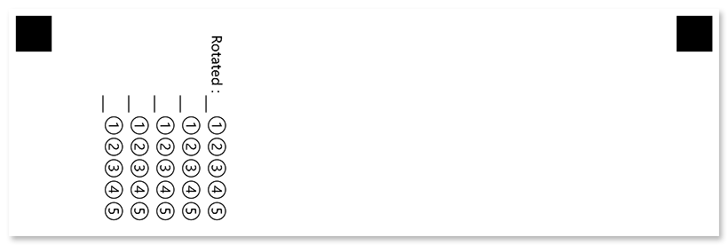

This element works similarly to the [Grid](/omr/net/json-markup/grid/) element, but offers much more flexibility and customization.

## Declaration

This element is declared as an object with `"element_type": "CompositeGrid"` property.

The maximum number of digits in the combined response is specified in the **columns_count** property.

A set of characters to be drawn inside bubbles is specified in the **values** array.

```json
{
	"element_type": "CompositeGrid",
	"columns_count": 3,
	"values": ["U", "S", "A"]
}
```

### Required properties

Name | Type | Description
---- | ---- | -----------
**element_type** | string | Must be `"CompositeGrid"` (case-insensitive).
**columns_count** | integer | The maximum number of symbols in the combined response. Each symbol is represented as a line or column of bubbles, depending on the element's **orientation** property.
**values** | array | Characters to be drawn inside bubbles.

### Optional properties

Name | Type | Default value | Description
---- | ---- | ------------- | -----------
**name** | string | _n/a_ | Used as an element's identifier in recognition results and is displayed as a label on the form.
**extra_row** | array of arrays | _n/a_ | Each array provided in this property adds a custom line / column of bubbles at the start of the grid. Characters drawn inside these bubbles may differ from those provided in **values** property.<br />A set of characters that will be displayed inside the bubbles of a particular line / column is defined as an array of strings. **The length of the array cannot be less than the value of the **columns_count** property.** To hide certain bubbles, provide an empty string (`""`) at their positions.
**align** | string | "left" | Horizontal alignment of **Grid** element: `"left"`, `"center"` or `"right"`.
**orientation** | string | "horizontal" | Element's orientation:<ul><li>`"horizontal"` - each digit is represented as a column of bubbles;</li><li>`"vertical"` - each digit is represented as a row of bubbles.</li></ul>
**rotate** | integer | 0 | Rotate the element by the given degree. The following values are supported: `90`, `180`, `270`.
**header_type** | string | "underline" | The type of the box to be displayed in front of each column / row. This box can be used for hand-writing the answer in addition to marking bubbles.<ul><li>`"underline"` - draw a horizontal line.</li><li>`"square"` - draw a box.</li></ul>
**header_border_size** | integer | 3 | Border width of the box to be displayed in front of each column / row.
**header_border_color** | string | "black" | Border color of the box to be displayed in front of each column / row. Can be picked from the following values: `"Aqua"`, `"Aquamarine"`, `"Black"`, `"Blue"`, `"BlueViolet"`, `"Crimson"`, `"DarkBlue"`, `"DarkGreen"`, `"DarkOrange"`, `"DarkSalmon"`, `"Fuchsia"`, `"Indigo"`, `"Lime"`, `"Red"`, `"Teal"`, `"White"`, `"Gray"`, `"LightGray"`.
**vertical_margin** | integer| 0 | Vertical spacing between the element's lines, in pixels.
**bubble_size** | string | "normal" | Size of bubbles: `"extrasmall"`, `"small"`, `"normal"`, `"large"`, or `"extralarge"`.
**x** | integer | _n/a_ | Set the absolute position of the **Grid** element relative to the left edge of the page.<br />Overrides the value of **align** property.
**y** | integer | _n/a_ | Set the absolute position of the **Grid** element relative to the top edge of the page.
**column** | integer | 1 | The number of the column where the **Grid** element will be placed. Only applicable if **Grid** is placed in a multi-column [**Container**](/omr/net/json-markup/container/) element.

## Allowed child elements

None.

## Recognition behavior

Numbers from each marked bubble are merged into a single number.

If the respondent marks more than one bubble per row / column (depending on the `orientation` attribute), the affected **CompositeGrid** element will not be recognized and an error will be written to the recognition results.

## Examples

Check out the code examples to see how **CompositeGrid** elements can be used.

### Bank security word

```json
{
	"element_type": "Template",
	"children": [
		{
			"element_type": "Page",
			"children": [
				{
					"element_type": "CompositeGrid",
					"name": "Security word",
					"columns_count": 8,
					"values": ["A", "B", "C", "D", "E", "F", "G", "H", "I", "J", "K", "L", "M", "N", "O", "P", "Q", "R", "S", "T", "U", "V", "W", "X", "Y", "Z"]
				}
			]
		}
	]
}
```


#### Recognition result

`PASSWORD`

### Formula

```json
{
	"element_type": "Template",
	"children": [
		{
			"element_type": "Page",
			"children": [
				{
					"element_type": "CompositeGrid",
					"name": "Formula",
					"columns_count": 5,
					"values": ["X", "Y"],
					"extra_row": [
						["1", "2", "3", "4", "5"],
						["", "+", "+", "+", ""],
						["", "=", "=", "=", ""]
					]
				}
			]
		}
	]
}
```


#### Recognition result

`X+Y=5`

### Rotated

```json
{
	"element_type": "Template",
	"children": [
		{
			"element_type": "Page",
			"children": [
				{
					"element_type": "CompositeGrid",
					"name": "Rotated",
					"columns_count": 5,
					"values": ["1", "2", "3", "4", "5"],
					"orientation": "vertical",
					"rotate": 90
				}
			]
		}
	]
}
```


