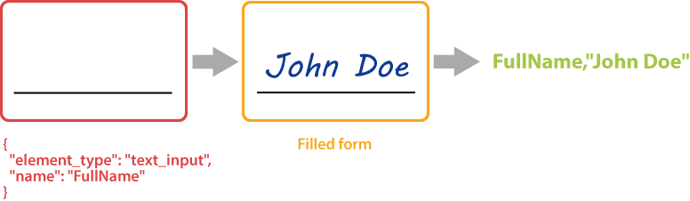
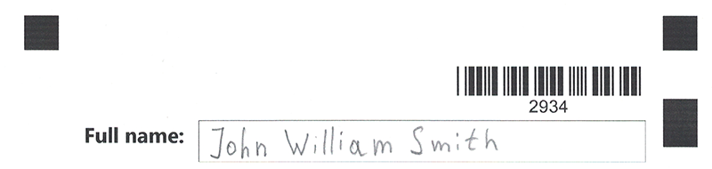

{} 
**free_text_input** element requires a handwritten recognition plugin to be installed. Otherwise, the corresponding JSON element will be ignored.
{}

This element adds a handwritten text placeholder to the form where the respondent can write a line of text in a free manner.

Handwritten line is recognized automatically without the need for an external OCR library.



**free_text_input** element can be used to request a full name, address, an answer answer to open-ended question and other textual information in free form.

## Syntax

**free_text_input** element is declared as an object with `"element_type": "free_text_input"` property.

```json
{
	"element_type": "free_text_input"
}
```

### Required properties

Name | Type | Description
---- | ---- | -----------
**element_type** | string | Must be `"free_text_input"` (case-insensitive).

### Optional properties

Name | Type | Description
---- | ---- | -----------
`name` | string | Used as a reminder of the element’s purpose in the form's source code and returned as an identifier of the recognition result.<br />You can use the same value for multiple elements. This text is not displayed on the form.
`line_height` | number | The height of the input element, in pixels.

## Allowed child elements

None.

## Example

```json
{
	"element_type": "Template",
	"children": [
		{
			"element_type": "Page",
			"children": [
        {
            "name": "docId",
            "value": "2934",
            "barcode_type": "Code39Standard",
            "align": "Right",
            "height": 200,
            "codetext": true,
            "element_type": "Barcode"
        },
				{
					"element_type": "Container",
					"name": "Two-column layout",
					"columns_count": 2,
					"children": [
						{
							"element_type": "Block",
							"column": 1,
							"children": [
								{
									"element_type": "Content",
									"name": "Full name:",
									"font_style": "Bold",
									"font_size": 18,
									"align": "Right"
								}
							]
						},
						{
							"element_type": "Block",
							"column": 2,
							"border": "square",
							"border_size": 10,
							"border_color": "Blue",
							"children": [
								{
									"element_type": "free_text_input",
									"name": "full name",
									"line_height": 150
								}
							]
						}
					]
				}
			]
		}
	]
}
```



**Recognition result:**

```
Element Name,Value,
docId,"2934"
full name,"John William Smith"
```
