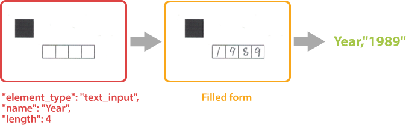

{} 
**text_input** element requires a handwritten recognition plugin to be installed. Otherwise, the corresponding JSON element will be ignored.
{}

This element adds a handwritten text placeholder to the form. The placeholder consists of several boxes in which the respondent can write letters or numbers, one character in each box.

Handwritten characters written inside boxers are recognized automatically without the need for an external OCR library.



**text_input** element can be used to request name, phone number, address and other textual information in free form or to offer a respondent answer an open-ended question.

## Syntax

**text_input** element is declared as an object with `"element_type": "text_input"` property.

```json
{
	"element_type": "text_input"
}
```

### Required properties

Name | Type | Description
---- | ---- | -----------
**element_type** | string | Must be `"text_input"` (case-insensitive).

### Optional properties

Name | Type | Default value | Description
---- | ---- | ------------- | -----------
`name` | string | _n/a_ | Used as a reminder of the element’s purpose in the form's source code and returned as an identifier of the recognition result.<br />You can use the same value for multiple elements. This text is not displayed on the form.
`input_type` | string | `"numbers"` | The type of allowed characters:<ul><li>`"numbers"`</li><li>`"letters"`</li></ul>
`cell_size` | string | `"normal"` | The size of each placeholder:<ul><li>`"normal"`</li><li>`"large"`</li><li>`"extralarge"`</li></ul>

## Allowed child elements

None.

## Example

```
{
	"element_type": "text_input",
	"name": "Year",
	"length": 4,
}
```


