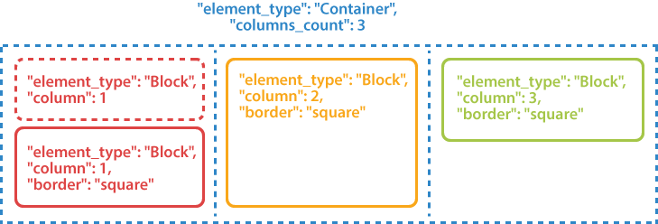
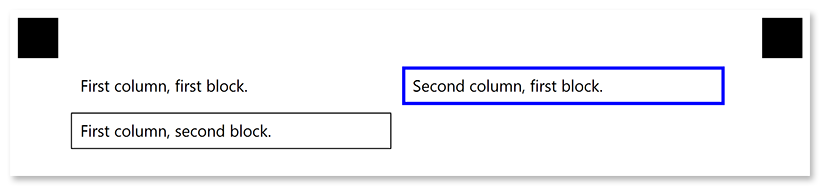
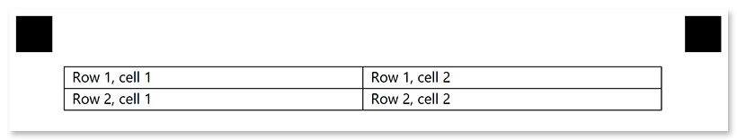

This element is used to organize content within [**Containers**](/omr/net/json-markup/container/). **Block** elements can only be nested within [**Container**](/omr/net/json-markup/container/) elements and cannot contain other **Block** elements.

**Block** elements may have no visual representation or have a border around them.



## Declaration

**Block** element is declared as an object with `"element_type": "Block"` property.

Elements displayed inside blocks are provided as an array of objects in the **children** property.

```json
{
	"element_type": "Block",
	"children": [
		/*** put child elements here */
	]
}
```

### Required properties

Name | Type | Description
---- | ---- | -----------
**element_type** | string | Must be `"Block"` (case-insensitive).
**children** | array | [Child elements]().

### Optional properties

Name | Type | Default value | Description
---- | ---- | ------------- | -----------
**name** | string | _n/a_ | Used as a reminder of the element's purpose; for example, "_Column 1_". You can use the same value for multiple blocks.<br />This text is not displayed on the form.
**column** | integer | 1 | The number of the column in which the Block will be placed.<br />This number must not exceed the number of columns of the parent [**Container**](/omr/net/json-markup/container/) element.
**border** | string | "none" | Whether to draw a border around the Block element.<ul><li>`"none"` - no border.</li><li>`"square"` - draw a rectangular border.</li></ul>
**border_size** | integer | 3 | Width of the **Block** borders.
**border_color** | string | "Black" | Color of the **Block** borders. Can be picked from the following values: `"Aqua"`, `"Aquamarine"`, `"Black"`, `"Blue"`, `"BlueViolet"`, `"Crimson"`, `"DarkBlue"`, `"DarkGreen"`, `"DarkOrange"`, `"DarkSalmon"`, `"Fuchsia"`, `"Indigo"`, `"Lime"`, `"Red"`, `"Teal"`, `"White"`, `"Gray"`, `"LightGray"`.
**is_clipped** | Boolean | false | If set to `true`, the content of the **Block** element is stored to [Images](https://apireference.aspose.com/omr/net/aspose.omr.model/recognitionresult/properties/images) collection during recognition, similar to the [**WriteIn**](/omr/net/json-markup/writein/) element. The image can be can be passed to optical character recognition library, such as [Aspose.OCR](https://products.aspose.app/ocr), or saved.<br />If the **Block** contains OMR elements, they will be recognized even if this property is set to `true`.

## Allowed child elements

All, except for [**Container**](/omr/net/json-markup/container/) or another **Block**.

## **Examples**

Check out the code examples to see how **Block** elements can be used and combined with each other.

### Two-column layout

```json
{
	"element_type": "Template",
	"children": [
		{
			"element_type": "Page",
			"children": [
				{
					"element_type": "Container",
					"name": "Two-column layout",
					"columns_count": 2,
					"children": [
						{
							"element_type": "Block",
							"column": 1,
							"children": [
								{
									"element_type": "Content",
									"name": "First column, first block."
								}
							]
						},
						{
							"element_type": "Block",
							"column": 1,
							"border": "square",
							"children": [
								{
									"element_type": "Content",
									"name": "First column, second block."
								}
							]
						},
						{
							"element_type": "Block",
							"column": 2,
							"border": "square",
							"border_size": 10,
							"border_color": "Blue",
							"children": [
								{
									"element_type": "Content",
									"name": "Second column, first block."
								}
							]
						}
					]
				}
			]
		}
	]
}
```



### Fake table layout

```json
{
	"element_type": "Template",
	"children": [
		{
			"element_type": "Page",
			"children": [
				{
					"element_type": "Container",
					"name": "Fake table layout",
					"columns_count": 2,
					"block_right_margin": 0,
					"block_bottom_margin": 0,
					"block_top_padding": 0,
					"children": [
						{
							"element_type": "Block",
							"column": 1,
							"border": "square",
							"children": [
								{
									"element_type": "Content",
									"name": "Row 1, cell 1"
								}
							]
						},
						{
							"element_type": "Block",
							"column": 1,
							"border": "square",
							"children": [
								{
									"element_type": "Content",
									"name": "Row 2, cell 1"
								}
							]
						},
						{
							"element_type": "Block",
							"column": 2,
							"border": "square",
							"children": [
								{
									"element_type": "Content",
									"name": "Row 1, cell 2"
								}
							]
						},
						{
							"element_type": "Block",
							"column": 2,
							"border": "square",
							"children": [
								{
									"element_type": "Content",
									"name": "Row 2, cell 2"
								}
							]
						}
					]
				}
			]
		}
	]
}
```


