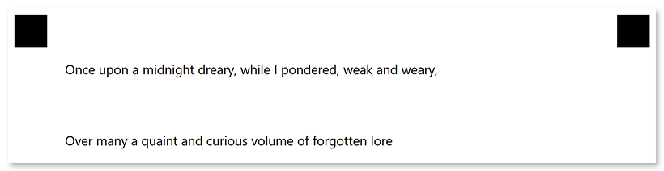

This element is used to add vertical spacing equal to _one line of text_ between other elements.

## Declaration

**EmptyLine** element is declared as an object with `"element_type": "EmptyLine"` property.

```json
{
	"element_type": "EmptyLine",
}
```

### Required properties

Name | Type | Description
---- | ---- | -----------
**element_type** | string | Must be `"EmptyLine"` (case-insensitive).

### Optional properties

Name | Type | Default value | Description
---- | ---- | ------------- | -----------
**name** | string | _n/a_ | Used as a reminder of the element's purpose; for example, "_Section break_". You can use the same value for multiple elements.<br />This text is not displayed on the form.
**height** | integer | _One line of text using the default font_ | Vertical spacing height, in pixels. Overrides the default line height.

## Allowed child elements

None.

## **Example**

```json
{
	"element_type": "Template",
	"children": [
		{
			"element_type": "Page",
			"children": [
				{
					"element_type": "Text",
					"name": "Once upon a midnight dreary, while I pondered, weak and weary,"
				},
				{
					"element_type": "EmptyLine",
					"height": 200
				},
				{
					"element_type": "Text",
					"name": "Over many a quaint and curious volume of forgotten lore"
				}
			]
		}
	]
}
```


