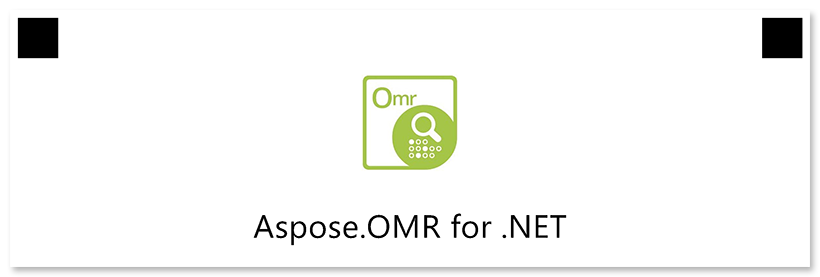

This element is used to add a picture.

## Declaration

**Image** element is declared as an object with `"element_type": "Image"` property.

Image file name is provided in the **name** property.

```json
{
	"element_type": "Image",
	"name": "image.jpg"
}
```

Full paths to all images used in the form must be [provided to the template generator](/omr/net/generate-template/images/).

### Required properties

Name | Type | Description
---- | ---- | -----------
**element_type** | string | Must be `"Image"` (case-insensitive).
**name** | string | Name of the image file.

### Optional properties

Name | Type | Default value | Description
---- | ---- | ------------- | -----------
**width** | integer | _Original image width_ | Image width, in pixels. Smaller or larger images will be resized.
**height** | integer | _Original image height_ | Image height, in pixels. Smaller or larger images will be resized.
**x** | integer | _n/a_ | Set the absolute position of the image relative to the left edge of the page.<br />Overrides the value of **align** property.
**y** | integer | _n/a_ | Set the absolute position of the image relative to the top edge of the page.
**align** | string | "left" | Horizontal image alignment: `"left"`, `"center"` or `"right"`.

## Allowed child elements

None.

## **Example**

```json
{
	"element_type": "Template",
	"children": [
		{
			"element_type": "Page",
			"children": [
				{
					"element_type": "Image",
					"name": "logo.jpg",
					"align": "center"
				},
				{
					"element_type": "EmptyLine"
				},
				{
					"element_type": "Text",
					"name": "Aspose.OMR for .NET",
					"align": "center",
					"font_size": 24
				}
			]
		}
	]
}
```


