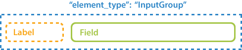
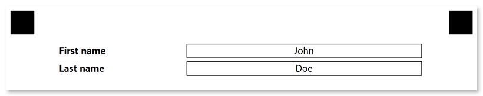

This element is used to insert personalized information, such as the respondent's name or email, into the form. **"InputGroup"** is a purely layout element which is not processed by Aspose.OMR during the recognition.

## Declaration

**InputGroup** element is declared as an object with `"element_type": "InputGroup"` property.

**InputGroup** must contain 2 [**Content**](/omr/net/json-markup/content/) elements provided as an array of objects in the `children` property:

- The first **Content** element defines the label.
- The second **Content** element defines the text in the field.



```json
{
	"element_type": "InputGroup",
	"children": [
		{
			"element_type": "Content",
			"name": "Label"
		},
		{
			"element_type": "Content",
			"name": "Field text"
		}
	]
}
```

### Required properties

Name | Type | Description
---- | ---- | -----------
**element_type** | string | Must be `"InputGroup"` (case-insensitive).

### Optional properties

Name | Type | Default value | Description
---- | ---- | ------------- | -----------
**name** | string | _n/a_ | Used as a reminder of the element's purpose; for example, "_Student name_". You can use the same value for multiple elements.<br />This text is not displayed on the form.
**label_border** | string | "none" | Whether to draw a border around the label.<ul><li>`"none"` - no border.</li><li>`"square"` - draw a rectangular border.</li><li>`rounded` - draw a rectangular border with rounded corners.</li></ul>
**input_border** | string | "none" | Whether to draw a border around the field.<ul><li>`"none"` - no border.</li><li>`"square"` - draw a rectangular border.</li><li>`rounded` - draw a rectangular border with rounded corners.</li></ul>
**border_size** | integer | 3 | Width of all borders.
**border_color** | string | "Black" | Color of all borders. Can be picked from the following values: `"Aqua"`, `"Aquamarine"`, `"Black"`, `"Blue"`, `"BlueViolet"`, `"Crimson"`, `"DarkBlue"`, `"DarkGreen"`, `"DarkOrange"`, `"DarkSalmon"`, `"Fuchsia"`, `"Indigo"`, `"Lime"`, `"Red"`, `"Teal"`, `"White"`, `"Gray"`, `"LightGray"`.

## Allowed child elements

- [**Content**](/omr/net/json-markup/content/)

## **Example**

```json
{
	"element_type": "Template",
	"children": [
		{
			"element_type": "Page",
			"children": [
				{
					"element_type": "InputGroup",
					"input_border": "square",
					"children": [
						{
							"element_type": "content",
							"name": "First name",
							"font_style": "bold"
						},
						{
							"element_type": "content",
							"name": "John",
							"align": "center"
						}
					]
				},
				{
					"element_type": "InputGroup",
					"input_border": "square",
					"children": [
						{
							"element_type": "content",
							"name": "Last name",
							"font_style": "bold"
						},
						{
							"element_type": "content",
							"name": "Doe",
							"align": "center"
						}
					]
				}
			]
		}
	]
}
```


