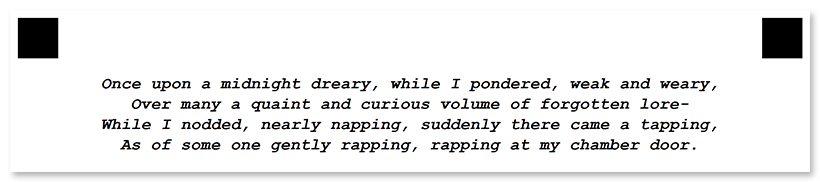

This element is used to add a line of text to the form. **Text** elements _cannot be nested within other elements_ - they should always be placed directly in the `children` array of the [template page object]().

## Declaration

**Text** element is declared as an object with `"element_type": "Text"` property.

The text displayed in the form is specified in the **name** property.

```json
{
	"element_type": "Text",
	"name": "Text goes here"
}
```

### Required properties

Name | Type | Description
---- | ---- | -----------
**element_type** | string | Must be `"Text"` (case-insensitive).
**name** | string | A line of text displayed in the form.

### Optional properties

Name | Type | Default value | Description
---- | ---- | ------------- | -----------
**font_family** | string | "Segoe UI" | The font family for the text.
**font_style** | string / array | "regular" | The font style for a text: `"bold"`, `"italic"` or `"underline"`.<br />Several font styles can be combined by providing them as an array, for example `["bold", "italic"]`.
**font_size** | integer | 12 | Font size for the text.
**align** | string | "left" | Horizontal text alignment: `"left"`, `"center"` or `"right"`.

## Allowed child elements

None.

## **Example**

```json
{
	"element_type": "Template",
	"children": [
		{
			"element_type": "Page",
			"children": [
				{
					"element_type": "Text",
					"name": "Once upon a midnight dreary, while I pondered, weak and weary,",
					"font_family": "Courier New",
					"font_style": ["bold", "italic"],
					"align": "center"
				},
				{
					"element_type": "Text",
					"name": "Over many a quaint and curious volume of forgotten lore-",
					"font_family": "Courier New",
					"font_style": ["bold", "italic"],
					"align": "center"
				},
				{
					"element_type": "Text",
					"name": "While I nodded, nearly napping, suddenly there came a tapping,",
					"font_family": "Courier New",
					"font_style": ["bold", "italic"],
					"align": "center"
				},
				{
					"element_type": "Text",
					"name": "As of some one gently rapping, rapping at my chamber door.",
					"font_family": "Courier New",
					"font_style": ["bold", "italic"],
					"align": "center"
				}
			]
		}
	]
}
```


