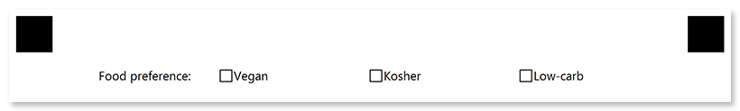

This element generates a list of answers with blank boxes, which can contain any marks - from marker filling to light pencil checks.

You can directly specify the recognition accuracy for this element so that even the lightest marks are detected.

## Declaration

This element is declared as an object with `"element_type": "CheckBox"` property.

The question text / label is specified in the **name** property.

Answers are provided as an array of [**Content**](/omr/net/json-markup/content/) objects in the **children** property.

```json
{
	"element_type": "CheckBox",
	"name": "Question",
	"children": [
		/*** put answers (Content elements) here */
	]
}
```

### Required properties

Name | Type | Description
---- | ---- | -----------
**element_type** | string | Must be `"CheckBox"` (case-insensitive).
**name** | string | Used as an element's identifier in recognition results and is displayed as a label on the form.
**children** | array | An array of [**Content**](/omr/net/json-markup/content/) objects representing the answers (boxes).

### Optional properties

Name | Type | Default value | Description
---- | ---- | ------------- | -----------
**threshold** | integer | 3 | Set the recognition accuracy for the answer boxes, from 0 to 100. Lower values allow even the lightest marks to be recognized, but may cause dirt or paper defects to be treated as marks. Higher values require a more solid fill and may cause pencil marks or small checks to be ignored.<br /><br />
**bubble_size** | string | "normal" | Size of bubbles: `"extrasmall"`, `"small"`, `"normal"`, `"large"`, or `"extralarge"`.
**bubble_type** | string | "square" | Bubble style: `"round`" or `"square"`.
**hide_name** | Boolean | false | Set to `true` to hide the label (**name**) of the **CheckBox** element.
**font_family** | string | "Segoe UI" | The font family for the text.
**font_style** | string | "regular" | The font style for a **CheckBox** label: `"bold"`, `"italic"` or `"underline"`.<br />Several font styles can be combined by providing them as an array, for example `["bold", "italic"]`.
**font_size** | integer | 12 | Font size for the **CheckBox** label.
**multiselect** | boolean | true | Set to `false` to allow the OMR API to validate whether multiple answers are selected and throws an exception if more than one choice is detected. Set to `true` to accept multiple answers.<br />Overrides the `Multiselect` page setting.

## Allowed child elements

- [**Content**](/omr/net/json-markup/content/)

## Example

```json
{
	"element_type": "Template",
	"children": [
		{
			"element_type": "Page",
			"children": [
				{
					"element_type": "CheckBox",
					"name": "Food preference:",
					"bubble_size": "extrasmall",
					"font_size": 10,
					"children": [
						{
							"element_type": "Content",
							"name": "Vegan",
							"font_size": 10
						},
						{
							"element_type": "Content",
							"name": "Kosher",
							"font_size": 10
						},
						{
							"element_type": "Content",
							"name": "Low-carb",
							"font_size": 10
						}
					]
				}
			]
		}
	]
}
```


