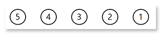
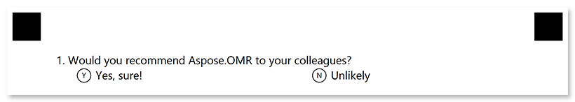
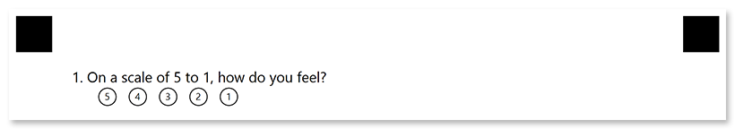

This element generates a question with a fixed number of answers. The respondent picks an answer by filling in the bubble next to it or by choosing a score on the rating scale.

## Declaration

This element is declared as an object with `"element_type": "ChoiceBox"` property.

The question text is specified in the **question_text** property.

Answers are specified in **answers_string** property.

```json
{
	"element_type": "ChoiceBox",
	"question_text": "Question",
	"answers_string": "() Answer 1 () Answer 2"
}
```

### Required properties

Name | Type | Description
---- | ---- | -----------
**element_type** | string | Must be `"ChoiceBox"` (case-insensitive).
**question_text** | string | Question text.
**answers_string** | string | A list of answers, represented as a specially formatted string.<br />Each answer is declared in the form `([character]) {Answer text}`, where `character` specifies the symbol to be placed inside the answer bubble. For example, `(α) Alpha Centauri`. The character is optional; if it is omitted, the letters A through Z will be used.<br />Multiple answers can be placed one after the other on one line or on new lines. To add a line break, insert CRLF (`\r\n`) or line feed (`\n`) before the answer to be placed on a new line. For example: `"() One () Two\r\n(3) Three"`.

### Optional properties

Name | Type | Default value | Description
---- | ---- | ------------- | -----------
**name** | string | _n/a_ | Used as an element's identifier in recognition results and as a reminder of the element's purpose in template source; for example, "_Satisfaction_".<br />This text is not displayed on the form.
**font_family** | string | "Segoe UI" | The font family for the text.
**font_style** | string / array | "regular" | The font style for a text: `"bold"`, `"italic"` or `"underline"`.<br />Several font styles can be combined by providing them as an array, for example `["bold", "italic"]`.
**font_size** | integer | 12 | Font size for the text.
**align** | string | "left" | Horizontal text alignment: `"left"`, `"center"` or `"right"`.
**multiselect** | boolean | true | Set to `false` to allow the OMR API to validate whether multiple answers are selected and throws an exception if more than one choice is detected. Set to `true` to accept multiple answers.<br />Overrides the `Multiselect` page setting.

## Rating scale

You can omit the answer text in [**answers_string**]() property and use `([character])` syntax alone to create rating scales. For example, `"answers_string": "(5) (4) (3) (2) (1)"`:



## Examples

Check out the code examples to see how questions can be used.

### Closed-ended question

```json
{
	"element_type": "Template",
	"children": [
		{
			"element_type": "Page",
			"children": [
				{
					"element_type": "ChoiceBox",
					"question_text": "Which Aspose.OMR features do you consider the most valuable?",
					"answers_string": "() Recognition accuracy () Wide range of supported file formats\r\n() Form generation () QR codes and barcodes support"
				}
			]
		}
	]
}
```


### Yes / no options

```json
{
	"element_type": "Template",
	"children": [
		{
			"element_type": "Page",
			"children": [
				{
					"element_type": "ChoiceBox",
					"question_text": "Would you recommend Aspose.OMR to your colleagues?",
					"answers_string": "(Yes) Yes, sure! (No) Unlikely"
				}
			]
		}
	]
}
```



### Question with a rating scale

```json
{
	"element_type": "Template",
	"children": [
		{
			"element_type": "Page",
			"children": [
				{
					"element_type": "ChoiceBox",
					"question_text": "On a scale of 5 to 1, how do you feel?",
					"answers_string": "(5)(4)(3)(2)(1)"
				}
			]
		}
	]
}
```


