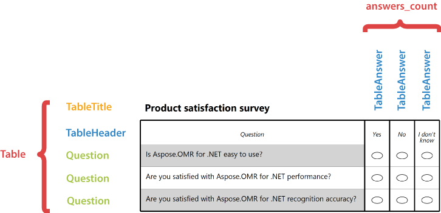
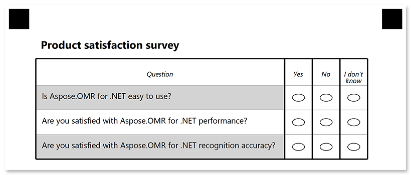
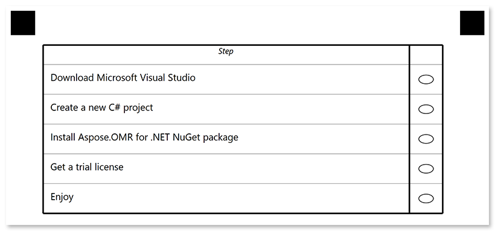

This element organizes questions and answers in a tabular structure (rows and columns) for better readability.

Tables are best suited for large surveys where all questions have the same set of answers.

## Declaration

This element is declared as an object with `"element_type": "Table"` property.

The number of answers common to all questions in the table is provided in **answers_count** property.

**Table** element includes an optional [**TableTitle**]() element, [**TableHeader**]() element and one or more [**Question**]() elements provided in **children** property.

```json
{
	"element_type": "Table",
	"answers_count": 3,
	"children": [
		/*** put table structure elements here */
	]
}
```



{} 

**table** elements can only be nested within [block](/omr/net/json-markup/block/) elements and cannot be used at the top level of the form hierarchy.

{}

### Required properties

Name | Type | Description
---- | ---- | -----------
**element_type** | string | Must be `"Table"` (case-insensitive).
**answers_count** | integer | The number of answers common to all questions in the table
**children** | array | An array including the [**TableTitle**]() element, [**TableHeader**]() element and one or more [**Question**]() objects representing the table structure.

### Optional properties

Name | Type | Default value | Description
---- | ---- | ------------- | -----------
**name** | string | _n/a_ | Used as an element's identifier and as a reminder of the element's purpose in template source; for example, `"Satisfaction survey"`.<br />This text is not displayed on the form.
**table_type** | string | "normal" | Table style:<ul><li>`"normal"` - standard table</li><li>`"striped"` - zebra-striped table rows</li><li>`"equalCells"` - make all table columns equal</li></ul>

### TableTitle element

This optional element defines the title row of the table. If **TableTitle** element is omitted, the table will be rendered without a title row.

This element is declared as an object with `"element_type": "TableTitle"` property.

Title text is provided in the **name** property.

```json
{
	"element_type": "TableTitle",
	"name": "Table title"
}
```

#### Required properties

Name | Type | Description
---- | ---- | -----------
**element_type** | string | Must be `"TableTitle"` (case-insensitive).
**name** | string | Table title text.

#### Optional properties

Name | Type | Default value | Description
---- | ---- | ------------- | -----------
**font_family** | string | "Segoe UI" | The font family for the title text.
**font_style** | string | "regular" | The font style for the title text: `"bold"`, `"italic"` or `"underline"`.<br />Several font styles can be combined by providing them as an array, for example `["bold", "italic"]`.
**font_size** | integer | 12 | Font size for the title text.
**color** | string | black | Color of the title text. Can be picked from one of the supported values.
**background_color** | string | _transparent_ | Background color of the title row. Can be picked from one of the supported values.
**border** | string | "none" | Whether to draw a border around the title row.<ul><li>`"none"` - no border.</li><li>`"square"` - draw a rectangular border.</li><li>`rounded` - draw a rectangular border with rounded corners.</li></ul>
**border_size** | integer| 3 | Width of the title row borders.
**border_color** | string | black | Color of the title row borders. Can be picked from one of the supported values.
**border_top_style** | object | _inherits border_size and border_color_ | Override the width and color of the element's top border. Provided as the following object: `{"size": <border width>, "color": "<border color>", "disable": <true \| false>}`. Specifying `true` in the `disable` property removes the top border.
**border_bottom_style** | object | _inherits border_size and border_color_ | Override the width and color of the element's bottom border. Provided as the following object: `{"size": <border width>, "color": "<border color>", "disable": <true \| false>}`. Specifying `true` in the `disable` property removes the bottom border.
**border_left_style** | object | _inherits border_size and border_color_ | Override the width and color of the element's left border. Provided as the following object: `{"size": <border width>, "color": "<border color>", "disable": <true \| false>}`. Specifying `true` in the `disable` property removes the left border.
**border_right_style** | object | _inherits border_size and border_color_ | Override the width and color of the element's right border. Provided as the following object: `{"size": <border width>, "color": "<border color>", "disable": <true \| false>}`. Specifying `true` in the `disable` property removes the right border.

### TableHeader element

This element specifies the content of the table header row.

This element is declared as an object with `"element_type": "TableHeader"` property.

**Table_header** element includes a [**Content**](/omr/net/json-markup/content/) element that defines the question text and several [**TableAnswer**]() elements that define the answers in the **children** property.

```json
{
	"element_type": "TableHeader",
	"children": [
		/*** put Content element and child elements here */
	]
}
```

#### Required properties

Name | Type | Description
---- | ---- | -----------
**element_type** | string | Must be `"TableHeader"` (case-insensitive).
**children** | array | [**Content**](/omr/net/json-markup/content/) element that defines the question text and one or more [**TableAnswer**]() elements that define the answers.<br />The number of **TableAnswer** elements must be equal to the value of the **answers_count** property of the **Table** element.

#### Optional properties

Name | Type | Default value | Description
---- | ---- | ------------- | -----------
**font_family** | string | "Segoe UI" | The font family for the table header text.
**font_style** | string | "regular" | The font style for the table header text: `"bold"`, `"italic"` or `"underline"`.<br />Several font styles can be combined by providing them as an array, for example `["bold", "italic"]`.
**font_size** | integer | 12 | Font size for the table header text.

#### TableAnswer element

The **TableAnswer** element defines the answer text that will be displayed in the table header. The number of **TableAnswer** elements must be equal to the value of the [**answers_count**]() property of the **Table** element.

This element is declared as an object with `"element_type": "TableAnswer"` property.

Answer text is provided in the **name** property.

```json
{
	"element_type": "TableAnswer",
	"name": "Answer"
}
```

##### Required properties

Name | Type | Description
---- | ---- | -----------
**element_type** | string | Must be `"TableAnswer"` (case-insensitive).
**name** | string | Answer text.

### Question element

The **Question** element defines the question text. A **Table** can include multiple question elements that will be displayed as rows.

This element is declared as an object with `"element_type": "Question"` property.

Question text is provided in the **name** property.

```json
{
	"element_type": "Question",
	"name": "Question"
}
```

#### Required properties

Name | Type | Description
---- | ---- | -----------
**element_type** | string | Must be `"Question"` (case-insensitive).
**name** | string | Question text.

## Examples

Check out the code examples to see how tables can be used.

### Product satisfaction survey

```json
{
	"element_type": "Template",
	"children": [
		{
			"element_type": "Page",
			"children": [
				{
					"element_type": "container",
					"children": [
						{
							"element_type": "block",
							"children": [
								{
									"element_type": "Table",
									"name": "Survey",
									"answers_count": 3,
									"table_type": "striped",
									"children": [
										{
											"element_type": "TableTitle",
											"name": "Product satisfaction survey",
											"font_size": 16,
											"font_style": "bold"
										},
										{
											"element_type": "TableHeader",
											"font_size": 10,
											"font_style": "italic",
											"children": [
												{
													"element_type": "Content",
													"name": "Question"
												},
												{
													"element_type": "TableAnswer",
													"name": "Yes"
												},
												{
													"element_type": "TableAnswer",
													"name": "No"
												},
												{
													"element_type": "TableAnswer",
													"name": "I don't know"
												}
											]
										},
										{
											"element_type": "Question",
											"name": "Is Aspose.OMR for .NET easy to use?"
										},
										{
											"element_type": "Question",
											"name": "Are you satisfied with Aspose.OMR for .NET performance?"
										},
										{
											"element_type": "Question",
											"name": "Are you satisfied with Aspose.OMR for .NET recognition accuracy?"
										}
									]
								}
							]
						}
					]
				}
			]
		}
	]
}
```



### Checklist

```json
{
	"element_type": "Template",
	"children": [
		{
			"element_type": "Page",
			"children": [
				{
					"element_type": "container",
					"children": [
						{
							"element_type": "block",
							"children": [
								{
									"element_type": "Table",
									"name": "Checklist",
									"answers_count": 1,
									"children": [
										{
											"element_type": "TableHeader",
											"font_size": 10,
											"font_style": "italic",
											"children": [
												{
													"element_type": "Content",
													"name": "Step"
												},
												{
													"element_type": "TableAnswer",
													"name": ""
												}
											]
										},
										{
											"element_type": "Question",
											"name": "Download Microsoft Visual Studio"
										},
										{
											"element_type": "Question",
											"name": "Create a new C# project"
										},
										{
											"element_type": "Question",
											"name": "Install Aspose.OMR for .NET NuGet package"
										},
										{
											"element_type": "Question",
											"name": "Get a trial license"
										},
										{
											"element_type": "Question",
											"name": "Enjoy"
										}
									]
								}
							]
						}
					]
				}
			]
		}
	]
}
```


