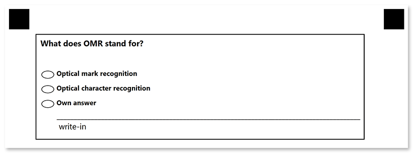

This element generates a vertical block with answers. 

**VerticalChoicebox** also supports [**WriteIn**](/omr/net/json-markup/writein/) element that allows for implementing open-ended questions.

## Declaration

This element is declared as an object with `"element_type": "VerticalChoiceBox"` property.

Answers are provided as an array of [**Answer**]() objects in the **children** property.

```json
{
	"element_type": "VerticalChoiceBox",
	"children": [
		/*** put one or more Answer elements here */
	]
}
```

{} 

**VerticalChoicebox** elements can only be nested within [**Block**](/omr/net/json-markup/block/) elements and cannot be used at the top level of the form hierarchy.

{}

### Required properties

Name | Type | Description
---- | ---- | -----------
**element_type** | string | Must be `"VerticalChoiceBox"` (case-insensitive).
**children** | array | An array of [**Answer**]() objects representing the answers.

### Optional properties

Name | Type | Default value | Description
---- | ---- | ------------- | -----------
**name** | string | _n/a_ | Used as an element's identifier in recognition results and as a reminder of the element's purpose in template source; for example, `"Preference"`.<br />This text is not displayed on the form.
**threshold** | integer | 45 | Set the recognition accuracy for the answer bubbles, from 0 to 100. Lower values allow even the lightest marks to be recognized, but may cause dirt or paper defects to be treated as marks. Higher values require a more solid fill and may cause pencil marks or small checks to be ignored.<br /><br />
**bubble_type** | string | "round" | Set the bubble design:<ul><li>`"round"` - oval;</li><li>`"square"` - box.</li></ul>
**top_padding** | integer | 0 | The vertical spacing (in pixels) before the first **Answer** element.

### Answer element

This element declares an answer to the **VerticalChoiceBox** question.

This element is declared as an object with `"element_type": "Answer"` property.

Each **Answer** can include the following elements (as well as their combinations) in its **children** property:

- [**Paragraph**](/omr/net/json-markup/paragraph/)
- [**Content**](/omr/net/json-markup/content/)
- [**WriteIn**](/omr/net/json-markup/writein/)

#### Required properties

Name | Type | Description
---- | ---- | -----------
**element_type** | string | Must be `"Answer"` (case-insensitive).
**children** | array | An array of [**Paragraph**](/omr/net/json-markup/paragraph/), [**Content**](/omr/net/json-markup/content/), or [**WriteIn**](/omr/net/json-markup/writein/) elements that form the answer text.

#### Optional properties

{} 
These properties can override the settings of the entire **VerticalChoiceBox** element.
{}

Name | Type | Default value | Description
---- | ---- | ------------- | -----------
**name** | string | Used for identifying the marked answer in recognition results.
**selectable** | Boolean | true | Whether to display the bubble for the answer.<br />**Setting this attribute to `false` removes the bubble in the generated form. This results in the answer cannot be chosen by the respondents.**
**bubble_position** | string | left | Override the bubble position relative to the answer text:<ul><li>`"left"`</li><li>`"right"`</li></ul>
**bubble_type** | string | "round" | Override the bubble design:<ul><li>`"round"` - oval;</li><li>`"square"` - box.</li></ul>
**bubble_offset_x** | string | _auto_ | Bubble offset relative to the left (for LTR layouts) or right (for RTL layouts) of the **answer** element.<br />By default, the bubble is positioned to the left (for LTR layouts) or to the right (for RTL layouts) of the **answer** element.
**bubble_offset_y** | string | _auto_ | Bubble offset, relative to the top of the **answer** element.<br />By default, the bubble is centered along the cross-axis of the first line of the **answer** element.

## Combining with WriteIn elements

The **Answer** element may contain a [**WriteIn**](/omr/net/txt-markup/writein/) element to allow respondents to provide free-form answers to an open-ended question. You can add several write-in fields per **VerticalChoiceBox** element.

If the bubble is marked, the contents of the corresponding **WriteIn** element are saved to [Images](https://reference.aspose.com/omr/net/aspose.omr.model/recognitionresult/properties/images) collection. It will work even if the [`required`](/omr/net/json-markup/writein/#optional-properties) property of the **WriteIn** is set to `false`.

{}
Each **WriteIn** element must have a unique name.
{}

## Example

```json
{
	"element_type": "Template",
	"children": [
		{
			"element_type": "Page",
			"children": [
				{
					"element_type": "Container",
					"children": [
						{
							"element_type": "Block",
							"border_type": "square",
							"border-size": 5,
							"children": [
								{
									"element_type": "Content",
									"name": "What does OMR stand for?",
									"font_size": 12,
									"font_style": "Bold"
								},
								{
									"element_type": "VerticalChoiceBox",
									"name": "Definition",
									"top_padding": 100,
									"children": [
										{
											"element_type": "Answer",
											"name": "1",
											"children": [
												{
													"element_type": "Content",
													"name": "Optical mark recognition",
													"font_size": 10,
													"font_style": "bold"
												}
											]
										},
										{
											"element_type": "Answer",
											"name": "2",
											"children": [
												{
													"element_type": "Content",
													"name": "Optical character recognition",
													"font_size": 10,
													"font_style": "bold"
												}
											]
										},
										{
											"element_type": "Answer",
											"name": "3",
											"children": [
												{
													"element_type": "Content",
													"name": "Own answer",
													"font_size": 10,
													"font_style": "bold"
												},
												{
													"element_type": "WriteIn",
													"name": "Own answer",
												}
											]
										}
									]
								}
							]
						}
					]
				}
			]
		}
	]
}
```


