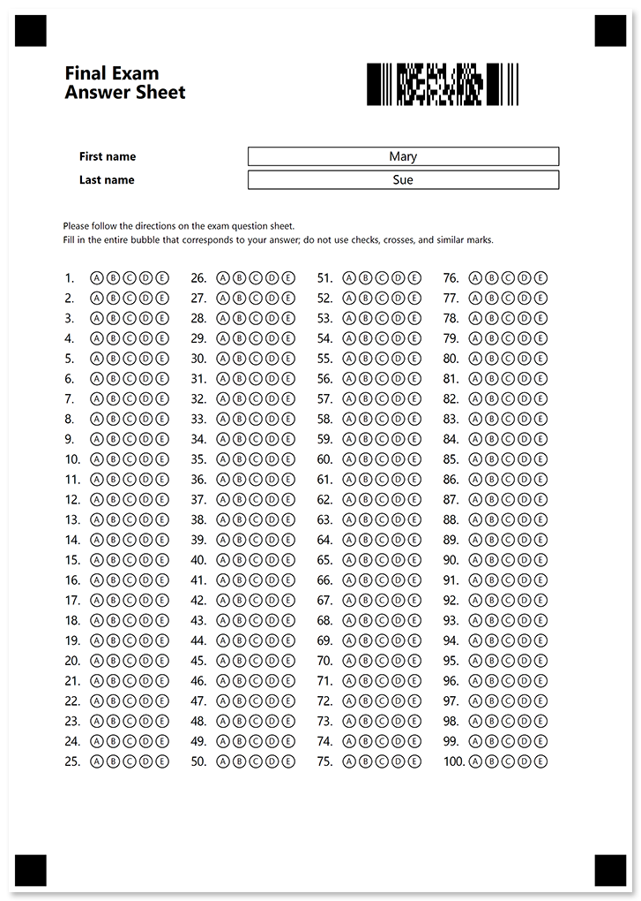
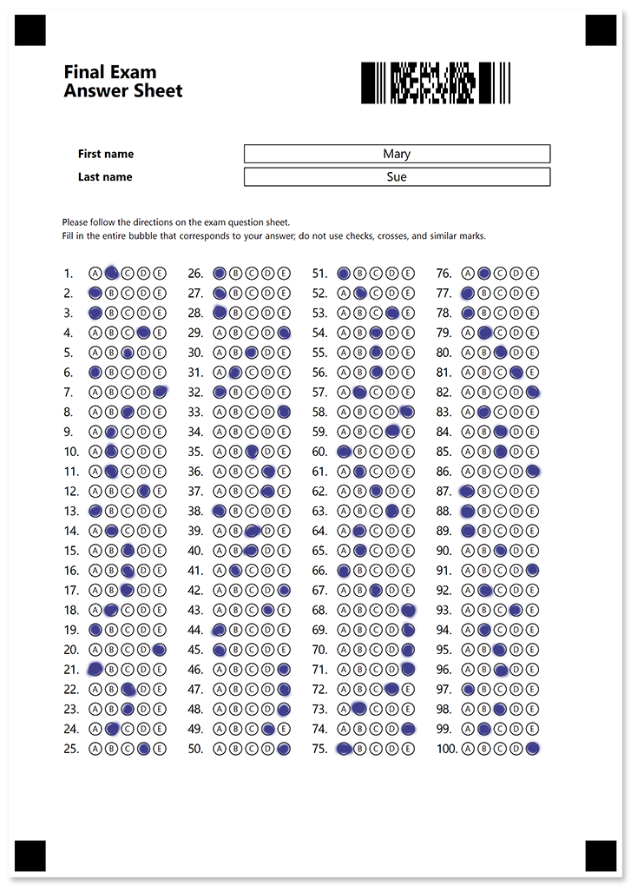

In this example, we'll show the source code for a standard 100-question answer sheet personalized with a barcode that encodes the student's name.

## Used elements

- [**AnswerSheet**](/omr/net/json-markup/answersheet/)  
  Generate a numbered matrix of bubbles arranged in multiple columns to make more efficient use of space.
- [**Barcode**](/omr/net/json-markup/elements-barcode/)  
  Add a QR-code to personalize or uniquely identify a form.
- [**EmptyLine**](/omr/net/json-markup/emptyline/)  
  Add a vertical spacing between elements.
- [**InputGroup**](/omr/net/json-markup/inputgroup/)  
  Insert unencrypted personalized information.
- [**Paragraph**](/omr/net/json-markup/paragraph/)  
  Combine texts with different formatting.
- [**Text**](/omr/net/json-markup/text/)  
  Add one or more lines of text to the form.

## Source code

```json
{
	"element_type": "Template",
	"children": [
		{
			"element_type": "Page",
			"children": [
				{
					"element_type": "Container",
					"name": "Personalized answer sheet",
					"columns_count": 2,
					"children": [
						{
							"element_type": "Block",
							"column": 1,
							"children": [
								{
									"element_type": "Paragraph",
									"children": [
										{
											"element_type": "Content",
											"name": "Final Exam",
											"font_size": 18,
											"font_style": "bold"
										},
										{
											"element_type": "Content",
											"name": "Answer Sheet",
											"font_size": 18,
											"font_style": "bold"
										}
									]
								}
							]
						},
						{
							"element_type": "Block",
							"column": 2,
							"children": [
								{
									"element_type": "Barcode",
									"name": "Student",
									"value": "Mary Sue",
									"barcode_type": "PDF417",
									"height": 200
								}
							]
						}
					]
				},
				{
					"element_type": "EmptyLine"
				},
				{
					"element_type": "InputGroup",
					"input_border": "square",
					"children": [
						{
							"element_type": "content",
							"name": "First name",
							"font_style": "bold",
							"font_size": 11
						},
						{
							"element_type": "content",
							"name": "Mary",
							"align": "center"
						}
					]
				},
				{
					"element_type": "InputGroup",
					"input_border": "square",
					"children": [
						{
							"element_type": "content",
							"name": "Last name",
							"font_style": "bold",
							"font_size": 11
						},
						{
							"element_type": "content",
							"name": "Sue",
							"align": "center"
						}
					]
				},
				{
					"element_type": "EmptyLine"
				},
				{
					"element_type": "Text",
					"name": "Please follow the directions on the exam question sheet.\r\nFill in the entire bubble that corresponds to your answer; do not use checks, crosses, and similar marks.",
					"font_size": 9
				},
				{
					"element_type": "EmptyLine"
				},
				{
					"element_type": "AnswerSheet",
					"name": "Answers",
					"columns_count": 4,
					"elements_count": 100,
					"answers_count": 5,
					"bubble_size": "small",
					"vertical_margin": 10
				}
			]
		}
	]
}
```

## Printable form



## Filled form



## Recognition results

```
Element Name,Value,
Answers1,"B"
Answers2,"A"
Answers3,"A"
Answers4,"D"
Answers5,"C"
Answers6,"A"
Answers7,"E"
Answers8,"C"
Answers9,"B"
Answers10,"B"
Answers11,"B"
Answers12,"D"
Answers13,"A"
Answers14,"B"
Answers15,"C"
Answers16,"C"
Answers17,"C"
Answers18,"B"
Answers19,"A"
Answers20,"E"
Answers21,"A"
Answers22,"C"
Answers23,"C"
Answers24,"B"
Answers25,"D"
Answers26,"A"
Answers27,"A"
Answers28,"A"
Answers29,"E"
Answers30,"C"
Answers31,"B"
Answers32,"A"
Answers33,"E"
Answers34,""
Answers35,"C"
Answers36,"D"
Answers37,"D"
Answers38,"A"
Answers39,"C"
Answers40,"C"
Answers41,"B"
Answers42,"E"
Answers43,"D"
Answers44,"A"
Answers45,"A"
Answers46,"E"
Answers47,"E"
Answers48,"E"
Answers49,"D"
Answers50,"E"
Answers51,"A"
Answers52,"B"
Answers53,"D"
Answers54,"C"
Answers55,"C"
Answers56,"C"
Answers57,"B"
Answers58,"E"
Answers59,"D"
Answers60,"A"
Answers61,"B"
Answers62,"C"
Answers63,"D"
Answers64,"B"
Answers65,"B"
Answers66,"A"
Answers67,"C"
Answers68,"E"
Answers69,"E"
Answers70,"E"
Answers71,"E"
Answers72,"D"
Answers73,"B"
Answers74,"E"
Answers75,"A"
Answers76,"B"
Answers77,"A"
Answers78,"A"
Answers79,"B"
Answers80,"C"
Answers81,"D"
Answers82,"E"
Answers83,"B"
Answers84,"C"
Answers85,"C"
Answers86,"E"
Answers87,"A"
Answers88,"A"
Answers89,"A"
Answers90,"C"
Answers91,"E"
Answers92,"B"
Answers93,"D"
Answers94,"B"
Answers95,"C"
Answers96,"C"
Answers97,"A"
Answers98,"C"
Answers99,"B"
Answers100,"E"
Student,"Mary Sue"
```
