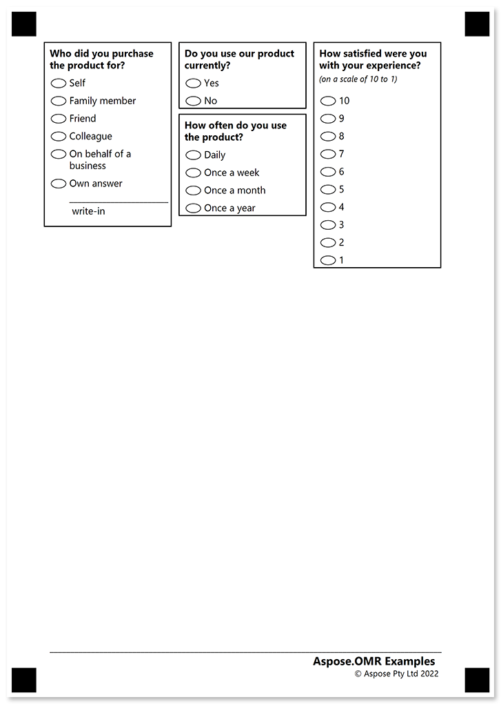
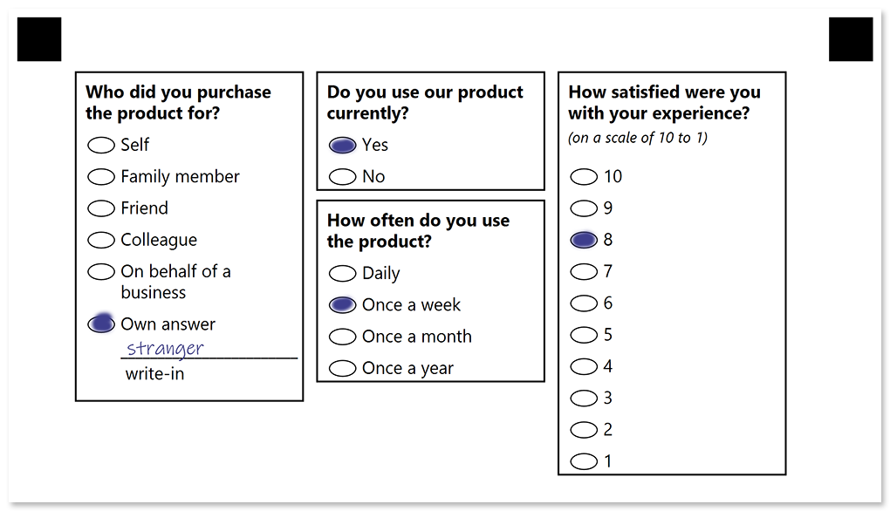

In this example, we will show the source code for a compact questionnaire with a multi-column layout, open-ended questions and a footer.

## Used elements

- [Block](/omr/net/json-markup/block/)  
  Organize other elements in container columns.
- [Container](/omr/net/json-markup/container/)  
  Break content into columns and to add a footer to the form.
- [Content](/omr/net/json-markup/content/)  
  Add a line of text to the parent element.
- [Paragraph](/omr/net/json-markup/paragraph/)  
  Combine texts with different formatting.
- [VerticalChoiceBox](/omr/net/json-markup/verticalchoicebox/)  
  Generate a vertical question block with multiple answers.
- [WriteIn](/omr/net/json-markup/writein/)  
  Provide a blank field in which the respondent can hand write some text or draw a picture.

## Source code

```json
{
	"element_type": "Template",
	"children": [
		{
			"element_type": "Page",
			"children": [
				{
					"element_type": "Container",
					"name": "Multi-column questionnaire",
					"columns_count": 3,
					"children": [
						{
							"element_type": "Block",
							"column": 1,
							"border": "square",
							"border_size": 5,
							"border_color": "black",
							"children": [
								{
									"element_type": "Content",
									"name": "Who did you purchase the product for?",
									"font_style": "bold",
									"font_size": 12
								},
								{
									"element_type": "VerticalChoiceBox",
									"name": "Who did you purchase the product for?",
									"children": [
										{
											"element_type": "Answer",
											"name": "Self",
											"children": [
												{
													"element_type": "Content",
													"name": "Self",
													"font_size": 12
												}
											]
										},
										{
											"element_type": "Answer",
											"name": "Family member",
											"children": [
												{
													"element_type": "Content",
													"name": "Family member",
													"font_size": 12
												}
											]
										},
										{
											"element_type": "Answer",
											"name": "Friend",
											"children": [
												{
													"element_type": "Content",
													"name": "Friend",
													"font_size": 12
												}
											]
										},
										{
											"element_type": "Answer",
											"name": "Colleague",
											"children": [
												{
													"element_type": "Content",
													"name": "Colleague",
													"font_size": 12
												}
											]
										},
										{
											"element_type": "Answer",
											"name": "On behalf of a business",
											"children": [
												{
													"element_type": "Content",
													"name": "On behalf of a business",
													"font_size": 12
												}
											]
										},
										{
											"element_type": "Answer",
											"name": "Own answer",
											"children": [
												{
													"element_type": "Content",
													"name": "Own answer",
													"font_size": 12
												},
												{
													"element_type": "WriteIn",
													"required": true
												}
											]
										}
									]
								}
							]
						},
						{
							"element_type": "Block",
							"column": 2,
							"border": "square",
							"border_size": 5,
							"border_color": "black",
							"children": [
								{
									"element_type": "Content",
									"name": "Do you use our product currently?",
									"font_style": "bold",
									"font_size": 12
								},
								{
									"element_type": "VerticalChoiceBox",
									"name": "Do you use our product currently?",
									"children": [
										{
											"element_type": "Answer",
											"name": "Yes",
											"children": [
												{
													"element_type": "Content",
													"name": "Yes",
													"font_size": 12
												}
											]
										},
										{
											"element_type": "Answer",
											"name": "No",
											"children": [
												{
													"element_type": "Content",
													"name": "No",
													"font_size": 12
												}
											]
										}
									]
								}
							]
						},
						{
							"element_type": "Block",
							"column": 2,
							"border": "square",
							"border_size": 5,
							"border_color": "black",
							"children": [
								{
									"element_type": "Content",
									"name": "How often do you use the product?",
									"font_style": "bold",
									"font_size": 12
								},
								{
									"element_type": "VerticalChoiceBox",
									"name": "How often do you use the product?",
									"children": [
										{
											"element_type": "Answer",
											"name": "Daily",
											"children": [
												{
													"element_type": "Content",
													"name": "Daily",
													"font_size": 12
												}
											]
										},
										{
											"element_type": "Answer",
											"name": "Once a week",
											"children": [
												{
													"element_type": "Content",
													"name": "Once a week",
													"font_size": 12
												}
											]
										},
										{
											"element_type": "Answer",
											"name": "Once a month",
											"children": [
												{
													"element_type": "Content",
													"name": "Once a month",
													"font_size": 12
												}
											]
										},
										{
											"element_type": "Answer",
											"name": "Once a year",
											"children": [
												{
													"element_type": "Content",
													"name": "Once a year",
													"font_size": 12
												}
											]
										}
									]
								}
							]
						},
						{
							"element_type": "Block",
							"column": 3,
							"border": "square",
							"border_size": 5,
							"border_color": "black",
							"children": [
								{
									"element_type": "Paragraph",
									"children": [
										{
										"element_type": "Content",
										"name": "How satisfied were you with your experience?",
										"font_style": "bold",
										"font_size": 12
										},
										{
										"element_type": "Content",
										"name": "(on a scale of 10 to 1)",
										"font_style": "italic",
										"font_size": 10
										},
									]
								},
								{
									"element_type": "VerticalChoiceBox",
									"name": "How satisfied were you with your experience?",
									"children": [
										{
											"element_type": "Answer",
											"name": "10",
											"children": [
												{
													"element_type": "Content",
													"name": "10",
													"font_size": 12
												}
											]
										},
										{
											"element_type": "Answer",
											"name": "9",
											"children": [
												{
													"element_type": "Content",
													"name": "9",
													"font_size": 12
												}
											]
										},
										{
											"element_type": "Answer",
											"name": "8",
											"children": [
												{
													"element_type": "Content",
													"name": "8",
													"font_size": 12
												}
											]
										},
										{
											"element_type": "Answer",
											"name": "7",
											"children": [
												{
													"element_type": "Content",
													"name": "7",
													"font_size": 12
												}
											]
										},
										{
											"element_type": "Answer",
											"name": "6",
											"children": [
												{
													"element_type": "Content",
													"name": "6",
													"font_size": 12
												}
											]
										},
										{
											"element_type": "Answer",
											"name": "5",
											"children": [
												{
													"element_type": "Content",
													"name": "5",
													"font_size": 12
												}
											]
										},
										{
											"element_type": "Answer",
											"name": "4",
											"children": [
												{
													"element_type": "Content",
													"name": "4",
													"font_size": 12
												}
											]
										},
										{
											"element_type": "Answer",
											"name": "3",
											"children": [
												{
													"element_type": "Content",
													"name": "3",
													"font_size": 12
												}
											]
										},
										{
											"element_type": "Answer",
											"name": "2",
											"children": [
												{
													"element_type": "Content",
													"name": "2",
													"font_size": 12
												}
											]
										},
										{
											"element_type": "Answer",
											"name": "1",
											"children": [
												{
													"element_type": "Content",
													"name": "1",
													"font_size": 12
												}
											]
										}
									]
								}
							]
						}
					]
				},
				{
					"element_type": "Container",
					"name": "Footer",
					"container_type": "footer",
					"children": [
						{
							"element_type": "block",
							"name": "Copyright",
							"children": [
								{
									"element_type": "Paragraph",
									"children": [
										{
											"element_type": "Content",
											"name": "Aspose.OMR Examples",
											"align": "right",
											"font_style": "bold",
											"font_size": 14
										},
										{
											"element_type": "Content",
											"name": "© Aspose Pty Ltd 2022",
											"align": "right",
											"font_size": 10
										}
									]
								}
							]
						}
					]
				}
			]
		}
	]
}
```

## Printable form



## Filled form



## Recognition results

```
Element Name,Value,
Do you use our product currently?,"Yes"
How often do you use the product?,"Once a week"
How satisfied were you with your experience?,"8"
Who did you purchase the product for?,"Own answer"
```

### Write-in field image


