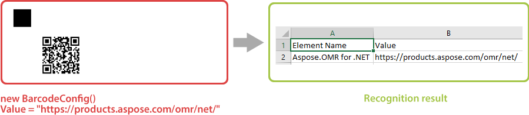
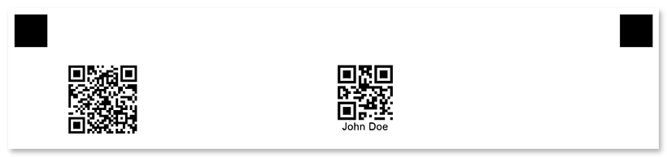

This element adds a barcode or QR code to the form based on the provided string. You can use it to link to your website or to uniquely identify a form (for example, generate personalized exam papers for each student).

Information from the barcode is decoded during recognition.



Aspose.OMT for .NET can generate and recognize a wide variety of barcodes:

- QR code
- Codabar
- Code11
- Code39Standard
- Code39Extended
- Code93Standard
- Code93Extended
- Code128
- GS1Code128
- EAN8
- EAN13
- EAN14
- SCC14
- SSCC18
- UPCA
- UPCE
- ISBN
- ISSN
- ISMN
- Standard2of5
- Interleaved2of5
- Matrix2of5
- ItalianPost25
- IATA2of5
- ITF14
- ITF6
- MSI
- VIN
- DeutschePostIdentcode
- DeutschePostLeitcode
- OPC
- PZN
- Code16K
- Pharmacode
- DataMatrix
- Aztec
- Pdf417
- MacroPdf417
- AustraliaPost
- Postnet
- Planet
- OneCode
- RM4SCC
- Mailmark
- DatabarOmniDirectional
- DatabarTruncated
- DatabarLimited
- DatabarExpanded
- SingaporePost
- GS1DataMatrix
- AustralianPosteParcel
- SwissPostParcel
- PatchCode
- DatabarExpandedStacked
- DatabarStacked
- DatabarStackedOmniDirectional
- MicroPdf417
- GS1QR
- MaxiCode
- Code32
- DataLogic2of5
- DotCode
- DutchKIX
- UpcaGs1Code128Coupon
- UpcaGs1DatabarCoupon
- CodablockF
- GS1CodablockF
- MailMark

## Declaration

This element is declared as an instance of [`BarcodeConfig`](https://reference.aspose.com/omr/net/aspose.omr.generation.config.elements/barcodeconfig/) class. Reference `Aspose.OMR.Generation.Config.Elements` and `Aspose.OMR.Generation.Config.Enums` namespaces to use `ContentConfig` types without specifying the fully qualified namespace:

```csharp
using Aspose.OMR.Generation.Config.Elements;
using Aspose.OMR.Generation.Config.Enums;
```

A string encoded as a barcode is specified in the **Value** property.

```csharp
new BarcodeConfig() {
	Value = "Encoded string"
}
```

### Required properties

Name | Type | Description
---- | ---- | -----------
**Value** | string | A string encoded as a barcode.

### Optional properties

Name | Type | Default value | Description
---- | ---- | ------------- | -----------
**Name** | `string` | _n/a_ | Used as an element's identifier in recognition results and as a reminder of the element's purpose in template source; for example, "_Web site_".<br />This text is not displayed on the form.
**BarcodeType** | Type of the barcode, a value from `Aspose.OMR.Generation.Config.Enums.BarcodeType` enumerator. | `BarcodeType.QR` | Type of the barcode.
**BarcodeQRVersion** | QR code version, a value from `Aspose.OMR.Generation.Config.Enums.QRVersion` enumerator. | `QRVersion.Auto` | QR Code version. Only applicable when `BarcodeType` is `QR`.
**DrawCodetext** | `bool` | false | Add a string from the `Value` property below the barcode image.
**Align** | [`AlignmentEnum`](https://reference.aspose.com/omr/net/aspose.omr.generation.config.enums/alignmentenum/) | `AlignmentEnum.Center` | Horizontal alignment of the barcode image.
**Height** | `int` | _Automatic_ | Barcode height, in pixels. The width is adjusted automatically.
**X** | `int` | _n/a_ | Set the absolute position of the barcode relative to the left edge of the page.<br />Overrides the value of `Align` property.
**Y** | `int` | _n/a_ | Set the absolute position of the barcode relative to the top edge of the page.

## Allowed child elements

None.

## Example

```csharp
TemplateConfig templateConfig = new TemplateConfig() {
	Children=new List<BaseConfig>() {
		new PageConfig() {
			Children = new List<BaseConfig>() {
				new ContainerConfig() {
					Name = "Example",
					ColumnsCount = 2,
					Children= new List<BaseConfig>() {
						new BlockConfig() {
							Column = 1,
							Children = new List<BaseConfig>() {
								new BarcodeConfig() {
									Value = Guid.NewGuid().ToString(),
									Align = AlignmentEnum.Left,
									Height = 300
								}
							}
						},
						new BlockConfig() {
							Column = 2,
							Children = new List<BaseConfig>() {
								new BarcodeConfig() {
									Value = "John Doe",
									Align = AlignmentEnum.Left,
									DrawCodetext = true,
									Height = 300
								}
							}
						}
					}
				}
			}
		}
	}
};
```


