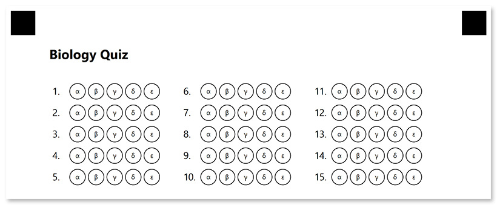

This element generates a numbered matrix of bubbles representing answers to a list of questions. Bubbles can be arranged in multiple columns to make more efficient use of space.

**AnswerSheetConfig** is best suited for exam papers where you want to fit the maximum number of answers on a single page.

## Declaration

**AnswerSheetConfig** element is declared as an instance of [`AnswerSheetConfig`](https://reference.aspose.com/omr/net/aspose.omr.generation.config.elements/answersheetconfig/) class. Reference `Aspose.OMR.Generation.Config.Elements` namespace to use `AnswerSheetConfig` types without specifying the fully qualified namespace:

```csharp
using Aspose.OMR.Generation.Config.Elements;
```

The total number of exam questions that the answer sheet corresponds to is specified in the **ElementsCount** property.

```csharp
new AnswerSheetConfig() {
	ElementsCount = 100
}
```

### Required properties

Name | Type | Description
---- | ---- | -----------
**ElementsCount** | `int` | The total number of exam questions that the answer sheet corresponds to.

{}

If set the value of **ElementsCount** property to `0`, **AnswerSheetConfig** element will not be rendered.

{}

### Optional properties

Name | Type | Default value | Description
---- | ---- | ------------- | -----------
**Name** | `string` | _n/a_ | Used as an element's identifier in recognition results and as a reminder of the element's purpose in template source; for example, "_Biology Quiz_".<br />This text is not displayed on the form.
**ColumnsCount** | `int` | 4 | The number of columns to arrange lines into. Use multiple columns to make the answer sheet more compact.
**AanswersCount** | `int` | 4 | The total number of bubbles (answers) for each question.<br />You can only set the same number of answers for all questions. If the number of answers is different for each section of the exam, use multiple **AnswerSheetConfig** elements.
**StartId** | `int` | _Automatic_ | The number of the first line used as a base for further numbering.<br />If omitted, the number will be calculated based on the numbering of previous elements.
**VerticalMargin** | `int` | 0 | Vertical spacing between lines, in pixels.
**BubbleSize** | [`BubbleSize`](https://reference.aspose.com/omr/net/aspose.omr.generation/bubblesize/) | `BubbleSize.Normal` | Size of bubbles.
**BubbleType** | [`BubbleType`](https://reference.aspose.com/omr/net/aspose.omr.generation/bubbletype/) | `BubbleType.Round` | Bubble style.
**AnswersValues** | `string[]` | _["A" ... "Z"]_ | Characters to be drawn inside bubbles. The total number of array items must match the value of the **AnswersCount** property.
**Column** | `int` | 1 | The number of the column where the **AnswerSheetConfig** element will be placed. Only applicable if **AnswerSheetConfig** is placed in a multi-column [**ContainerConfig**](/omr/net/programmatic-forms/containerconfig/) element.

## Allowed child elements

None.

## Example

```csharp
TemplateConfig templateConfig = new TemplateConfig() {
	Children=new List<BaseConfig>() {
		new PageConfig() {
			Children = new List<BaseConfig>() {
				new TextConfig() {
					Name = "Biology Quiz",
					FontSize = 16,
					FontStyle = FontStyle.Bold
				},
				new EmptyLineConfig(),
				new AnswerSheetConfig() {
					Name = "Plants",
					ElementsCount = 15,
					ColumnsCount = 3,
					AnswersCount = 5,
					BubbleSize = BubbleSize.Large,
					VerticalMargin = 10,
					AnswersValues = new string[] { "α", "β", "γ", "δ", "ε" }
				}
			}
		}
	}
};
```


