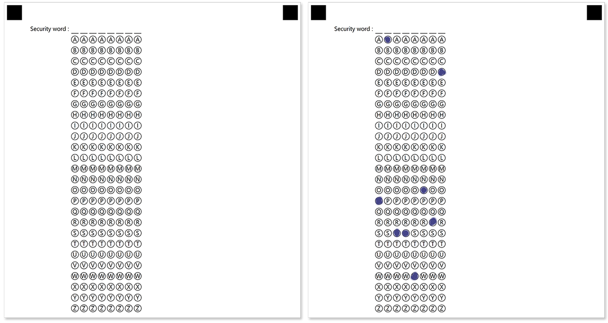
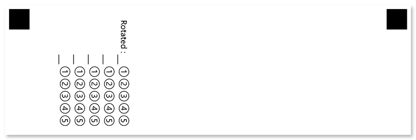

This element works similarly to the [GridConfig](/omr/net/programmatic-forms/gridconfig/) element, but offers much more flexibility and customization.

## Declaration

**CompositeGridConfig** element is declared as an instance of [`CompositeGridConfig`](https://reference.aspose.com/omr/net/aspose.omr.generation.config.elements/compositegridconfig/) class. Reference `Aspose.OMR.Generation.Config.Elements` and `Aspose.OMR.Generation.Config.Enums` namespaces to use `CompositeGridConfig` types without specifying the fully qualified namespace:

```csharp
using Aspose.OMR.Generation.Config.Elements;
using Aspose.OMR.Generation.Config.Enums;
```

The maximum number of digits in the combined response is specified in the **ColumnsCount** property.

A set of characters to be drawn inside bubbles is specified in the **Values** array.

```csharp
new CompositeGridConfig() {
	ColumnsCount = 3,
	Values = new List<string>() {"U", "S", "A"}
}
```

### Required properties

Name | Type | Description
---- | ---- | -----------
**ColumnsCount** | `int` | The maximum number of symbols in the combined response. Each symbol is represented as a line or column of bubbles, depending on the element's **GridOrientation** property.
**Values** | `List<string>` | Characters to be drawn inside bubbles.

### Optional properties

Name | Type | Default value | Description
---- | ---- | ------------- | -----------
**Name** | `string` | _n/a_ | Used as an element's identifier in recognition results and is displayed as a label on the form.
**ExtraRow** | `string[][]` | _n/a_ | Each array provided in this property adds a custom line / column of bubbles at the start of the grid. Characters drawn inside these bubbles may differ from those provided in **Values** property.<br />A set of characters that will be displayed inside the bubbles of a particular line / column is defined as an array of strings. **The length of the array cannot be less than the value of the **ColumnsCount** property.** To hide certain bubbles, provide an empty string (`""`) at their positions.
**GridAlignment** | [`AlignmentEnum`](https://reference.aspose.com/omr/net/aspose.omr.generation.config.enums/alignmentenum/) | `AlignmentEnum.Left` | Horizontal grid alignment.
**GridOrientation** | [`Orientation`](https://reference.aspose.com/omr/net/aspose.omr.generation/orientation/) | `Orientation.Horizontal` | Element's orientation:<ul><li>`Orientation.Horizontal` - each digit is represented as a column of bubbles;</li><li>`Orientation.Vertical` - each digit is represented as a row of bubbles.</li></ul>
**RotationAngle** | `int` | 0 | Rotate the element by the given degree. The following values are supported: `90`, `180`, `270`.
**HeaderType** | [`GridHeaderTypeEnum`](https://reference.aspose.com/omr/net/aspose.omr.generation.config.enums/gridheadertypeenum/) | `GridHeaderTypeEnum.Underline` | The type of the box to be displayed in front of each column / row. This box can be used for hand-writing the answer in addition to marking bubbles.<ul><li>`GridHeaderTypeEnum.Underline` - draw a horizontal line.</li><li>`GridHeaderTypeEnum.Square` - draw a box.</li></ul>
**HeaderBorderSize** | `int` | 3 | Border width of the box to be displayed in front of each column / row.
**HeaderBorderColor** | [`Color`](https://reference.aspose.com/omr/net/aspose.omr.generation/color/) | `Color.Black` | Border color of the box to be displayed in front of each column / row.
**VerticalMargin** | `int` | 0 | Vertical spacing between the element's lines, in pixels.
**BubbleSize** | [`BubbleSize`](https://reference.aspose.com/omr/net/aspose.omr.generation/bubblesize/) | `BubbleSize.Normal` | Size of bubbles.
**BubbleType** | [`BubbleType`](https://reference.aspose.com/omr/net/aspose.omr.generation/bubbletype/) | `BubbleType.Round` | Bubble style.
**XPosition** | `int` | _n/a_ | Set the absolute position of the **GridConfig** element relative to the left edge of the page.<br />Overrides the value of **GridAlignment** property.
**YPosition** | `int` | _n/a_ | Set the absolute position of the **GridConfig** element relative to the top edge of the page.
**Column** | `int` | 1 | The number of the column where the **GridConfig** element will be placed. Only applicable if **GridConfig** is placed in a multi-column [**ContainerConfig**](/omr/net/programmatic-forms/containerconfig/) element.
**DisplayHint** | `bool` | `true` | Show (`true`) or hide (`false`) the label above the element.

## Allowed child elements

None.

## Recognition behavior

Numbers from each marked bubble are merged into a single number.

If the respondent marks more than one bubble per row / column (depending on the `GridOrientation` attribute), the affected **CompositeGridConfig** element will not be recognized and an error will be written to the recognition results.

## Examples

Check out the code examples to see how **CompositeGridConfig** elements can be used.

### Bank security word

```csharp
TemplateConfig templateConfig = new TemplateConfig() {
	Children=new List<BaseConfig>() {
		new PageConfig() {
			Children = new List<BaseConfig>() {
				new CompositeGridConfig() {
					Name = "Security word",
					ColumnsCount = 8,
					Values = new List<string>() { "A", "B", "C", "D", "E", "F", "G", "H", "I", "J", "K", "L", "M", "N", "O", "P", "Q", "R", "S", "T", "U", "V", "W", "X", "Y", "Z" }
				}
			}
		}
	}
};
```



#### Recognition result

`PASSWORD`

### Formula

```csharp
TemplateConfig templateConfig = new TemplateConfig() {
	Children=new List<BaseConfig>() {
		new PageConfig() {
			Children = new List<BaseConfig>() {
				new CompositeGridConfig() {
					Name = "Formula",
					ColumnsCount = 5,
					Values = new List<string>() { "X", "Y" },
					ExtraRow = new string[][] {
						new string[] { "1", "2", "3", "4", "5" },
						new string[] { "", "+", "+", "+", "" },
						new string[] { "", "=", "=", "=", "" }
					}
				}
			}
		}
	}
};
```


#### Recognition result

`X+Y=5`

### Rotated

```csharp
TemplateConfig templateConfig = new TemplateConfig() {
	Children=new List<BaseConfig>() {
		new PageConfig() {
			Children = new List<BaseConfig>() {
				new CompositeGridConfig() {
					Name = "Rotated",
					ColumnsCount = 5,
					Values = new List<string>() { "1", "2", "3", "4", "5" },
					GridOrientation = Orientation.Vertical,
					RotationAngle = 90
				}
			}
		}
	}
};
```


