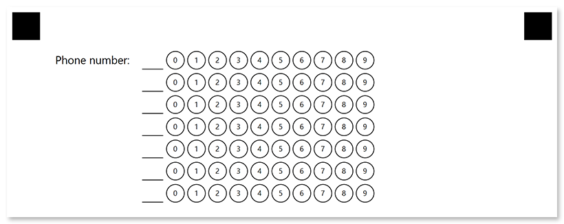

This element generates a block consisting of numbered bubbles. The block is recognized as a whole, resulting in all marked bubbles forming a single answer.

**GridConfig** element is an OMR-specific approach to collecting simple numeric data such as a TIN or phone number, or getting an answer to a math test without using optical character recognition (OCR).


## Declaration

**GridConfig** element is declared as an instance of [`GridConfig`](https://reference.aspose.com/omr/net/aspose.omr.generation.config.elements/gridconfig/) class. Reference `Aspose.OMR.Generation.Config.Elements` and `Aspose.OMR.Generation.Config.Enums` namespaces to use `GridConfig` types without specifying the fully qualified namespace:

```csharp
using Aspose.OMR.Generation.Config.Elements;
using Aspose.OMR.Generation.Config.Enums;
```

The maximum number of digits in the combined response is specified in the **SectionsCount** property.

The number of bubbles for each digit is specified in the **OptionsCount** property.

```csharp
new GridConfig() {
	SectionsCount = 7,
	OptionsCount = 10
}
```

### Required properties

Name | Type | Description
---- | ---- | -----------
**SectionsCount** | `int` | The maximum number of digits in the combined response. Each digit is represented as a line or column of bubbles, depending on the element's **GridOrientation** property.
**OptionsCount** | `int` | The number of bubbles for each digit.

### Optional properties

Name | Type | Default value | Description
---- | ---- | ------------- | -----------
**Name** | `string` | _n/a_ | Used as an element's identifier in recognition results and is displayed as a label on the form.
**GridAlignment** | [`AlignmentEnum`](https://reference.aspose.com/omr/net/aspose.omr.generation.config.enums/alignmentenum/) | `AlignmentEnum.Left` | Horizontal grid alignment.
**GridOrientation** | [`Orientation`](https://reference.aspose.com/omr/net/aspose.omr.generation/orientation/) | `Orientation.Horizontal` | Element's orientation:<ul><li>`Orientation.Horizontal` - each digit is represented as a column of bubbles;</li><li>`Orientation.Vertical` - each digit is represented as a row of bubbles.</li></ul>
**HeaderType** | [`GridHeaderTypeEnum`](https://reference.aspose.com/omr/net/aspose.omr.generation.config.enums/gridheadertypeenum/) | `GridHeaderTypeEnum.Underline` | The type of the box to be displayed in front of each column / row. This box can be used for hand-writing the answer in addition to marking bubbles.<ul><li>`GridHeaderTypeEnum.Underline` - draw a horizontal line.</li><li>`GridHeaderTypeEnum.Square` - draw a box.</li></ul>
**HeaderBorderSize** | `int` | 3 | Border width of the box to be displayed in front of each column / row.
**HeaderBorderColor** | [`Color`](https://reference.aspose.com/omr/net/aspose.omr.generation/color/) | `Color.Black` | Border color of the box to be displayed in front of each column / row.
**VerticalMargin** | `int` | 0 | Vertical spacing between the element's lines, in pixels.
**BubbleSize** | [`BubbleSize`](https://reference.aspose.com/omr/net/aspose.omr.generation/bubblesize/) | `BubbleSize.Normal` | Size of bubbles.
**BubbleType** | [`BubbleType`](https://reference.aspose.com/omr/net/aspose.omr.generation/bubbletype/) | `BubbleType.Round` | Bubble style.
**XPosition** | `int` | _n/a_ | Set the absolute position of the **GridConfig** element relative to the left edge of the page.<br />Overrides the value of **GridAlignment** property.
**YPosition** | `int` | _n/a_ | Set the absolute position of the **GridConfig** element relative to the top edge of the page.
**Column** | `int` | 1 | The number of the column where the **GridConfig** element will be placed. Only applicable if **GridConfig** is placed in a multi-column [**ContainerConfig**](/omr/net/programmatic-forms/containerconfig/) element.

## Recognition behavior

Numbers from each marked bubble are merged into a single number.

If several bubbles are marked in one row / column, they are also merged into a number with multiple digits. For example, if the respondent marks bubbles "_3_" and "_7_" in one row and "_5_" in another, the recognition result for the **grid** element will be "_375_".

If this behavior is undesirable, instruct respondents to select one bubble per row / column (depending on the `orientation` property) or use [**CompositeGrid**](/omr/json-markup/compositegrid/) element.

## Allowed child elements

None.

## Examples

Check out the code examples to see how **GridConfig** elements can be used.

### Horizontal grid

```csharp
TemplateConfig templateConfig = new TemplateConfig() {
	Children=new List<BaseConfig>() {
		new PageConfig() {
			Children = new List<BaseConfig>() {
				new GridConfig() {
					Name = "Convert decimal number 123 to octal",
					SectionsCount = 4,
					OptionsCount = 8,
					BubbleSize = BubbleSize.Large,
					HeaderType = GridHeaderTypeEnum.Square
				}
			}
		}
	}
};
```


### Vertical grid

```csharp
TemplateConfig templateConfig = new TemplateConfig() {
	Children=new List<BaseConfig>() {
		new PageConfig() {
			Children = new List<BaseConfig>() {
				new GridConfig() {
					Name = "Phone number",
					SectionsCount = 7,
					OptionsCount = 10,
					BubbleSize = BubbleSize.Large,
					GridOrientation = Orientation.Vertical
				}
			}
		}
	}
};
```


