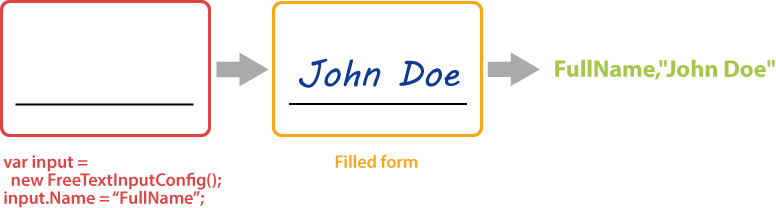

{} 
**FreeTextInputConfig** element requires a handwritten recognition plugin to be installed. Otherwise, you will get an exception when creating the instance of the class.
{}

This element adds a handwritten text placeholder to the form where the respondent can write a line of text in a free manner.

Handwritten line is recognized automatically without the need for an external OCR library.



**FreeTextInputConfig** element can be used to request a full name, address, an answer answer to open-ended question and other textual information in free form.

## Declaration

**FreeTextInputConfig** element is declared as an instance of `Aspose.OMR.Handwriting.Generation.Config.Elements.FreeTextInputConfig` class:

```csharp
var input = new Aspose.OMR.Handwriting.Generation.Config.Elements.FreeTextInputConfig();
```

### Optional properties

Name | Type | Description
---- | ---- | -----------
`Name` | `string` | Used as a reminder of the element’s purpose and returned in the recognition results; for example, `"FullName"`.<br />You can use the same value for multiple elements. This text is not displayed on the form.
`LineHeight` | `int` | The height of the input element, in pixels.

## Allowed child elements

None.

## Example

```
var input = new FreeTextInputConfig();
input.Name = "FullName";
```
