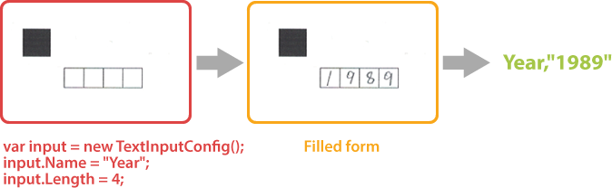
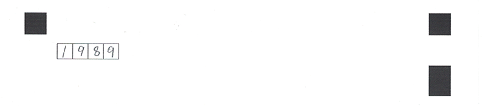

{} 
**TextInputConfig** element requires a handwritten recognition plugin to be installed. Otherwise, you will get an exception when creating the instance of the class.
{}

This element adds a handwritten text placeholder to the form. The placeholder consists of several boxes in which the respondent can write letters or numbers, one character in each box.

Handwritten characters written inside boxers are recognized automatically without the need for an external OCR library.



**TextInputConfig** element can be used to request name, phone number, address and other textual information in free form or to offer a respondent answer an open-ended question.

## Declaration

**TextInputConfig** element is declared as an instance of `TextInputConfig` class:

```csharp
var input = new TextInputConfig();
```

### Required properties

Name | Type | Description
---- | ---- | -----------
`Length` | `int` | The number of character input placeholders.

### Optional properties

Name | Type | Default value | Description
---- | ---- | ------------- | -----------
`Name` | `string` | _n/a_ | Used as a reminder of the element’s purpose and returned in the recognition results; for example, `Year,"2024"`.<br />You can use the same value for multiple elements. This text is not displayed on the form.
`InputType` | `Aspose.OMR.Handwriting.Generation.Config.Enums.InputType` | `InputType.Numbers` | The type of allowed characters:<ul><li>`InputType.Numbers`</li><li>`InputType.Letters`</li></ul>
`CellSize` | `Aspose.OMR.Handwriting.Generation.Config.Enums.CellSize` | `CellSize.Normal` | The size of each placeholder:<ul><li>`CellSize.Normal`</li><li>`CellSize.Large`</li><li>`CellSize.Extralarge`</li></ul>

## Allowed child elements

None.

## Example

```
var input = new TextInputConfig();
input.Name = "Year";
input.Length = 4;
```


