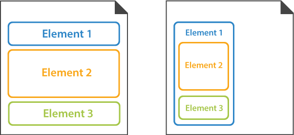

Layout elements are used to arrange other elements and define the appearance and design of the OMR form. 

Layout elements themselves are not recognized by Aspose.OMR; however, they may contain elements that are recognized.

## Default arrangement of elements

All form elements are rendered one below the other and occupy the entire width of the **page** or the **parent element**.

## Layout elements

Each element is defined as an instance of the corresponding class.

- [PageConfig](/omr/net/programmatic-forms/pageconfig/)  
  This element is used to break large forms into several pages that are recognized as a single document.
- [ContainerConfig](/omr/net/programmatic-forms/containerconfig/)  
  This element is used to break content into columns and to add a footer to the form.
- [BlockConfig](/omr/net/programmatic-forms/blockconfig/)  
  This element is used to organize other elements in container columns.
- [PositionedBlockConfig](/omr/net/programmatic-forms/positionedblockconfig/)  
  This element is used to place any number of other form elements at the specific coordinates on the page.
- [TextConfig](/omr/net/programmatic-forms/textconfig/)  
  This element is used to add one or more lines of text to the form. Can only be used at the **top level** of the form hierarchy.
- [ContentConfig](/omr/net/programmatic-forms/contentconfig/)  
  This element is used to add a line of text to the parent element. Can only be used inside **other elements**.
- [EmptyLineConfig](/omr/net/programmatic-forms/emptylineconfig/)  
  This element is used to add vertical spacing between elements.
- [ImageConfig](/omr/net/programmatic-forms/imageconfig/)  
  This element is used to add a picture.
- [ParagraphConfig](/omr/net/programmatic-forms/paragraphconfig/)  
  This element is used to combine text and images.
- [InputGroup](/omr/net/programmatic-forms/inputgroup/)  
  This element is used to insert personalized information, such as the respondent's name or email, into the form.
