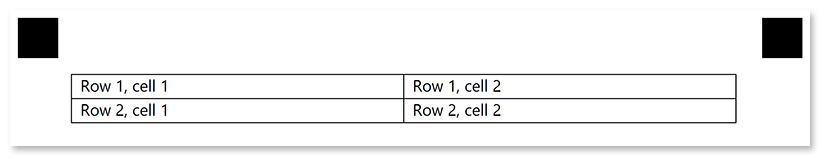

This element is used to organize content within [**containers**](/omr/net/programmatic-forms/containerconfig/). **BlockConfig** elements can only be nested within [**ContainerConfig**](/omr/net/programmatic-forms/containerconfig/) elements.

**BlockConfig** elements may have no visual representation or have a border around them.


## Declaration

**BlockConfig** element is declared as an instance of [`BlockConfig`](https://reference.aspose.com/omr/net/aspose.omr.generation.config.elements.parents/blockconfig/) class. Reference `Aspose.OMR.Generation.Config.Elements.Parents` and `Aspose.OMR.Generation.Config.Enums` namespaces to use `BlockConfig` types without specifying the fully qualified namespace:

```csharp
using Aspose.OMR.Generation.Config.Elements.Parents;
using Aspose.OMR.Generation.Config.Enums;
```

Elements displayed inside blocks are provided in the `Children` list.

```csharp
new BlockConfig() {
	Children= new List<BaseConfig>() {
		/*
		 * Put child elements here
		 */
	}
}
```

### Required properties

Name | Type | Description
---- | ---- | -----------
**Children** | `List<BaseConfig>` | [Child elements]().

### Optional properties

Name | Type | Default value | Description
---- | ---- | ------------- | -----------
**Name** | `string` | _n/a_ | Used as a reminder of the element's purpose; for example, "_Column 1_". You can use the same value for multiple blocks.<br />This text is not displayed on the form.
**Column** | `int` | 1 | The number of the column in which the **BlockConfig** element will be placed.<br />This number must not exceed the number of columns of the parent [**Container**](/omr/net/programmatic-forms/container/) element.
**BorderType** | [`BorderType`](https://reference.aspose.com/omr/net/aspose.omr.generation.config.enums/bordertype/) | `BorderType.None` | Whether to draw a border around the **BlockConfig** element.<ul><li>`BorderType.None` - no border.</li><li>`BorderType.Square` - draw a rectangular border.</li><li>`BorderType.Rounded` - draw a rectangular border with rounded corners.</li></ul>
**BorderSize** | `int` | 3 | Width of the **BlockConfig** borders.
**BorderColor** | [`Color`](https://reference.aspose.com/omr/net/aspose.omr.generation/color/) | `Color.Black` | Color of the **BlockConfig** borders.
**IsClipped** | `bool` | false | If set to `true`, the content of the **BlockConfig** element is stored to [Images](https://reference.aspose.com/omr/net/aspose.omr.model/recognitionresult/properties/images) collection during recognition, similar to the [**WriteInConfig**](/omr/net/programmatic-forms/writeinconfig/) element. The image can be can be passed to optical character recognition library, such as [Aspose.OCR](https://products.aspose.app/ocr), or saved.<br />If the **BlockConfig** contains OMR elements, they will be recognized even if this property is set to `true`.

## Allowed child elements

All, except for another **BlockConfig**.

## **Examples**

Check out the code examples to see how **BlockConfig** elements can be used and combined with each other.

### Two-column layout

```csharp
TemplateConfig templateConfig = new TemplateConfig() {
	Children=new List<BaseConfig>() {
		new PageConfig() {
			Children = new List<BaseConfig>() {
				new ContainerConfig() {
					Name = "Two-column layout",
					ColumnsCount = 2,
					Children= new List<BaseConfig>() {
						new BlockConfig() {
							Column = 1,
							Children = new List<BaseConfig>() {
								new ContentConfig() {
									Name = "First column, first block."
								}
							}
						},
						new BlockConfig() {
							Column = 1,
							BorderType = BorderType.Square,
							Children = new List<BaseConfig>() {
								new ContentConfig() {
									Name = "First column, second block."
								}
							}
						},
						new BlockConfig() {
							Column = 2,
							BorderType = BorderType.Square,
							BorderSize = 10,
							BorderColor = Color.Blue,
							Children = new List<BaseConfig>() {
								new ContentConfig() {
									Name = "Second column, first block."
								}
							}
						}
					}
				}
			}
		}
	}
};
```


### Fake table layout

```csharp
TemplateConfig templateConfig = new TemplateConfig() {
	Children=new List<BaseConfig>() {
		new PageConfig() {
			Children = new List<BaseConfig>() {
				new ContainerConfig() {
					Name = "Fake table layout",
					ColumnsCount = 2,
					BlockRightMargin = 0,
					BlockBottomMargin = 0,
					BlockTopPadding = 0,
					Children= new List<BaseConfig>() {
						new BlockConfig() {
							Column = 1,
							BorderType = BorderType.Square,
							Children = new List<BaseConfig>() {
								new ContentConfig() {
									Name = "Row 1, cell 1"
								}
							}
						},
						new BlockConfig() {
							Column = 1,
							BorderType = BorderType.Square,
							Children = new List<BaseConfig>() {
								new ContentConfig() {
									Name = "Row 1, cell 2"
								}
							}
						},
						new BlockConfig() {
							Column = 2,
							BorderType = BorderType.Square,
							Children = new List<BaseConfig>() {
								new ContentConfig() {
									Name = "Row 2, cell 1"
								}
							}
						},
						new BlockConfig() {
							Column = 2,
							BorderType = BorderType.Square,
							Children = new List<BaseConfig>() {
								new ContentConfig() {
									Name = "Row 2, cell 2"
								}
							}
						}
					}
				}
			}
		}
	}
};
```


