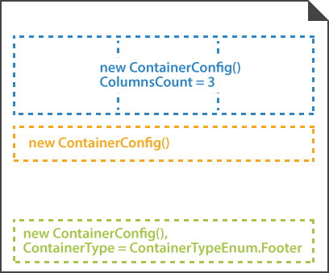

This element is used to break content into columns and to add a footer to the form. Nested containers must be placed inside [**BlockConfig**](/omr/net/programmatic-forms/blockconfig/) elements.

**ContainerConfig** element does not have a visual representation and is only used to arrange other elements.



## Declaration

**ContainerConfig** element is declared as an instance of [`ContainerConfig`](https://reference.aspose.com/omr/net/aspose.omr.generation.config.elements.parents/containerconfig/) class. Reference `Aspose.OMR.Generation.Config.Elements.Parents` and `Aspose.OMR.Generation.Config.Enums` namespaces to use `ContainerConfig` types without specifying the fully qualified namespace:

```csharp
using Aspose.OMR.Generation.Config.Elements.Parents;
using Aspose.OMR.Generation.Config.Enums;
```

Elements displayed inside the **ContainerConfig**'s columns are provided in the `Children` list.

```csharp
new ContainerConfig() {
	Children= new List<BaseConfig>() {
		/*
		 * Put child elements here
		 */
	}
}
```

### Required properties

Name | Type | Description
---- | ---- | -----------
**Children** | `List<BaseConfig>` | [Child elements]().

### Optional properties

Name | Type | Default value | Description
---- | ---- | ------------- | -----------
**Name** | `string` | _n/a_ | Used as a reminder of the container's purpose; for example, "_General Chemistry_". You can use the same value for multiple containers.<br />This text is not displayed on the form.
**ColumnsCount** | `int` |	1 | The number of columns in the container (1 or more). All columns have the same width regardless of their content.
**Proportions** | `List<int>` | _n/a_ | Overrides the number of columns and sets their relative proportions.<br />The number of columns is determined by the number of list items. Column widths (in percent) are provided as list items. The grand total of all column widths must not exceed 100%.
**ContainerType** | [`ContainerTypeEnum`](https://reference.aspose.com/omr/net/aspose.omr.generation.config.enums/containertypeenum/) | `ContainerTypeEnum.Normal` | Determines whether the container is displayed inside the body of the form (`ContainerTypeEnum.Normal`) or as a footer at the bottom of the page (`ContainerTypeEnum.Footer`).<br />**Each [page](/omr/net/programmatic-forms/pageconfig/) can only have one footer!**
**BlockRightMargin** | `int` | 40 | Right margin (in pixels) of container's columns.
**BlockBottomMargin** | `int` | 20 | Bottom margin (in pixels) of nested [**BlockConfig**](/omr/net/programmatic-forms/blockconfig/) elements.
**BlockTopPadding** | `int` | 20 | Top padding (in pixels) of nested [**BlockConfig**](/omr/net/programmatic-forms/blockconfig/) elements.
**SyncBlockHeight** | `bool` | `false` | If set to `true`, all blocks in the container will have the same height, regardless of their content.

## Adding page footer

To add a footer that will appear at the bottom of the page:

1. Create a **ContainerConfig** object.
2. Set the `ContainerType` property of the object to `ContainerTypeEnum.Footer`.
3. Provide the content of the footer in the `Children` property.

## Allowed child elements

- [**BlockConfig**](/omr/net/programmatic-forms/blockconfig/)
- [**AnswerSheetConfig**](/omr/net/programmatic-forms/answersheetconfig/)
- [**GridConfig**](/omr/net/programmatic-forms/gridconfig/)
- [**CompositeGridConfig**](/omr/net/programmatic-forms/compositegridconfig/)

## **Examples**

Check out the code examples to see how **ContainerConfig** elements can be used and combined with each other.

### Three-column layout

```csharp
TemplateConfig templateConfig = new TemplateConfig() {
	Children=new List<BaseConfig>() {
		new PageConfig() {
			Children = new List<BaseConfig>() {
				new ContainerConfig() {
					Name = "Three-column layout",
					ColumnsCount = 3,
					Children= new List<BaseConfig>() {
						new BlockConfig() {
							Column = 1,
							Children = new List<BaseConfig>() {
								new ContentConfig() {
									Name = "First column"
								}
							}
						},
						new BlockConfig() {
							Column = 2,
							Children = new List<BaseConfig>() {
								new ContentConfig() {
									Name = "Second column"
								}
							}
						},
						new BlockConfig() {
							Column = 3,
							Children = new List<BaseConfig>() {
								new ContentConfig() {
									Name = "Third column"
								}
							}
						}
					}
				}
			}
		}
	}
};
```


### Page footer

```csharp
TemplateConfig templateConfig = new TemplateConfig() {
	Children=new List<BaseConfig>() {
		new PageConfig() {
			Children = new List<BaseConfig>() {
				new ContainerConfig() {
					ContainerType = ContainerTypeEnum.Footer,
					Children= new List<BaseConfig>() {
						new BlockConfig() {
							Children = new List<BaseConfig>() {
								new ParagraphConfig() {
									Children= new List<BaseConfig>() {
										new ContentConfig() {
											Name = "Aspose.OMR Examples",
											Alignment = AlignmentEnum.Right,
											FontStyle = FontStyle.Bold,
											FontSize = 14
										},
										new ContentConfig() {
											Name = "© Aspose Pty Ltd 2022",
											Alignment = AlignmentEnum.Right,
											FontSize = 10
										}
									}
								}
							}
						}
					}
				}
			}
		}
	}
};
```


