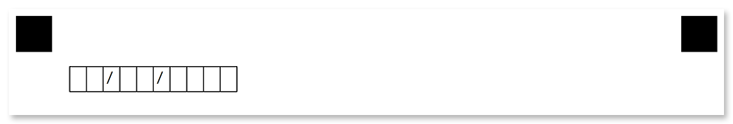

This element is used to add a single line of text to the parent element. **ContentConfig** elements can only be nested _within other elements_ and cannot be used at the top level of the form hierarchy.

## Declaration

**ContentConfig** element is declared as an instance of [`ContentConfig`](https://apireference.aspose.com/omr/net/aspose.omr.generation.config.elements/contentconfig/) class. Reference `Aspose.OMR.Generation.Config.Elements` and `Aspose.OMR.Generation.Config.Enums` namespaces to use `ContentConfig` types without specifying the fully qualified namespace:

```csharp
using Aspose.OMR.Generation.Config.Elements;
using Aspose.OMR.Generation.Config.Enums;
```

The text displayed in the form is specified in the `Name` property.

```csharp
new ContentConfig() {
	Name = "Text goes here"
}
```

### Required properties

Name | Type | Description
---- | ---- | -----------
**Name** | `string` | A line of text displayed in the form.

### Optional properties

Name | Type | Default value | Description
---- | ---- | ------------- | -----------
**FontFamily** | `string` | "Segoe UI" | The font family for the text.
**FontStyle** | [`FontStyle`](https://apireference.aspose.com/omr/net/aspose.omr.generation/fontstyle/) | `FontStyle.Regular` | The font style for a text.<br />Several font styles can be combined with `\|` operator, for example `FontStyle.Bold \| FontStyle.Italic`.
**FontSize** | `int` | 12 | Font size for the text.
**TextAlignment** | [`AlignmentEnum`](https://apireference.aspose.com/omr/net/aspose.omr.generation.config.enums/alignmentenum/) | `AlignmentEnum.Left` | Horizontal text alignment.
**ContentType** | [`ContentType`](https://apireference.aspose.com/omr/net/aspose.omr.generation.config.enums/contenttype/) | `ContentType.Normal` | Set the value of this property to `ContentType.Cells` to draw a border around every character, including spaces.

## Allowed child elements

None.

## **Examples**

Check out the code examples to see how **ContentConfig** elements can be used.

### Text inside blocks

```csharp
TemplateConfig templateConfig = new TemplateConfig() {
	Children=new List<BaseConfig>() {
		new PageConfig() {
			Children = new List<BaseConfig>() {
				new ContainerConfig() {
					Name = "Example",
					ColumnsCount = 2,
					Children= new List<BaseConfig>() {
						new BlockConfig() {
							Column = 1,
							Children = new List<BaseConfig>() {
								new ContentConfig() {
									Name = "Lorem ipsum dolor sit amet, consectetur adipiscing elit, sed do eiusmod tempor incididunt ut labore et dolore magna aliqua."
								}
							}
						},
						new BlockConfig() {
							Column = 2,
							Children = new List<BaseConfig>() {
								new ContentConfig() {
									Name = "Second column",
									FontStyle = FontStyle.Bold
								}
							}
						}
					}
				}
			}
		}
	}
};
```


### Date input box with content_type

```csharp
TemplateConfig templateConfig = new TemplateConfig() {
	Children=new List<BaseConfig>() {
		new PageConfig() {
			Children = new List<BaseConfig>() {
				new ContainerConfig() {
					Name = "Example",
					Children= new List<BaseConfig>() {
						new BlockConfig() {
							Children = new List<BaseConfig>() {
								new ContentConfig() {
									Name = "  /  /    ",
									ContentType = ContentType.Cells
								}
							}
						}
					}
				}
			}
		}
	}
};
```


