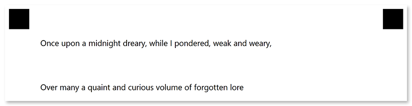

This element is used to add vertical spacing equal to _one line of text_ between other elements.

## Declaration

**EmptyLineConfig** element is declared as an instance of [`EmptyLineConfig`](https://reference.aspose.com/omr/net/aspose.omr.generation.config.elements/emptylineconfig/) class. Reference `Aspose.OMR.Generation.Config.Elements` namespace to use `EmptyLineConfig` types without specifying the fully qualified namespace:

```csharp
using Aspose.OMR.Generation.Config.Elements;
```

**EmptyLineConfig** element does not have required properties.

```csharp
new EmptyLineConfig()
```

### Optional properties

Name | Type | Default value | Description
---- | ---- | ------------- | -----------
**Name** | `string` | _n/a_ | Used as a reminder of the element's purpose; for example, "_Section break_". You can use the same value for multiple elements.<br />This text is not displayed on the form.
**Height** | `int` | _One line of text using the default font_ | Vertical spacing height, in pixels. Overrides the default line height.

## Allowed child elements

None.

## **Example**

```csharp
TemplateConfig templateConfig = new TemplateConfig() {
	Children=new List<BaseConfig>() {
		new PageConfig() {
			Children = new List<BaseConfig>() {
				new TextConfig() {
					Name = "Once upon a midnight dreary, while I pondered, weak and weary,"
				},
				new EmptyLineConfig() {
					Height = 200
				},
				new TextConfig() {
					Name = "Over many a quaint and curious volume of forgotten lore"
				}
			}
		}
	}
};
```


