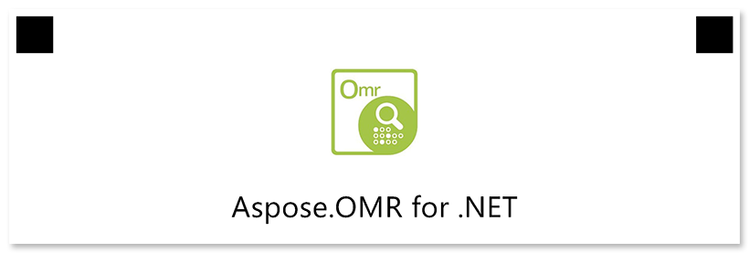

This element is used to add a picture.

## Declaration

**ImageConfig** element is declared as an instance of [`ImageConfig`](https://reference.aspose.com/omr/net/aspose.omr.generation.config.elements/imageconfig/) class. Reference `Aspose.OMR.Generation.Config.Elements` and `Aspose.OMR.Generation.Config.Enums` namespaces to use `ImageConfig` types without specifying the fully qualified namespace:

```csharp
using Aspose.OMR.Generation.Config.Elements;
using Aspose.OMR.Generation.Config.Enums;
```

Image file name is specified in the `Name` property.

```csharp
new ImageConfig() {
	Name = "image.jpg"
}
```

Full paths to all images used in the form must be [provided to the template generator](/omr/net/generate-template/images/).

### Required properties

Name | Type | Description
---- | ---- | -----------
**Name** | `string` | Name of the image file.

### Optional properties

Name | Type | Default value | Description
---- | ---- | ------------- | -----------
**Width** | `int` | _Original image width_ | Image width, in pixels. Smaller or larger images will be resized.
**Height** | `int` | _Original image height_ | Image height, in pixels. Smaller or larger images will be resized.
**XPosition** | `int` | _n/a_ | Set the absolute position of the image relative to the left edge of the page.<br />Overrides the value of `ImageAlign` property.
**YPosition** | `int` | _n/a_ | Set the absolute position of the image relative to the top edge of the page.
**ImageAlign** | [`AlignmentEnum`](https://reference.aspose.com/omr/net/aspose.omr.generation.config.enums/alignmentenum/) | `AlignmentEnum.Left` | Horizontal image alignment.

## Allowed child elements

None.

## **Example**

```csharp
TemplateConfig templateConfig = new TemplateConfig() {
	Children=new List<BaseConfig>() {
		new PageConfig() {
			Children = new List<BaseConfig>() {
				new ImageConfig() {
					Name = "logo.png",
					ImageAlign = AlignmentEnum.Center
				},
				new EmptyLineConfig(),
				new TextConfig() {
					Name = "Aspose.OMR for .NET",
					TextAlignment = AlignmentEnum.Center,
					FontSize = 24
				}
			}
		}
	}
};
```


