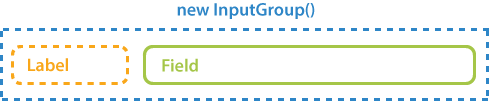
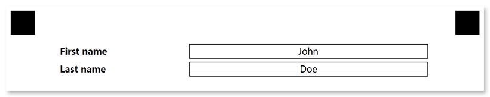

This element is used to insert personalized information, such as the respondent's name or email, into the form. **"InputGroup"** is a purely layout element which is not processed by Aspose.OMR during the recognition.

## Declaration

**InputGroup** element is declared as an instance of [`InputGroup`](https://reference.aspose.com/omr/net/aspose.omr.generation.config.elements/inputgroup/) class. Reference `Aspose.OMR.Generation.Config.Elements` and `Aspose.OMR.Generation.Config.Enums` namespaces to use `InputGroup` types without specifying the fully qualified namespace:

```csharp
using Aspose.OMR.Generation.Config.Elements;
using Aspose.OMR.Generation.Config.Enums;
```

**InputGroup** must contain 2 [**ContentConfig**](/omr/net/programmatic-forms/contentconfig/) elements provided as an array of objects in the `children` property:

- The first **Content** element defines the label.
- The second **Content** element defines the text in the field.



```csharp
new InputGroup() {
	Children = new List<BaseConfig>() {
		new ContentConfig() {
			Name = "Label"
		},
		new ContentConfig() {
			Name = "Field text"
		}
	}
}
```

### Optional properties

Name | Type | Default value | Description
---- | ---- | ------------- | -----------
**Name** | `string` | _n/a_ | Used as a reminder of the element's purpose; for example, "_Student name_". You can use the same value for multiple elements.<br />This text is not displayed on the form.
**LabelBorder** | [`BorderType`](https://reference.aspose.com/omr/net/aspose.omr.generation.config.enums/bordertype/) | `BorderType.None` | Whether to draw a border around the label.<ul><li>`BorderType.None` - no border.</li><li>`BorderType.Square` - draw a rectangular border.</li><li>`BorderType.Rounded` - draw a rectangular border with rounded corners.</li></ul>
**InputBorder** | [`BorderType`](https://reference.aspose.com/omr/net/aspose.omr.generation.config.enums/bordertype/) | `BorderType.None` | Whether to draw a border around the field.<ul><li>`BorderType.None` - no border.</li><li>`BorderType.Square` - draw a rectangular border.</li><li>`BorderType.Rounded` - draw a rectangular border with rounded corners.</li></ul>
**BorderSize** | `int` | 3 | Width of all borders.
**BorderColor** | [`Color`](https://reference.aspose.com/omr/net/aspose.omr.generation/color/) | `Color.Black` | Color of the **BlockConfig** borders.

## Allowed child elements

- [**ContentConfig**](/omr/net/programmatic-forms/contentconfig/)

## **Example**

```csharp
TemplateConfig templateConfig = new TemplateConfig() {
	Children=new List<BaseConfig>() {
		new PageConfig() {
			Children = new List<BaseConfig>() {
				new InputGroup() {
					InputBorder = BorderType.Square,
					Children = new List<BaseConfig>() {
						new ContentConfig() {
							Name = "First name",
							FontStyle = FontStyle.Bold
						},
						new ContentConfig() {
							Name = "John",
							Alignment = AlignmentEnum.Center
						}
					}
				},
				new InputGroup() {
					InputBorder = BorderType.Square,
					Children = new List<BaseConfig>() {
						new ContentConfig() {
							Name = "Last name",
							FontStyle = FontStyle.Bold
						},
						new ContentConfig() {
							Name = "Doe",
							Alignment = AlignmentEnum.Center
						}
					}
				}
			}
		}
	}
};
```


