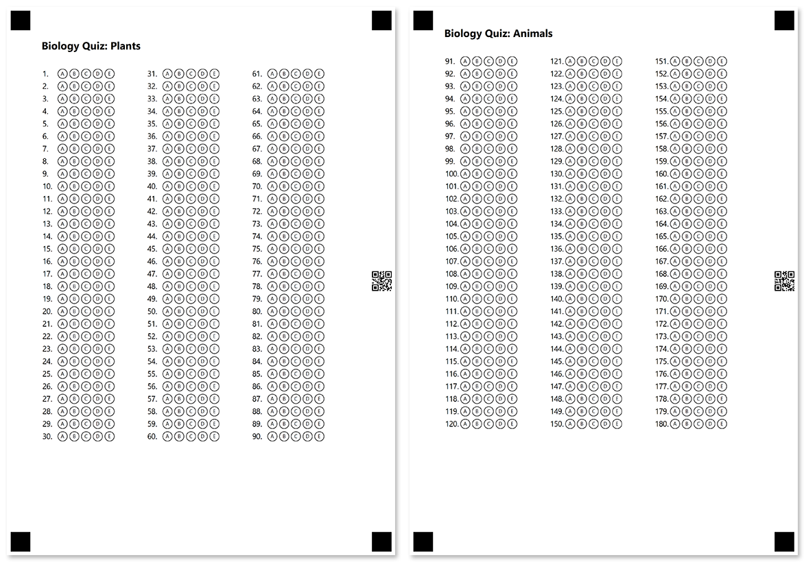

This element allows you to break large forms into several pages that are recognized as a single document. Pages must always be top-level elements in the form hierarchy and cannot be nested within other layout elements. The form must include at least one **PageConfig** element.

**PageConfig** element does not have a visual representation and is only used to organize form content.

Generated pages are marked with a special QR code that is automatically added to their margin, even if you do not use the [Barcode](/omr/net/programmatic-forms/elements-barcode/) element. This QR code is used as a page identifier and allows the recognition engine to treat multiple scanned images as one form.

{} 

- Even if a printable form is split into multiple pages, it will have a single recognition pattern (.OMR) file.
- At the moment, new pages are not automatically created, even if the content does not fit on one page.

{}

## Declaration

**PageConfig** element is declared as an instance of [`PageConfig`](https://reference.aspose.com/omr/net/aspose.omr.generation.config.elements.parents/pageconfig/) class. Reference `Aspose.OMR.Generation.Config.Elements.Parents` namespace to use `PageConfig` types without specifying the fully qualified namespace:

```csharp
using Aspose.OMR.Generation.Config.Elements.Parents;
```

To include **PageConfig** element to the form, add it to the `Children` list of the [top-level `TemplateConfig` object]().

```csharp
TemplateConfig templateConfig = new TemplateConfig() {
	Children=new List<BaseConfig>() {
		new PageConfig() {
			Children = new List<BaseConfig>() {
				/*
				 * Describe page content here
				 */
			}
		}
	}
};
```

### Required properties

Name | Type | Description
---- | ---- | -----------
**Children** | `List<BaseConfig>` | [Child elements]().

### Optional properties

Name | Type | Default value | Description
---- | ---- | ------------- | -----------
**Name** | `string` | _n/a_ | Used as a reminder of the element's purpose; for example, "_Page 1_". You can use the same value for multiple pages.<br />This text is not displayed on the form.
**Orientation** | `Aspose.OMR.Generation.Orientation` | `Aspose.OMR.Generation.Orientation.Vertical` | Override individual page orientation: <ul><li>`Orientation.Horizontal` - landscape</li><li>`Orientation.Vertical` - portrait</li></ul>
**PaperSize** | `Aspose.OMR.Generation.PaperSize` | `Aspose.OMR.Generation.PaperSize.A4` | Override the physical dimensions for the individual page.<br />See details [below](#supported-paper-sizes).
**PageMarginLeft** | `int` | 210 pixels | Override the size of the left page margin in pixels.
**PageMarginRight** | `int` | 210 pixels | Override the size of the right page margin in pixels.
**RotationPointPosition** | `Aspose.OMR.Generation.RotationPointPosition` | Below the top-right square reference point marker. | Override the placement of the rectangular [rotation marker](/omr/net/omr-form-structure/) that is used to detect the page orientation.<br />See details [below](#rotation-marker-placement).

#### Supported paper sizes

The `PaperSize` property controls the paper size of the generated form. All form elements will be re-aligned to best match the selected paper size.

Enumeration | Page dimensions (pixels) | Page dimensions (mm) | Page dimensions (inches)
----------- | ------------------------ | -------------------- | ------------------------
`A3` | 3508 x 4961 | 297 x 420 | 11.7 x 16.5
`A4`| 2480 x 3508 | 210 x 297 | 8.3 x 11.7
`Legal` | 2551 x 4205 | 215.9 x 355.6 | 8.5 x 14
`Letter`| 2551 x 3295 | 215.9 x 279.4 | 8.5 x 11
`p8519` | 2551 x 5702 | 215.9 x 482.6 | 8.5 x 19
`p8521` | 2551 x 6302 | 215.9 x 533.4 | 8.5 x 21
`Tabloid` | 3295 x 5102 | 279 x 432 | 11 x 17

{} 
The selected paper size does not affect the size of bubbles, images or fonts. Changing the paper size only affects the positioning of elements on the page.
{} 

#### Rotation marker placement

The `RotationPointPosition` property controls the placement of the rectangular [rotation marker](/omr/net/omr-form-structure/) that is used to detect the page orientation. It is provided one of the following values of `Aspose.OMR.Generation.RotationPointPosition` enumerator:

Enumeration | Result
----------- | ------
`RotationPointPosition.TopLeft1` | 
`RotationPointPosition.TopLeft2` | 
`RotationPointPosition.TopRight1` | 
`RotationPointPosition.TopRight2` | 
`RotationPointPosition.BottomLeft1` | 
`RotationPointPosition.BottomLeft2` | 
`RotationPointPosition.BottomRight1` | 
`RotationPointPosition.BottomRight2` | 

## Allowed child elements

All, except for other **PageConfig** elements.

## **Example**

```csharp
TemplateConfig templateConfig = new TemplateConfig() {
	Children=new List<BaseConfig>() {
		new PageConfig() {
			Children = new List<BaseConfig>() {
				new TextConfig() {
					Name="Biology Quiz: Plants",
					FontSize=16,
					FontStyle=FontStyle.Bold
				},
				new EmptyLineConfig(),
				new AnswerSheetConfig() {
					Name="Plants",
					ElementsCount=90,
					ColumnsCount=3,
					AnswersCount=5
				}
			}
		},
		new PageConfig() {
			Children = new List<BaseConfig>() {
				new TextConfig() {
					Name="Biology Quiz: Animals",
					FontSize=16,
					FontStyle=FontStyle.Bold
				},
				new EmptyLineConfig(),
				new AnswerSheetConfig() {
					Name="Animals",
					ElementsCount=90,
					ColumnsCount=3,
					AnswersCount=5
				}
			}
		}
	}
};
```


