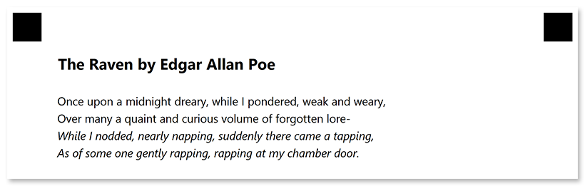

This element is used to combine [text](/omr/net/programmatic-forms/contentconfig/) and [images](/omr/net/programmatic-forms/imageconfig/).

## Declaration

**ParagraphConfig** element is declared as an instance of [`ParagraphConfig`](https://reference.aspose.com/omr/net/aspose.omr.generation.config.elements.parents/paragraphconfig/) class. Reference `Aspose.OMR.Generation.Config.Elements.Parents` and `Aspose.OMR.Generation.Config.Enums` namespaces to use `ParagraphConfig` types without specifying the fully qualified namespace:

```csharp
using Aspose.OMR.Generation.Config.Elements.Parents;
using Aspose.OMR.Generation.Config.Enums;
```

Texts and images are provided in the `Children` list.

```csharp
new ParagraphConfig() {
	Children= new List<BaseConfig>() {
		/*
		 * Put child elements here
		 */
	}
}
```

### Required properties

Name | Type | Description
---- | ---- | -----------
**Children** | `List<BaseConfig>` | [Child elements]().

### Optional properties

Name | Type | Default value | Description
---- | ---- | ------------- | -----------
**Name** | `string` | _n/a_ | Used as a reminder of the element's purpose; for example, "_Important notice_". You can use the same value for multiple paragraphs.<br />This text is not displayed on the form.
**ParagraphType** | `ParagraphTypeEnum` | `ParagraphTypeEnum.Normal` | Defines how paragraph elements are rendered:<ul><li>`ParagraphTypeEnum.ImageWrap` - wrap text around the image.</li><li>`ParagraphTypeEnum.Inline` - place all paragraph elements on the same line.</li></ul>Omitting this property or setting its value to `ParagraphTypeEnum.Normal` will cause the text to overflow the image.
**VerticalAlign** | `VerticalAlignment` | `VerticalAlignment.undefined` | Controls how inline elements of different sizes align vertically within the lines of a paragraph:<ul><li>`VerticalAlignment.Top` - the elements are aligned with the top of the tallest element on the line.</li><li>`VerticalAlignment.Center` - smaller elements are placed in the middle of the line.</li><li>`VerticalAlignment.Bottom` - the bottom of the elements are aligned with the bottom of the entire line.</li></ul>If all paragraph elements have the same height, this property does not visually apply.

## Image wrapping

To allow the text to wrap around an image:

1. Set the **Width**, **Height**, **XPosition** and **YPosition** properties of the [**ImageConfig**](/omr/net/programmatic-forms/imageconfig/) element.
2. Set the **ParagraphType** property of the **ParagraphConfig** element to `ParagraphTypeEnum.ImageWrap`.

## Allowed child elements

- [**ContentConfig**](/omr/net/programmatic-forms/contentconfig/)
- [**ImageConfig**](/omr/net/programmatic-forms/imageconfig/)
- [**EmptyLineConfig**](/omr/net/programmatic-forms/emptylineconfig/)

## **Examples**

Check out the code examples to see how **ParagraphConfig** elements can be used.

### Multi-line paragraph

```csharp
TemplateConfig templateConfig = new TemplateConfig() {
	Children=new List<BaseConfig>() {
		new PageConfig() {
			Children = new List<BaseConfig>() {
				new ContainerConfig() {
					Name = "Example",
					Children = new List<BaseConfig>() {
						new BlockConfig() {
							Children = new List<BaseConfig>() {
								new ParagraphConfig() {
									Children = new List<BaseConfig> {
										new ContentConfig() {
											Name = "The Raven by Edgar Allan Poe",
											FontStyle = FontStyle.Bold,
											FontSize = 16
										},
										new EmptyLineConfig(),
										new ContentConfig() {
											Name = "Once upon a midnight dreary, while I pondered, weak and weary,"
										},
										new ContentConfig() {
											Name = "Over many a quaint and curious volume of forgotten lore-"
										},
										new ContentConfig() {
											Name = "While I nodded, nearly napping, suddenly there came a tapping,",
											FontStyle = FontStyle.Italic
										},
										new ContentConfig() {
											Name = "As of some one gently rapping, rapping at my chamber door.",
											FontStyle = FontStyle.Italic
										}
									}
								}
							}
						}
					}
				}
			}
		}
	}
};
```



### Text with image

```csharp
TemplateConfig templateConfig = new TemplateConfig() {
	Children=new List<BaseConfig>() {
		new PageConfig() {
			Children = new List<BaseConfig>() {
				new ContainerConfig() {
					Name = "Example",
					Children = new List<BaseConfig>() {
						new BlockConfig() {
							Children = new List<BaseConfig>() {
								new ParagraphConfig() {
									ParagraphType = ParagraphTypeEnum.ImageWrap,
									Children = new List<BaseConfig> {
										new ImageConfig() {
											Name = "logo.png",
											XPosition = 1000,
											YPosition = 200,
											Height = 175,
											Width = 200
										},
										new ContentConfig() {
											Name = "Aspose.OMR for .NET",
											FontStyle = FontStyle.Bold,
											FontSize = 16
										},
										new ContentConfig() {
											Name = "is an easy-to-use, versatile, and cost-effective API for designing, rendering and recognizing hand-filled forms."
										}
									}
								}
							}
						}
					}
				}
			}
		}
	}
};
```


