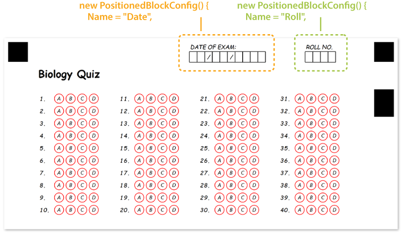

This element is used to place any number of other form elements at the specific coordinates on the page. This element does not have a visual representation by itself and is only used for organizing other content.

## Declaration

**PositionedBlockConfig** element is declared as an instance of [`PositionedBlockConfig`](https://reference.aspose.com/omr/net/aspose.omr.generation.config.elements.parents/positionedblockconfig/) class. Reference `Aspose.OMR.Generation.Config.Elements.Parents` and `Aspose.OMR.Generation.Config.Enums` namespaces to use `PositionedBlockConfig` types without specifying the fully qualified namespace:

```csharp
using Aspose.OMR.Generation.Config.Elements.Parents;
using Aspose.OMR.Generation.Config.Enums;
```

Elements displayed inside the **PositionedBlockConfig** element are provided in the `Children` list.

```csharp
new PositionedBlockConfig() {
	Children= new List<BaseConfig>() {
		/*
		 * Put child elements here
		 */
	}
}
```

### Required properties

Name | Type | Description
---- | ---- | -----------
**Children** | `List<BaseConfig>` | [Child elements]().
**XPosition** | `int` | Absolute position of the block (in pixels) relative to the left edge of the page.
**YPosition** | `int` | Absolute position of the block (in pixels) relative to the top edge of the page.

### Optional properties

Name | Type | Default value | Description
---- | ---- | ------------- | -----------
**Width** | `int` | _Automatically adjusted to fit content_ | Set fixed block width, in pixels.<br />The content that does not fit the block width may be clipped or wrapped based on the global page overflow setting.
**Height** | `int` | _Automatically adjusted to fit content_ | Set fixed block height, in pixels.<br />The content that does not fit the block height may be clipped based on the global page overflow setting.

## Allowed child elements

All, except for [**PageConfig**](/omr/net/programmatic-forms/pageconfig/).

## **Examples**

Check out the code example to see how **PositionedBlockConfig** element can be used and combined with other elements.

```csharp
TemplateConfig templateConfig = new TemplateConfig() {
	Children=new List<BaseConfig>() {
		new PageConfig() {
			Children = new List<BaseConfig>() {
				new TextConfig() {
					Name = "Biology Quiz",
					FontSize = 16,
					FontStyle = FontStyle.Bold
				},
				new EmptyLineConfig(),
				new AnswerSheetConfig() {
					Name = "Plants",
					ElementsCount = 40,
					ColumnsCount = 4,
					AnswersCount = 4
				},
				new PositionedBlockConfig() {
					Name = "Date",
					XPosition = 1200,
					YPosition = 30,
					Children = new List<BaseConfig>() {
						new ContentConfig() {
							Name = "DATE OF EXAM:"
						},
						new ContentConfig() {
							Name = "  /  /    ",
							ContentType = ContentType.Cells
						}
					}
				},
				new PositionedBlockConfig() {
					Name = "Roll",
					XPosition = 1950,
					YPosition = 30,
					Children = new List<BaseConfig>() {
						new ContentConfig() {
							Name = "ROLL NO."
						},
						new ContentConfig() {
							Name = "    ",
							ContentType = ContentType.Cells
						}
					}
				}
			}
		}
	}
};
```


