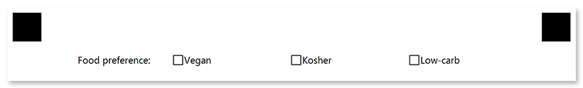

This element generates a list of answers with blank boxes, which can contain any marks - from marker filling to light pencil checks.

You can directly specify the recognition accuracy for this element so that even the lightest marks are detected.

## Declaration

**CheckBoxConfig** element is declared as an instance of [`CheckBoxConfig`](https://reference.aspose.com/omr/net/aspose.omr.generation.config.elements.parents/checkboxconfig/) class. Reference `Aspose.OMR.Generation.Config.Elements.Parents`, `Aspose.OMR.Generation.Config.Elements` and `Aspose.OMR.Generation.Config.Enums` namespaces to use `CheckBoxConfig` types without specifying the fully qualified namespace:

```csharp
using Aspose.OMR.Generation.Config.Elements;
using Aspose.OMR.Generation.Config.Elements.Parents;
using Aspose.OMR.Generation.Config.Enums;
```

The question text / label is specified in the **Name** property.

Answers are provided as a list of [**ContentConfig**](/omr/net/programmatic-forms/contentconfig/) objects in the **Children** property.

```csharp
new CheckBoxConfig() {
	Name = "Question",
	Children = new List<BaseConfig>() {
		/*
		 * Put answers (ContentConfig objects) here
		 */
	}
}
```

### Required properties

Name | Type | Description
---- | ---- | -----------
**Name** | `string` | Used as an element's identifier in recognition results and is displayed as a label on the form.
**Children** | `List<BaseConfig>` | A list of [**ContentConfig**](/omr/net/programmatic-forms/contentconfig/) objects representing the answers (boxes).

### Optional properties

Name | Type | Default value | Description
---- | ---- | ------------- | -----------
**Threshold** | `int` | 3 | Set the recognition accuracy for the answer boxes, from 0 to 100. Lower values allow even the lightest marks to be recognized, but may cause dirt or paper defects to be treated as marks. Higher values require a more solid fill and may cause pencil marks or small checks to be ignored.<br /><br />
**BubbleSize** | [`BubbleSize`](https://reference.aspose.com/omr/net/aspose.omr.generation/bubblesize/) | `BubbleSize.Normal` | Size of bubbles.
**BubbleType** | [`BubbleType`](https://reference.aspose.com/omr/net/aspose.omr.generation/bubbletype/) | `BubbleType.Square` | Bubble style.
**HideName** | `bool` | false | Set to `true` to hide the label (**Name**) of the **CheckBoxConfig** element.
**FontFamily** | `string` | "Segoe UI" | The font family for the text.
**FontStyle** | [`FontStyle`](https://reference.aspose.com/omr/net/aspose.omr.generation/fontstyle/) | `FontStyle.Regular` | The font style for a text.<br />Several font styles can be combined with `\|` operator, for example `FontStyle.Bold \| FontStyle.Italic`.
**FontSize** | `int` | 12 | Font size for the text.

## Allowed child elements

- [**ContentConfig**](/omr/net/programmatic-forms/contentconfig/)

## Example

```csharp
TemplateConfig templateConfig = new TemplateConfig() {
	Children=new List<BaseConfig>() {
		new PageConfig() {
			Children = new List<BaseConfig>() {
				new CheckBoxConfig() {
					Name = "Food preference:",
					BubbleSize = BubbleSize.Extrasmall,
					FontSize = 10,
					Children = new List<BaseConfig>() {
						new ContentConfig() {
							Name = "Vegan",
							FontSize = 10
						},
						new ContentConfig() {
							Name = "Kosher",
							FontSize = 10
						},
						new ContentConfig() {
							Name = "Low-carb",
							FontSize = 10
						}
					}
				}
			}
		}
	}
};
```


