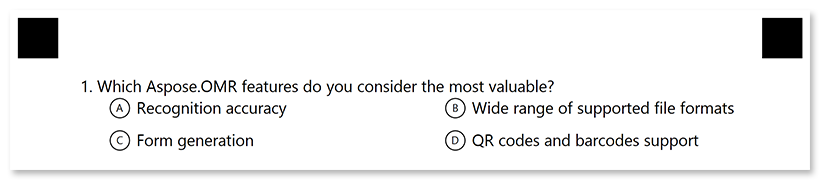
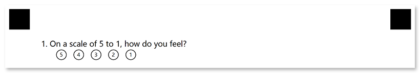

This element generates a question with a fixed number of answers. The respondent picks an answer by filling in the bubble next to it or by choosing a score on the rating scale.

## Declaration

**ChoiceBoxConfig** element is declared as an instance of [`ChoiceBoxConfig`](https://reference.aspose.com/omr/net/aspose.omr.generation.config.elements/choiceboxconfig/) class. Reference `Aspose.OMR.Generation.Config.Elements` and `Aspose.OMR.Generation.Config.Enums` namespaces to use `ChoiceBoxConfig` types without specifying the fully qualified namespace:

```csharp
using Aspose.OMR.Generation.Config.Elements;
using Aspose.OMR.Generation.Config.Enums;
```

The question text is specified in the **QuestionText** property.

Answers are specified in **AnswersString** property.

```csharp
new ChoiceBoxConfig() {
	QuestionText = "Question",
	AnswersString = "() Answer 1 () Answer 2"
}
```

### Required properties

Name | Type | Description
---- | ---- | -----------
**QuestionText** | `string` | Question text.
**AnswersString** | `string` | A list of answers, represented as a specially formatted string.<br />Each answer is declared in the form `([character]) {Answer text}`, where `character` specifies the symbol to be placed inside the answer bubble. For example, `(α) Alpha Centauri`. The character is optional; if it is omitted, the letters A through Z will be used.<br />Multiple answers can be placed one after the other on one line or on new lines. To add a line break, insert CRLF (`\r\n`) or line feed (`\n`) before the answer to be placed on a new line. For example: `"() One () Two\r\n(3) Three"`.

### Optional properties

Name | Type | Default value | Description
---- | ---- | ------------- | -----------
**Name** | `string` | _n/a_ | Used as an element's identifier in recognition results and as a reminder of the element's purpose in template source; for example, "_Satisfaction_".<br />This text is not displayed on the form.
**FontFamily** | `string` | "Segoe UI" | The font family for the text.
**FontStyle** | [`FontStyle`](https://reference.aspose.com/omr/net/aspose.omr.generation/fontstyle/) | `FontStyle.Regular` | The font style for a text.<br />Several font styles can be combined with `\|` operator, for example `FontStyle.Bold \| FontStyle.Italic`.
**FontSize** | `int` | 12 | Font size for the text.
**TextAlignment** | [`AlignmentEnum`](https://reference.aspose.com/omr/net/aspose.omr.generation.config.enums/alignmentenum/) | `AlignmentEnum.Left` | Horizontal text alignment.

## Rating scale

You can omit the answer text in [`AnswersString`]() property and use `([character])` syntax alone to create rating scales. For example, `AnswersString = "(5) (4) (3) (2) (1)"`:


## Examples

Check out the code examples to see how questions can be used.

### Closed-ended question

```csharp
TemplateConfig templateConfig = new TemplateConfig() {
	Children=new List<BaseConfig>() {
		new PageConfig() {
			Children = new List<BaseConfig>() {
				new ChoiceBoxConfig() {
					QuestionText = "Which Aspose.OMR features do you consider the most valuable?",
					AnswersString = "() Recognition accuracy () Wide range of supported file formats\r\n() Form generation () QR codes and barcodes support"
				}
			}
		}
	}
};
```



### Yes / no options

```csharp
TemplateConfig templateConfig = new TemplateConfig() {
	Children=new List<BaseConfig>() {
		new PageConfig() {
			Children = new List<BaseConfig>() {
				new ChoiceBoxConfig() {
					QuestionText = "Would you recommend Aspose.OMR to your colleagues?",
					AnswersString = "(Yes) Yes, sure! (No) Unlikely"
				}
			}
		}
	}
};
```


### Question with a rating scale

```csharp
TemplateConfig templateConfig = new TemplateConfig() {
	Children=new List<BaseConfig>() {
		new PageConfig() {
			Children = new List<BaseConfig>() {
				new ChoiceBoxConfig() {
					QuestionText = "On a scale of 5 to 1, how do you feel?",
					AnswersString = "(5)(4)(3)(2)(1)"
				}
			}
		}
	}
};
```


