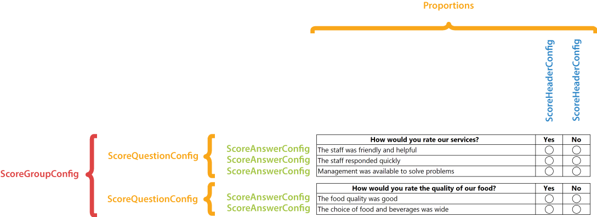
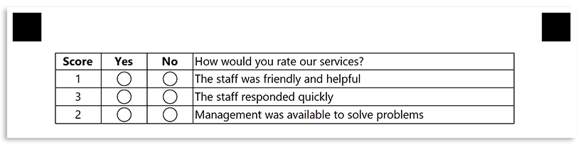

This element defines a group of questions with multiple evaluation criteria. The marked criteria for each question are summarized upon recognition and the resulting value is used as an answer for the question.

**ScoreGroupConfig** content is organized in a tabular view for better readability.

## Declaration

**ScoreGroupConfig** element is declared as an instance of [`ScoreGroupConfig`](https://reference.aspose.com/omr/net/aspose.omr.generation.config.elements.scoregroup/scoregroupconfig/) class. Reference `Aspose.OMR.Generation.Config.Elements.ScoreGroup` and `Aspose.OMR.Generation.Config.Enums` namespaces to use `ScoreGroupConfig` types without specifying the fully qualified namespace:

```csharp
using Aspose.OMR.Generation.Config.Elements.ScoreGroup;
using Aspose.OMR.Generation.Config.Enums;
```

Questions are provided as a list of [**ScoreQuestionConfig**]() objects in the **Children** property.

```csharp
new ScoreGroupConfig() {
	Children = new List<BaseConfig>() {
		/*
		 * Put one or more ScoreQuestionConfig elements here
		 */
	}
}
```



### Required properties

Name | Type | Description
---- | ---- | -----------
**children** | `List<BaseConfig>` | A list of [**ScoreQuestionConfig**]() objects representing the questions.

### Optional properties

Name | Type | Default value | Description
---- | ---- | ------------- | -----------
**Name** | `string` | _n/a_ | Used as an element's identifier and as a reminder of the element's purpose in template source; for example, `"Satisfaction survey"`.<br />This text is not displayed on the form.
**ScoreGroupType** | [`ScoreGroupType`](https://reference.aspose.com/omr/net/aspose.omr.generation.config.enums/scoregrouptype/) | `ScoreGroupType.Table` | Layout of the **ScoreGroup** element.<br />This property is reserved for future use.

### ScoreQuestionConfig element

This element defines the question to be rated based on the underlying criteria.

**ScoreQuestionConfig** element is declared as an instance of [`ScoreQuestionConfig`](https://reference.aspose.com/omr/net/aspose.omr.generation.config.elements.scoregroup/scorequestionconfig/) class.

Question text is provided in the **Name** property.

Criteria, bubbles and custom content for the question are organized in a tabular view. The number of columns and their relative proportions are provided in **Proportions** list.

**ScoreQuestionConfig** element includes [**ScoreHeaderConfig**](), [**ScoreAnswerConfig**](), and optional [**TableContentConfig**]() objects in the **Children** property.

```csharp
{
	new ScoreQuestionConfig() {
		Proportions = new List<int>() {10, 10, 10, 70},
		Children = new List<BaseConfig>() {
			/*
			 * Put table structure and criteria elements here
			 */
		}
	}
}
```

#### Required properties

Name | Type | Description
---- | ---- | -----------
**Name** | `string` | Question text.
**Proportions** | `List<int>` | Criteria, bubbles and custom content for the question are organized in a tabular view. This property specifies the number of columns and their relative proportions.<br />The number of columns is determined by the number of list items. Column widths (in percent) are provided as list items. The grand total of all column widths must not exceed 100%.
**Children** | `List<BaseConfig>` | A list of [**ScoreHeaderConfig**](), [**ScoreAnswerConfig**](), and optional [**TableContentConfig**]() objects representing the criteria structure.

#### Optional properties

Name | Type | Default value | Description
---- | ---- | ------------- | -----------
**ScoreDisplay** | [`ScoreDisplay`](https://reference.aspose.com/omr/net/aspose.omr.generation.config.enums/scoredisplay/) | `ScoreDisplay.DontDisplay` | Defines how to display the numeric score for each evaluation criterion (value of the **Score** property of [**ScoreAnswerConfig**]() element).
**FontFamily** | `string` | "Segoe UI" | The font family for the question text.
**FontStyle** | [`FontStyle`](https://reference.aspose.com/omr/net/aspose.omr.generation/fontstyle/) | `FontStyle.Regular` | The font style for the question text.<br />Several font styles can be combined with `\|` operator, for example `FontStyle.Bold \| FontStyle.Italic`.
**FontSize** | `int` | 12 | Font size for the question text.

#### ScoreHeaderConfig element

This element defines the text that will be displayed in the header cell of the corresponding column and determines the content of that column.

{} 

The total number of **ScoreHeaderConfig** elements must be 1 less than the number of columns defined in the **Proportions** property of the parent [**ScoreQuestionConfig**]() element.

One column is always reserved for the [criteria text]().

{}

**ScoreHeaderConfig** element is declared as an instance of [`ScoreHeaderConfig`](https://reference.aspose.com/omr/net/aspose.omr.generation.config.elements.scoregroup/scoreheaderconfig/) class.

Column header text is provided in the **name** property.

The **HeaderType** property determines what will be displayed inside the corresponding column (see property description for details).

```scharp
new ScoreHeaderConfig() {
	Name = "Yes",
	HeaderType = ScoreHeaderType.Positive
}
```

##### Required properties

Name | Type | Description
---- | ---- | -----------
**name** | `string` | Column header text.
**HeaderType** | [`ScoreHeaderType`](https://reference.aspose.com/omr/net/aspose.omr.generation.config.enums/scoreheadertype/) | Determines what will be displayed inside the corresponding column. This property can take one of the following values:<ul><li>`ScoreHeaderType.Positive` (default) - draw a bubble that, if marked, will add the criteria score to the resulting score of the question.</li><li>`ScoreHeaderType.Negative` - draw a bubble that, if marked, will be ignored.</li><li>`ScoreHeaderType.Amount` - show the criterion score in the corresponding column. Requires **ScoreDisplay** property of the parent [**ScoreQuestionConfig**]() element to be set to `ScoreDisplay.DisplayAsExtraColumn`.</li><li>`ScoreHeaderType.Question` - moves the first column with criteria to this position. All other columns are shifted to the left.</li><li>`ScoreHeaderType.Content` - fills the column with the value of [**TableContentConfig**]() element.</li></ul>

##### Optional properties

Name | Type | Default value | Description
---- | ---- | ------------- | -----------
**FontFamily** | `string` | "Segoe UI" | The font family for the header text.
**FontStyle** | [`FontStyle`](https://reference.aspose.com/omr/net/aspose.omr.generation/fontstyle/) | `FontStyle.Regular` | The font style for the header text.<br />Several font styles can be combined with `\|` operator, for example `FontStyle.Bold \| FontStyle.Italic`.
**FontSize** | `int` | 12 | Font size for the header text.
**Alignment** | [`AlignmentEnum`](https://reference.aspose.com/omr/net/aspose.omr.generation.config.enums/alignmentenum/) | `AlignmentEnum.Left` | Horizontal text alignment.

#### ScoreAnswerConfig element

This element defines the evaluation criterion.

**ScoreAnswerConfig** element is declared as an instance of [`ScoreAnswerConfig`](https://reference.aspose.com/omr/net/aspose.omr.generation.config.elements.scoregroup/scoreanswerconfig/) class.

Criterion text is provided in the **Name** property.

The score (weight) of the criterion that is used for calculation is provided in the **Score** property.

```csharp
new ScoreHeaderConfig() {
	Name = "Criterion",
	Score = 1
}
```

##### Required properties

Name | Type | Description
---- | ---- | -----------
**Name** | `string` | Criterion text.
**Score** | `int` | The score (weight) of the criterion that is used for calculation.

##### Optional properties

Name | Type | Default value | Description
---- | ---- | ------------- | -----------
**FontFamily** | `string` | "Segoe UI" | The font family for the criterion text.
**FontStyle** | [`FontStyle`](https://reference.aspose.com/omr/net/aspose.omr.generation/fontstyle/) | `FontStyle.Regular` | The font style for the criterion text.<br />Several font styles can be combined with `\|` operator, for example `FontStyle.Bold \| FontStyle.Italic`.
**FontSize** | `int` | 12 | Font size for the criterion text.
**Alignment** | [`AlignmentEnum`](https://reference.aspose.com/omr/net/aspose.omr.generation.config.enums/alignmentenum/) | `AlignmentEnum.Left` | Horizontal text alignment.

#### TableContentConfig element

This optional element allows you to define the content of the custom column declared with [**ScoreHeaderConfig**]() element with the **HeaderType** property equals to `ScoreHeaderType.Content`.

**TableContentConfig** element is declared as an instance of [`TableContentConfig`](https://reference.aspose.com/omr/net/aspose.omr.generation.config.elements.scoregroup/tablecontentconfig/) class.

The text to be put in the custom column is provided in the **Name** property.

The column and row numbers to insert the text into are provided in **Column** and **Row**  properties respectively.

```csharp
new TableContentConfig() {
	Name = "Text",
	Column = 1,
	Row = 1
}
```

##### Required properties

Name | Type | Description
---- | ---- | -----------
**Name** | `string` | Text to be inserted at the given position.
**Column** | `int` | Determines the column number to insert the text into.<br />Note, that the column must be declared with [**ScoreHeaderConfig**]() element with the **HeaderType** property equals to `ScoreHeaderType.Content`.
**Row** | `int` | Determines the row number to insert the text into.<br />This value must not exceed the number of [**ScoreAnswerConfig**]() elements!

##### Optional properties

Name | Type | Default value | Description
---- | ---- | ------------- | -----------
**FontFamily** | `string` | "Segoe UI" | The font family for the text.
**FontStyle** | [`FontStyle`](https://reference.aspose.com/omr/net/aspose.omr.generation/fontstyle/) | `FontStyle.Regular` | The font style for the text.<br />Several font styles can be combined with `\|` operator, for example `FontStyle.Bold \| FontStyle.Italic`.
**FontSize** | `int` | 12 | Font size for the text.
**Alignment** | [`AlignmentEnum`](https://reference.aspose.com/omr/net/aspose.omr.generation.config.enums/alignmentenum/) | `AlignmentEnum.Left` | Horizontal text alignment.

## Examples

Check out the code examples to see how **ScoreGroupConfig** elements can be used.

### Customer satisfaction survey

```csharp
TemplateConfig templateConfig = new TemplateConfig() {
	Children=new List<BaseConfig>() {
		new PageConfig() {
			Children = new List<BaseConfig>() {
				new ScoreGroupConfig() {
					Children = new List<BaseConfig>() {
						new ScoreQuestionConfig() {
							Name = "How would you rate our services?",
							Proportions = new List<int>() {80, 10, 10},
							FontStyle = FontStyle.Bold,
							Children = new List<BaseConfig>() {
								new ScoreHeaderConfig() {
									Name = "Yes",
									HeaderType = ScoreHeaderType.Positive,
									FontStyle = FontStyle.Bold,
									Alignment = AlignmentEnum.Center
								},
								new ScoreHeaderConfig() {
									Name = "No",
									HeaderType = ScoreHeaderType.Negative,
									FontStyle = FontStyle.Bold,
									Alignment = AlignmentEnum.Center
								},
								new ScoreAnswerConfig() {
									Name = "The staff was friendly and helpful",
									Score = 1
								},
								new ScoreAnswerConfig() {
									Name = "The staff responded quickly",
									Score = 1
								},
								new ScoreAnswerConfig() {
									Name = "Management was available to solve problems",
									Score = 1
								}
							}
						}
					}
				}
			}
		}
	}
};
```


#### Recognition result

```
How would you rate our services?_total, "2"
Satisfaction survey_total, "2"
```

### Custom column ordering

```csharp
TemplateConfig templateConfig = new TemplateConfig() {
	Children=new List<BaseConfig>() {
		new PageConfig() {
			Children = new List<BaseConfig>() {
				new ScoreGroupConfig() {
					Children = new List<BaseConfig>() {
						new ScoreQuestionConfig() {
							Name = "How would you rate our services?",
							Proportions = new List<int>() {10, 10, 10, 70},
							ScoreDisplay = ScoreDisplay.DisplayAsExtraColumn,
							FontStyle = FontStyle.Bold,
							Children = new List<BaseConfig>() {
								new ScoreHeaderConfig() {
									Name = "Score",
									HeaderType = ScoreHeaderType.Amount,
									FontStyle = FontStyle.Bold,
									Alignment = AlignmentEnum.Center
								},
								new ScoreHeaderConfig() {
									Name = "Yes",
									HeaderType = ScoreHeaderType.Positive,
									FontStyle = FontStyle.Bold,
									Alignment = AlignmentEnum.Center
								},
								new ScoreHeaderConfig() {
									Name = "No",
									HeaderType = ScoreHeaderType.Negative,
									FontStyle = FontStyle.Bold,
									Alignment = AlignmentEnum.Center
								},
								new ScoreHeaderConfig() {
									Name = "How would you rate our services?",
									HeaderType = ScoreHeaderType.Question
								},
								new ScoreAnswerConfig() {
									Name = "The staff was friendly and helpful",
									Score = 1
								},
								new ScoreAnswerConfig() {
									Name = "The staff responded quickly",
									Score = 3
								},
								new ScoreAnswerConfig() {
									Name = "Management was available to solve problems",
									Score = 2
								}
							}
						}
					}
				}
			}
		}
	}
};
```


