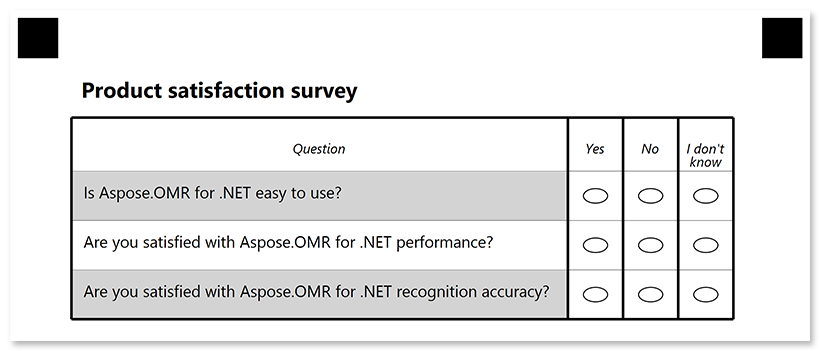

This element organizes questions and answers in a tabular structure (rows and columns) for better readability.

Tables are best suited for large surveys where all questions have the same set of answers.

## Declaration

**TableConfig** element is declared as an instance of [`TableConfig`](https://reference.aspose.com/omr/net/aspose.omr.generation.config.elements.table/tableconfig/) class. Reference `Aspose.OMR.Generation.Config.Elements.Table`, `Aspose.OMR.Generation.Config.Elements` and `Aspose.OMR.Generation.Config.Enums` namespaces to use `TableConfig` types without specifying the fully qualified namespace:

```csharp
using Aspose.OMR.Generation.Config.Elements;
using Aspose.OMR.Generation.Config.Elements.Table;
using Aspose.OMR.Generation.Config.Enums;
```

The number of answers common to all questions in the table is provided in **AnswersCount** property.

**TableConfig** element includes an optional [**TableTitleConfig**]() element, [**TableHeaderConfig**]() element and one or more [**QuestionConfig**]() elements provided in **children** property.

```csharp
new TableConfig() {
	AnswersCount = 3,
	Children = new List<BaseConfig>() {
		/*
		 * Put table structure elements here
		 */
	}
}
```


{} 

**TableConfig** elements can only be nested within [BlockConfig](/omr/net/programmatic-forms/blockconfig/) elements and cannot be used at the top level of the form hierarchy.

{}

### Required properties

Name | Type | Description
---- | ---- | -----------
**AnswersCount** | `int` | The number of answers common to all questions in the table
**Children** | `List<BaseConfig>` | A list including the [**TableTitleConfig**]() object, [**TableHeaderConfig**]() object and one or more [**QuestionConfig**]() objects representing the table structure.

### Optional properties

Name | Type | Default value | Description
---- | ---- | ------------- | -----------
**Name** | `string` | _n/a_ | Used as an element's identifier and as a reminder of the element's purpose in template source; for example, `"Satisfaction survey"`.<br />This text is not displayed on the form.
**TableType** | [`TableType`](https://reference.aspose.com/omr/net/aspose.omr.generation.config.enums/tabletype/) | `TableType.None` | Table style:<ul><li>`TableType.None` - standard table</li><li>`TableType.Striped` - zebra-striped table rows</li><li>`TableType.EqualCells` - make all table columns equal</li></ul>

### TableTitleConfig element

This optional element defines the title row of the table. If **TableTitleConfig** element is omitted, the table will be rendered without a title row.

**TableTitleConfig** element is declared as an instance of [`TableTitleConfig`](https://reference.aspose.com/omr/net/aspose.omr.generation.config.elements.table/tabletitleconfig/) class.

Title text is provided in the **Name** property.

```csharp
new TableTitleConfig() {
	Name = "Table title"
}
```

#### Required properties

Name | Type | Description
---- | ---- | -----------
**Name** | string | Table title text.

#### Optional properties

Name | Type | Default value | Description
---- | ---- | ------------- | -----------
**FontFamily** | `string` | "Segoe UI" | The font family for the title text.
**FontStyle** | [`FontStyle`](https://reference.aspose.com/omr/net/aspose.omr.generation/fontstyle/) | `FontStyle.Regular` | The font style for the title text.<br />Several font styles can be combined with `\|` operator, for example `FontStyle.Bold \| FontStyle.Italic`.
**FontSize** | `int` | 12 | Font size for the title text.
**Color** | [`Color`](https://reference.aspose.com/omr/net/aspose.omr.generation/color/) | `Color.Black` | Color of the title text.
**BackgroundColor** | [`Color`](https://reference.aspose.com/omr/net/aspose.omr.generation/color/) | _transparent_ | Background color of the title row.
**BorderType** | [`BorderType`](https://reference.aspose.com/omr/net/aspose.omr.generation.config.enums/bordertype/) | `BorderType.None` | Whether to draw a border around the title row.<ul><li>`BorderType.None` - no border.</li><li>`BorderType.Square` - draw a rectangular border.</li><li>`BorderType.Rounded` - draw a rectangular border with rounded corners.</li></ul>
**BorderSize** | `int`| 3 | Width of the title row borders.
**BorderColor** | [`Color`](https://reference.aspose.com/omr/net/aspose.omr.generation/color/) | `Color.Black` | Color of the title row borders.
**BorderTopStyle** | `object` | _inherits border_size and border_color_ | Override the width and color of the element's top border. Provided as the object with the following properties: <ul><li>`BorderSize` - top border width, integer;</li><li>`BorderColor` - top border color, [`Color`](https://reference.aspose.com/omr/net/aspose.omr.generation/color/) object;</li><li>`Disable` - specify `true` to remove the top border, Boolean.</li></ul>
**BorderBottomStyle** | `object` | _inherits border_size and border_color_ | Override the width and color of the element's bottom border. Provided as the object with the following properties: <ul><li>`BorderSize` - bottom border width, integer;</li><li>`BorderColor` - bottom border color, [`Color`](https://reference.aspose.com/omr/net/aspose.omr.generation/color/) object;</li><li>`Disable` - specify `true` to remove the bottom border, Boolean.</li></ul>
**BorderLeftStyle** | `object` | _inherits border_size and border_color_ | Override the width and color of the element's left border. Provided as the object with the following properties: <ul><li>`BorderSize` - left border width, integer;</li><li>`BorderColor` - left border color, [`Color`](https://reference.aspose.com/omr/net/aspose.omr.generation/color/) object;</li><li>`Disable` - specify `true` to remove the left border, Boolean.</li></ul>
**BorderRightStyle** | `object` | _inherits border_size and border_color_ | Override the width and color of the element's right border. Provided as the object with the following properties: <ul><li>`BorderSize` - right border width, integer;</li><li>`BorderColor` - right border color, [`Color`](https://reference.aspose.com/omr/net/aspose.omr.generation/color/) object;</li><li>`Disable` - specify `true` to remove the right border, Boolean.</li></ul>

### TableHeaderConfig element

This element specifies the content of the table header row.

**TableHeaderConfig** element is declared as an instance of [`TableHeaderConfig`](https://reference.aspose.com/omr/net/aspose.omr.generation.config.elements.table/tableheaderconfig/) class.

**TableHeaderConfig** element includes a [**ContentConfig**](/omr/net/programmatic-forms/contentconfig/) object that defines the question text and several [**TableAnswerConfig**]() objects that define the answers in the **Children** list.

```csharp
new TableHeaderConfig() {
	Children = new List<BaseConfig>() {
		/*
		 * Put ContentConfig element and child elements here
		 */
	}
}
```

#### Required properties

Name | Type | Description
---- | ---- | -----------
**Children** | `List<BaseConfig>` | [**ContentConfig**](/omr/net/programmatic-forms/contentconfig/) object that defines the question text and several [**TableAnswerConfig**]() objects that define the answers<br />The number of **TableAnswerConfig** objects must be equal to the value of the **AnswersCount** property of the **TableConfig** element.

#### Optional properties

Name | Type | Default value | Description
---- | ---- | ------------- | -----------
**FontFamily** | `string` | "Segoe UI" | The font family for the table header text.
**FontStyle** | [`FontStyle`](https://reference.aspose.com/omr/net/aspose.omr.generation/fontstyle/) | `FontStyle.Regular` | The font style for the table header text.<br />Several font styles can be combined with `\|` operator, for example `FontStyle.Bold \| FontStyle.Italic`.
**FontSize** | `int` | 12 | Font size for the table header text.

#### TableAnswerConfig element

The **TableAnswerConfig** element defines the answer text that will be displayed in the table header. The number of **TableAnswerConfig** elements must be equal to the value of the [**AnswersCount**]() property of the **TableConfig** element.

**TableAnswerConfig** element is declared as an instance of [`TableAnswerConfig`](https://reference.aspose.com/omr/net/aspose.omr.generation.config.elements.table/tableanswerconfig/) class.

Answer text is provided in the **Name** property.

```csharp
new TableAnswerConfig() {
	Name = "Answer"
}
```

##### Required properties

Name | Type | Description
---- | ---- | -----------
**Name** | `string` | Answer text.

### QuestionConfig element

The **QuestionConfig** element defines the question text. A **TableConfig** can include multiple question elements that will be displayed as rows.

**QuestionConfig** element is declared as an instance of [`QuestionConfig`](https://reference.aspose.com/omr/net/aspose.omr.generation.config.elements.table/questionconfig/) class.

Question text is provided in the **Name** property.

```csharp
new QuestionConfig() {
	Name = "Question"
}
```

#### Required properties

Name | Type | Description
---- | ---- | -----------
**Name** | `string` | Question text.

## Examples

Check out the code examples to see how tables can be used.

### Product satisfaction survey

```csharp
TemplateConfig templateConfig = new TemplateConfig() {
	Children=new List<BaseConfig>() {
		new PageConfig() {
			Children = new List<BaseConfig>() {
				new ContainerConfig() {
					Children = new List<BaseConfig>() {
						new BlockConfig() {
							Children = new List<BaseConfig>() {
								new TableConfig() {
									Name = "Survey",
									AnswersCount = 3,
									TableType = TableType.Striped,
									Children = new List<BaseConfig>() {
										new TableTitleConfig() {
											Name = "Product satisfaction survey",
											FontSize = 16,
											FontStyle = FontStyle.Bold
										},
										new TableHeaderConfig() {
											FontSize = 10,
											FontStyle = FontStyle.Italic,
											Children = new List<BaseConfig>() {
												new ContentConfig() {
													Name = "Question"
												},
												new TableAnswerConfig() {
													Name = "Yes"
												},
												new TableAnswerConfig() {
													Name = "No"
												},
												new TableAnswerConfig() {
													Name = "I don't know"
												}
											}
										},
										new QuestionConfig() {
											Name = "Is Aspose.OMR for .NET easy to use?"
										},
										new QuestionConfig() {
											Name = "Are you satisfied with Aspose.OMR for .NET performance?"
										},
										new QuestionConfig() {
											Name = "Are you satisfied with Aspose.OMR for .NET recognition accuracy?"
										}
									}
								}
							}
						}
					}
				}
			}
		}
	}
};
```



### Checklist

```csharp
TemplateConfig templateConfig = new TemplateConfig() {
	Children=new List<BaseConfig>() {
		new PageConfig() {
			Children = new List<BaseConfig>() {
				new ContainerConfig() {
					Children = new List<BaseConfig>() {
						new BlockConfig() {
							Children = new List<BaseConfig>() {
								new TableConfig() {
									Name = "Checklist",
									AnswersCount = 1,
									Children = new List<BaseConfig>() {
										new TableHeaderConfig() {
											FontSize = 10,
											FontStyle = FontStyle.Italic,
											Children = new List<BaseConfig>() {
												new ContentConfig() {
													Name = "Step"
												},
												new TableAnswerConfig() {
													Name = ""
												}
											}
										},
										new QuestionConfig() {
											Name = "Download Microsoft Visual Studio"
										},
										new QuestionConfig() {
											Name = "Create a new C# project"
										},
										new QuestionConfig() {
											Name = "Install Aspose.OMR for .NET NuGet package"
										},
										new QuestionConfig() {
											Name = "Get a trial license"
										},
										new QuestionConfig() {
											Name = "Enjoy"
										}
									}
								}
							}
						}
					}
				}
			}
		}
	}
};
```


