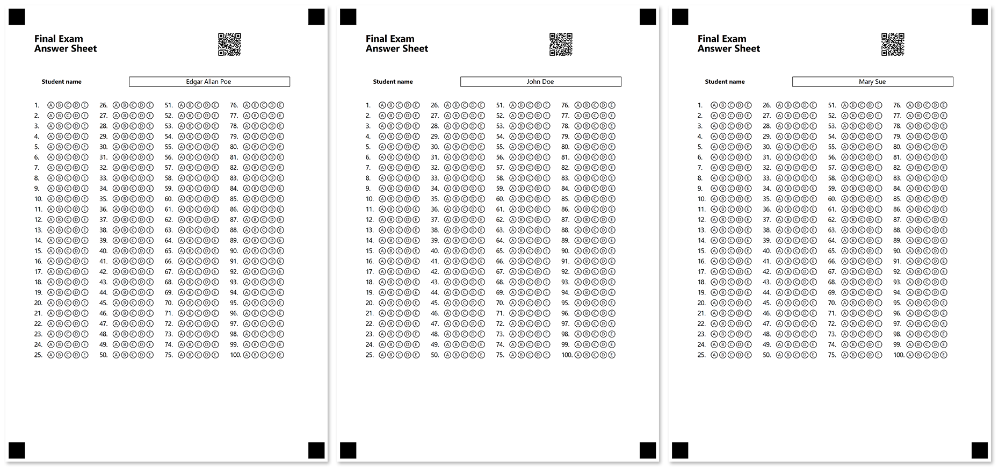

In this example, we will show how to automatically generate personalized OMR-ready 100-question answer sheets in PDF format for a group of students.

## Used elements

- [AnswerSheetConfig](/omr/net/programmatic-forms/answersheetconfig/)  
  This element generates a numbered matrix of bubbles arranged in multiple columns to make more efficient use of space.
- [QR code](/omr/net/programmatic-forms/elements-barcode/)  
  Add QR codes to personalize or uniquely identify a form.
- [ContainerConfig](/omr/net/programmatic-forms/containerconfig/)  
  This element is used to break content into columns and to add a footer to the form.
- [BlockConfig](/omr/net/programmatic-forms/blockconfig/)  
  This element is used to organize other elements in container columns.
- [ContentConfig](/omr/net/programmatic-forms/contentconfig/)  
  This element is used to add a line of text to the parent element. Can only be used inside **other elements**.
- [EmptyLineConfig](/omr/net/programmatic-forms/emptylineconfig/)  
  This element is used to add vertical spacing between elements.
- [ParagraphConfig](/omr/net/programmatic-forms/paragraphconfig/)  
  This element is used to combine text and images.
- [InputGroup](/omr/net/programmatic-forms/inputgroup/)  
  This element is used to insert personalized information, such as the respondent's name or email, into the form.
- [PageConfig](/omr/net/programmatic-forms/pageconfig/)  
  This element is used to break large forms into several pages that are recognized as a single document.

## Source code

```csharp
using Aspose.OMR;
using Aspose.OMR.Api;
using Aspose.OMR.Generation;
using Aspose.OMR.Generation.Config;
using Aspose.OMR.Generation.Config.Elements;
using Aspose.OMR.Generation.Config.Elements.Parents;
using Aspose.OMR.Generation.Config.Enums;
using System;
using System.Collections.Generic;
using System.IO;

namespace FormBuilder
{
	internal class Program
	{
		public static string AppPath;

		static void Main(string[] args)
		{
			AppPath = Path.GetDirectoryName(typeof(Program).Assembly.Location);
			// Mock data
			Dictionary<Guid, string> students = new Dictionary<Guid, string>();
			students.Add(Guid.NewGuid(), "John Doe");
			students.Add(Guid.NewGuid(), "Mary Sue");
			students.Add(Guid.NewGuid(), "Edgar Allan Poe");
			// Set license
			var license = new License();
			license.SetLicense(Path.Combine(AppPath, "Aspose.OMR.NET.lic"));
			// Initialize Aspose.OMR engine
			OmrEngine omrEngine = new OmrEngine();
			GlobalPageSettings globalPageSettings = new GlobalPageSettings() {
				PaperSize = PaperSize.A4,
			};
			// Generate forms
			foreach(var student in students)
			{
				// Build form
				TemplateConfig templateConfig = new TemplateConfig() {
					Children=new List<BaseConfig>() {
						new PageConfig() {
							Children = new List<BaseConfig>() {
								new ContainerConfig() {
									Name = $"Personalized answer sheet for {student.Value}",
									ColumnsCount = 2,
									Children = new List<BaseConfig>() {
										new BlockConfig() {
											Column = 1,
											Children = new List<BaseConfig>() {
												new ParagraphConfig() {
													Children = new List<BaseConfig>() {
														new ContentConfig() {
															Name = "Final Exam",
															FontSize = 18,
															FontStyle = FontStyle.Bold
														},
														new ContentConfig() {
															Name = "Answer Sheet",
															FontSize = 18,
															FontStyle = FontStyle.Bold
														},
													}
												}
											}
										},
										new BlockConfig() {
											Column = 2,
											Children = new List<BaseConfig>() {
												new BarcodeConfig() {
													Name = "Student ID",
													Value = student.Key.ToString(),
													Height = 200
												}
											}
										}
									}
								},
								new EmptyLineConfig(),
								new InputGroup() {
									InputBorder = BorderType.Square,
									Children = new List<BaseConfig>() {
										new ContentConfig() {
											Name = "Student name",
											FontStyle = FontStyle.Bold,
											FontSize = 11
										},
										new ContentConfig() {
											Name = student.Value,
											Alignment = AlignmentEnum.Center
										}
									}
								},
								new EmptyLineConfig(),
								new AnswerSheetConfig() {
									Name = "Answers",
									ColumnsCount = 4,
									ElementsCount = 100,
									AnswersCount = 5,
									BubbleSize = BubbleSize.Small,
									VerticalMargin = 10
								}
							}
						}
					}
				};
				// Save form
				GenerationResult generationResult = omrEngine.Generate(templateConfig, globalPageSettings);
				generationResult.SaveAsPdf("forms", student.Value.Replace(' ', '_'));
			}
		}
	}
}
```

## Results

The program generates the following results based on mock data:

### Files in _forms_ subfolder

- Edgar_Allan_Poe.omr
- Edgar_Allan_Poe.pdf
- John_Doe.omr
- John_Doe.pdf
- Mary_Sue.omr
- Mary_Sue.pdf

### Printable forms



