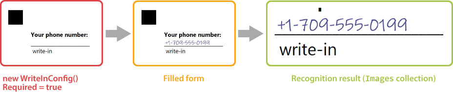

This element provides a blank field in which the respondent can hand write some text or draw a picture.

{} 

Write-in field always has an underline and "_write-in_" comment below.

{}

The hand-filled content of the **WriteInConfig** element is stored as an [image](https://reference.aspose.com/omr/net/aspose.omr.model/recognitionresult/properties/images) during recognition and can be passed to optical character recognition library, such as [Aspose.OCR](https://products.aspose.app/ocr).



**WriteInConfig** element can be used to request some information in free form (name, phone, address, and the like) or to offer a respondent answer an open-ended question.

## Declaration

**WriteInConfig** element is declared as an instance of [`WriteInConfig`](https://reference.aspose.com/omr/net/aspose.omr.generation.config.elements/writeinconfig/) class. Reference `Aspose.OMR.Generation.Config.Elements` namespace to use `WriteInConfig` types without specifying the fully qualified namespace:

```csharp
using Aspose.OMR.Generation.Config.Elements;
```

**WriteInConfig** element does not have required properties.

```csharp
new WriteInConfig()
```

### Optional properties

Name | Type | Default value | Description
---- | ---- | ------------- | -----------
**Name** | `string` | _n/a_ | Used as a reminder of the element's purpose; for example, "_Phone_". You can use the same value for multiple elements.<br />This text is not displayed on the form.
**Required** | `bool` | false | Set to `true` to store the hand-filled content of the element to [Images](https://reference.aspose.com/omr/net/aspose.omr.model/recognitionresult/properties/images) collection during recognition. Set to `false` or omit the property to ignore this element during recognition.
**Hint** | `string` | "write-in" | Redefine the underlying label of the write-in element.
**Color** | [`Color`](https://reference.aspose.com/omr/net/aspose.omr.generation/color/) | `Color.Black` | Color of the underlying label text.

## Combining with VerticalChoiceBoxConfig elements

**WriteInConfig** element can be included into [**VerticalChoiceBoxConfig**](/omr/json-markup/verticalchoiceboxconfig/) element to give the respondent the opportunity to provide a free-form answer to an open-ended question.

In this case, the content of the element is stored to [`Images`](https://reference.aspose.com/omr/net/aspose.omr.model/recognitionresult/properties/images) collection only if the respondent marks the corresponding bubble.

## Allowed child elements

None.

## Example

```csharp
TemplateConfig templateConfig = new TemplateConfig() {
	Children=new List<BaseConfig>() {
		new PageConfig() {
			Children = new List<BaseConfig>() {
				new ContainerConfig() {
					Name = "Example",
					Children= new List<BaseConfig>() {
						new BlockConfig() {
							Children = new List<BaseConfig>() {
								new ContentConfig() {
									Name = "Your phone number:",
									FontStyle = FontStyle.Bold
								},
								new WriteInConfig() {
									Name = "Phone",
									Required = true
								}
							}
						}
					}
				}
			}
		}
	}
};
```


