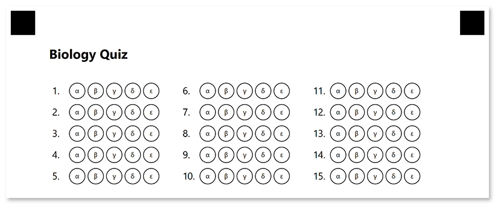

This element generates a numbered matrix of bubbles representing answers to a list of questions. Bubbles can be arranged in multiple columns to make more efficient use of space.

**Answer_sheet** is best suited for exam papers where you want to fit the maximum number of answers on a single page.

## Syntax

The element is declared with `?answer_sheet=[name]` statement. This statement must be placed on a separate line.

`name` property is used as an element's identifier in recognition results and as a reminder of the element's purpose in template source; for example, "_Biology Quiz_". The **name** is not displayed on the form.

### Attributes

An attribute is written as `[attribute_name]=[value]`. Each attribute must be placed on a **new line** immediately after the opening `?answer_sheet=` statement or another attribute, and must begin with a **tab character**.

#### Required

Specify the number of exam questions that the answer sheet corresponds to in the **elements_count** attribute. Each question will correspond to a numbered line with multiple answer bubbles.

For example, `elements_count=100`.

{}

If you omit this attribute or set its value to `0`, **answer_sheet** element will not be rendered.

{}

#### Optional

The **answer_sheet** element can be customized by adding optional attributes to it.

Attribute | Default value | Description | Usage example
--------- | ------------- | ----------- | -------------
**columns_count** | 4 | The number of columns to arrange lines into. Use multiple columns to make the answer sheet more compact. | `columns_count=3`
**answers_count** | 4 | The total number of bubbles (answers) for each question.<br />You can only set the same number of answers for all questions. If the number of answers is different for each section of the exam, use multiple **answer_sheet** elements. | `answers_count=5`
**start_id** | Automatic | The number of the first line used as a base for further numbering.<br />If omitted, the number will be calculated based on the numbering of previous elements. | `start_id=1`
**vertical_margin** | 0 | Vertical spacing between lines, in pixels. | `vertical_margin=10`
**bubble_size** | Normal | Size of bubbles: `extrasmall`, `small`, `normal`, `large`, or `extralarge`. | `bubble_size=large`
**answers_list** | A to Z | Characters to be drawn inside bubbles in _({Character 1})({Character 2})...({Character N})_ format.<br />The total number of characters must match the value of the **answers_count** attribute. | `answers_list=(α)(β)(γ)(δ)(ε)`
**column** | 1 | The number of the column where the **answer_sheet** element will be placed. Only applicable if **answer_sheet** is placed in a multi-column [container](/omr/net/txt-markup/container/). | `column=2`

## Allowed child elements

None.

## Example

```
?text=Biology Quiz
	font_size=16
	font_style=bold
?empty_line=
?answer_sheet=Plants
	columns_count=3
	elements_count=15
	answers_count=5
	bubble_size=large
	vertical_margin=10
	answers_list=(α)(β)(γ)(δ)(ε)
```


