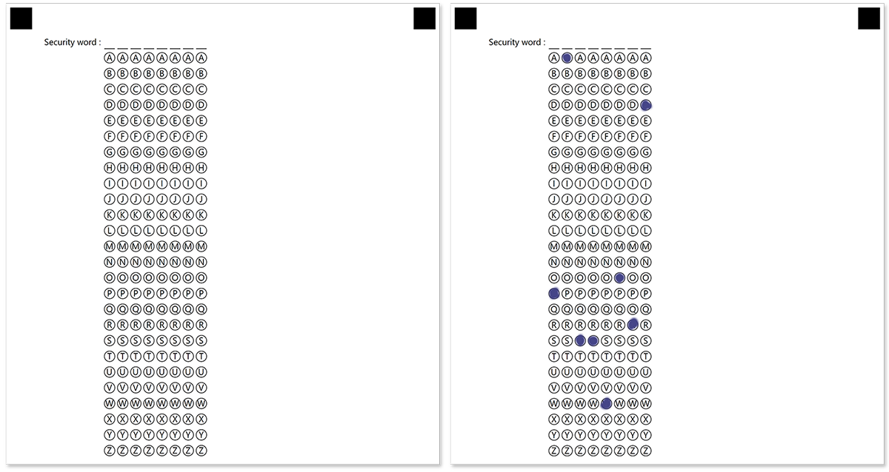
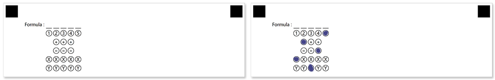

This element works similarly to the [grid](/omr/net/txt-markup/grid/) element, but offers much more flexibility and customization.

## Syntax

The element is declared with `?composite_grid=[name]` statement. This statement must be placed on a separate line.

`name` property is used as an element's identifier in recognition results and is displayed as a label on the form; for example, "_Passport_".

### Attributes

An attribute is written as `[attribute_name]=[value]`. Each attribute must be placed on a **new line** immediately after the opening `?grid=` statement or another attribute, and must begin with a **tab character**.

Attribute | Default value | Description | Usage example
--------- | ------------- | ----------- | -------------
**columns_count** | 5 | The maximum number of symbols in the combined response. Each symbol is represented as a line or column of bubbles, depending on the element's **orientation**. | `columns_count=7`
**values** | n/a | A common set of characters to be drawn inside bubbles in _({Character 1})({Character 2})...({Character N})_ format. | `values=(α)(β)(γ)(δ)(ε)`
**extra_row** | n/a | Add a custom line / column of bubbles at the start of the grid. Characters drawn inside these bubbles may differ from those provided in **values** attribute.<br />A set of characters to be drawn inside bubbles is provided in _({Character 1})({Character 2})...({Character N})_ format. You can hide certain bubbles by providing empty braces `()` at their positions.<br />**The number of bubbles provided in the extra_row attribute cannot be less than the value of columns_count attribute!**<br /><br />You can add multiple **extra_row** attributes to one **composite_grid** element. Each **extra_row** attribute adds an new line / column immediately following the previous one. | `extra_row=() (+) ()`
**align** | left | Horizontal alignment of **composite_grid** element: `left`, `center` or `right`. | `align=center`
**orientation** | horizontal | Element's orientation:<ul><li>`horizontal` - each symbol is represented as a column of bubbles;</li><li>`vertical` - each symbol is represented as a row of bubbles.</li></ul> | `orientation=vertical`
**rotate** | 0 | Rotate the element by the given degree. The following values are supported: `90`, `180`, `270`. | `rotate=270`
**header_type** | underline | The type of the box to be displayed in front of each column / row. This box can be used for hand-writing the answer in addition to marking bubbles.<ul><li>`underline` - draw a horizontal line.</li><li>`square` - draw a box.</li></ul> | `header_type=square`
**header_border_size** | 3 | Border width of the box to be displayed in front of each column / row. | `border_size=5`
**header_border_color** | black | Border color of the box to be displayed in front of each column / row. Can be picked from the following values: `Aqua`, `Aquamarine`, `Black`, `Blue`, `BlueViolet`, `Crimson`, `DarkBlue`, `DarkGreen`, `DarkOrange`, `DarkSalmon`, `Fuchsia`, `Indigo`, `Lime`, `Red`, `Teal`, `White`, `Gray`, `LightGray`. | `border_color=red`
**vertical_margin** | 0 | Vertical spacing between the element's lines, in pixels. | `vertical_margin=10`
**bubble_size** | Normal | Size of bubbles: `extrasmall`, `small`, `normal`, `large`, or `extralarge`. | `bubble_size=large`
**bubble_type** | round | Bubble style: `round` or `square`. | `bubble_type=square`
**x** | n/a | Set the absolute position of the **composite_grid** element relative to the left edge of the page.<br />Overrides the value of **align** attribute. | `x=300`
**y** | n/a | Set the absolute position of the **composite_grid** element relative to the top edge of the page. | `y=500`
**column** | 1 | The number of the column where the **composite_grid** element will be placed. Only applicable if **composite_grid** is placed in a multi-column [container](/omr/net/txt-markup/container/). | `column=2`

## Allowed child elements

None.

## Recognition behavior

Numbers from each marked bubble are merged into a single number.

If the respondent marks more than one bubble per row / column (depending on the `orientation` attribute), the affected **composite_grid** element will not be recognized and an error will be written to the recognition results.

## Examples

Check out the code examples to see how **composite_grid** elements can be used.

### Bank security word

```
?container=Example
?block=
?composite_grid=Security word
	columns_count=8
	values=(A)(B)(C)(D)(E)(F)(G)(H)(I)(J)(K)(L)(M)(N)(O)(P)(Q)(R)(S)(T)(U)(V)(W)(X)(Y)(Z)
&block
&container
```



#### Recognition result

`PASSWORD`

### Formula

```
?container=Example
?block=
?composite_grid=Formula
	columns_count=5
	values=(X)(Y)
	extra_row=(1)(2)(3)(4)(5)
	extra_row=()(+)(+)(+)()
	extra_row=()(=)(=)(=)()
&block
&container
```



#### Recognition result

`X+Y=5`

### Rotated

```
?container=Example
?block=
?composite_grid=Rotated
	columns_count=5
	values=(1)(2)(3)(4)(5)
	orientation=vertical
	rotate=90
&block
&container
```


