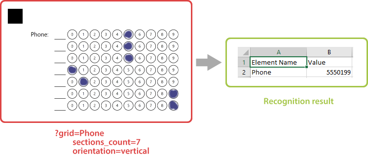

This element generates a block consisting of numbered bubbles. The block is recognized as a whole, resulting in all marked bubbles forming a single answer.

**Grid** element is an OMR-specific approach to collecting simple numeric data such as a TIN or phone number, or getting an answer to a math test without using optical character recognition (OCR).



## Syntax

The element is declared with `?grid=[name]` statement. This statement must be placed on a separate line.

`name` property is used as an element's identifier in recognition results and is displayed as a label on the form.

### Attributes

An attribute is written as `[attribute_name]=[value]`. Each attribute must be placed on a **new line** immediately after the opening `?grid=` statement or another attribute, and must begin with a **tab character**.

#### Mandatory

Attribute | Default value | Description | Usage example
--------- | ------------- | ----------- | -------------
**sections_count** | 8 | The maximum number of digits in the combined response. Each digit is represented as a line or column of bubbles, depending on the element's **orientation**. | `sections_count=7`
**options_count** | 10 | The number of bubbles for each digit. | `options_count=8`

#### Optional

Attribute | Default value | Description | Usage example
--------- | ------------- | ----------- | -------------
**align** | left | Horizontal alignment of **grid** element: `left`, `center` or `right`. | `align=center`
**orientation** | horizontal | Element's orientation:<ul><li>`horizontal` - each digit is represented as a column of bubbles;</li><li>`vertical` - each digit is represented as a row of bubbles.</li></ul> | `orientation=vertical`
**header_type** | underline | The type of the box to be displayed in front of each column / row. This box can be used for hand-writing the answer in addition to marking bubbles.<ul><li>`underline` - draw a horizontal line.</li><li>`square` - draw a box.</li></ul> | `header_type=square`
**header_border_size** | 3 | Border width of the box to be displayed in front of each column / row. | `border_size=5`
**header_border_color** | black | Border color of the box to be displayed in front of each column / row. Can be picked from the following values: `Aqua`, `Aquamarine`, `Black`, `Blue`, `BlueViolet`, `Crimson`, `DarkBlue`, `DarkGreen`, `DarkOrange`, `DarkSalmon`, `Fuchsia`, `Indigo`, `Lime`, `Red`, `Teal`, `White`, `Gray`, `LightGray`. | `border_color=red`
**vertical_margin** | 0 | Vertical spacing between the element's lines, in pixels. | `vertical_margin=10`
**bubble_size** | Normal | Size of bubbles: `extrasmall`, `small`, `normal`, `large`, or `extralarge`. | `bubble_size=large`
**x** | n/a | Set the absolute position of the **grid** element relative to the left edge of the page.<br />Overrides the value of **align** attribute. | `x=300`
**y** | n/a | Set the absolute position of the **grid** element relative to the top edge of the page. | `y=500`
**column** | 1 | The number of the column where the **grid** element will be placed. Only applicable if **grid** is placed in a multi-column [container](/omr/net/txt-markup/container/). | `column=2`

## Allowed child elements

None.

## Examples

Check out the code examples to see how **grid** elements can be used.

### Horizontal grid

```
?grid=Convert decimal number 123 to octal
	sections_count=4
	options_count=8
	bubble_size=large
	header_type=square
```


### Vertical grid

```
?grid=Phone number
	sections_count=7
	orientation=vertical
	bubble_size=large
```


