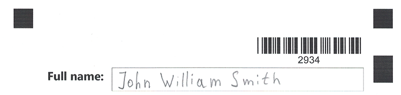

{} 
**free_text_input** element requires a handwritten recognition plugin to be installed. Otherwise, the corresponding markup syntax will be ignored.
{}

This element adds a handwritten text placeholder to the form where the respondent can write a line of text in a free manner.

Handwritten line is recognized automatically without the need for an external OCR library.


**free_text_input** element can be used to request a full name, address, an answer answer to open-ended question and other textual information in free form.

## Syntax

The element is declared with `?free_text_input=[name]` statement. This statement must be placed on a separate line.

`name` property is returned in the recognition results as an answer ID and also used as a reminder of the element's purpose in form's source code; for example, "_FullName_". This is an optional property - you can use the same **name** for multiple **free_text_input** elements or just omit it. The name is not displayed on the form.

**free_text_input** element can be nested within other elements or placed at the top level of the form hierarchy.

### Attributes

The **free_text_input** element can be customized by adding optional attributes to it.

An attribute is written as `[attribute_name]=[value]`. Each attribute must be placed on a **new line** immediately after the opening `?free_text_input=` statement or another attribute, and must begin with a **tab character**.

Attribute |Description | Usage examples
--------- | ----------- | --------------
`line_height` | The height of the input element, in pixels. | `line_height=100`

## Allowed child elements

None.

## Example

```
?barcode=docId
	value=2934
	height=200
	codetext=true
	barcode_type=code39StanDard
	align=right
?container=
	columns_proportions=20-80
?block=
	column=1
?content=Full name:
	font_style=bold
	font_size=18
	align=right
&block
?block=
	column=2
?free_text_input=full name
	line_height=150	
&block
&container
```



**Recognition result:**

```
Element Name,Value,
docId,"2934"
full name,"John William Smith"
```
