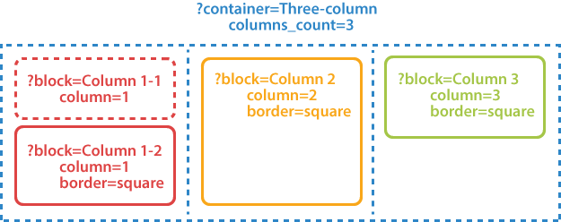
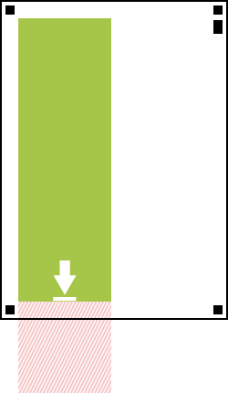
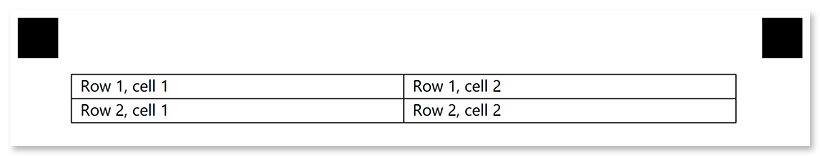

This element is used to organize content within [**containers**](/omr/net/txt-markup/container/). Blocks can only be nested within [**container**](/omr/net/txt-markup/container/) elements.

Blocks may not have a visual representation or have a border around them.



## Syntax

The element declaration begins with `?block=[name]` statement and ends with `&block` statement. These statements must be placed on separate lines.

`name` attribute is used as a reminder of the block's purpose; for example, "_First column_". This is an optional attribute - you can use the same **name** for multiple blocks or just omit it. The name is not displayed on the form.

{} 

Never add empty lines after the opening `?block=` statement. Doing so will result in an error when rendering a form.

{}

### Attributes

The **block** element can be customized by adding optional attributes to it.

An attribute is written as `[attribute_name]=[value]`. Each attribute must be placed on a **new line** immediately after the opening `?block=` statement or another attribute, and must begin with a **tab character**.

Attribute | Default value | Description | Usage example
--------- | ------------- | ----------- | -------------
**column** | 1 | The number of the column in which the **block** will be placed.<br />This number must not exceed the number of columns of the parent [**container**](/omr/net/txt-markup/container/) element. | `column=2`
**border** | none | Whether to draw a border around the block.<ul><li>`none` - no border.</li><li>`square` - draw a rectangular border.</li><li>`rounded` - draw a rectangular border with rounded corners.</li></ul> | `border=square`
**border_size** | 3 | Width of the block borders. | `border_size=10`
**border_color** | black | Color of the block borders. Can be picked from one of the [supported](/omr/net/supported-colors/) values. | `border_color=red`
**border_top_style** | _inherits border_size and border_color_ | Override the width and color of the element's top border in `<border width> <border color>` format. Specify `none` to remove the top border. | `border_top_style=10 red`
**border_bottom_style** | _inherits border_size and border_color_ | Override the width and color of the element's bottom border in `<border width> <border color>` format. Specify `none` to remove the bottom border. | `border_bottom_style=10 red`
**border_left_style** | _inherits border_size and border_color_ | Override the width and color of the element's left border in `<border width> <border color>` format. Specify `none` to remove the left border. | `border_left_style=10 red`
**border_right_style** | _inherits border_size and border_color_ | Override the width and color of the element's right border in `<border width> <border color>` format. Specify `none` to remove the right border. | `border_right_style=10 red`
**is_clipped** | false | If set to `true`, the content of the block is stored to [Images](https://reference.aspose.com/omr/net/aspose.omr.model/recognitionresult/properties/images) collection during recognition, similar to the [**write_in**](/omr/net/txt-markup/write_in/) element. The image can be can be passed to optical character recognition library, such as [Aspose.OCR](https://products.aspose.app/ocr), or saved.<br />If the block contains OMR elements, they will be recognized even if this attribute is set to `true`. | `is_clipped=true`
**background_color** | _no fill_ | Background color of the block element. Can be picked from one of the [supported](/omr/net/supported-colors/) values. | `background_color=red`
**height** | _Automatically adjust height to fit content_ | Set fixed block height, in pixels. | `height=200`
**horizontal_padding** | 20 | Set the left and right padding of the block, in pixels. | `horizontal_padding=40`
**vertical_padding** | 20 | Set the top and bottom padding of the block, in pixels. | `vertical_padding=40`
**overflow** | _Inherit the [page settings](/omr/net/generate-template/page-setup/)_ | Define how to clip and wrap elements inside the block:<ul><li>`noclip` - overflow content is displayed outside of the block boundaries;</li><li>`clip` - the content outside of the horizontal and vertical boundaries of the block will be invisible;</li><li>`wrap` - the content that does not match the block's bounds will automatically appear in the next column.</li></ul>See [Clipping and wrapping block content](#clipping-and-wrapping-block-content) for details. | `overflow=noclip`

## Allowed child elements

All, except for **block**.

## Clipping and wrapping block content

When designing OMR forms, you may run into a situation where the content does not fit inside the block. The handling of these edge cases is performed through the use of `overflow` attribute.

{} 
This attribute overrides the [`Overflow`](/omr/net/generate-template/page-setup/#clipping-and-wrapping-elements) page setting for the specific block.
{} 

### `overflow=noclip`

Overflow content is rendered outside the block boundaries. This can result in content overlapping with other elements or being clipped at page boundaries.

This is the default rendering method.


### `overflow=clip`

Overflow content will be invisible. Cropping will be done both horizontally and vertically. This may result in some content (images, bubbles, text, and so on) not being presented in the rendered OMR form.



### `overflow=wrap`

Content that does not fit inside the block will automatically appear in the next column. This rendering method only applies to multi-column layouts and cannot slice monolithic elements such as images and barcodes.


## **Examples**

Check out the code examples to see how **block** elements can be used and combined with each other.

### Two-column layout

```
?container=Two-column
	columns_count=2
?block=Column 1-1
	column=1
	border=none
?paragraph=
?content=First column, first block.
&paragraph
&block
?block=Column 1-2
	column=1
	border=square
?paragraph=
?content=First column, second block.
&paragraph
&block
?block=Column 2
	column=2
	border=square
	border_size=10
	border_color=blue
?paragraph=
?content=Second column, first block.
&paragraph
&block
&container
```


### Fake table layout

```
?container=Two-column
	columns_count=2
	block_right_margin=0
	block_bottom_margin=0
	block_top_padding=0
?block=
	column=1
	border=square
?content=Row 1, cell 1
&block
?block=
	column=1
	border=square
?content=Row 1, cell 2
&block
?block=
	column=2
	border=square
?content=Row 2, cell 1
&block
?block=
	column=2
	border=square
?content=Row 2, cell 2
&block
&container
```


