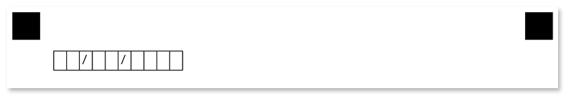

This element is used to add a single line of text to the parent element. **Content** elements can only be nested _within other elements_ and cannot be used at the top level of the form hierarchy.

## Syntax

The element declaration begins with `?content=` statement followed by a text to be displayed. This statement must be placed on a separate line.

### Attributes

The **content** element can be customized by adding optional attributes to it.

An attribute is written as `[attribute_name]=[value]`. Each attribute must be placed on a **new line** immediately after the opening `?content=` statement or another attribute, and must begin with a **tab character**.

Attribute | Default value | Description | Usage example
--------- | ------------- | ----------- | -------------
**font_family** | Segoe UI | The font family for the text. | `font_family=Courier New`
**font_style** | regular | The font style for a text: `bold`, `italic` or `underline`.<br />Several font styles can be combined by listing them separated by commas. | `font_style=bold, italic`
**font_size** | 12 | Font size for the text. | `font_size=16`
**color** | black | Text color. Can be picked from one of the supported values. | `color=red`
**align** | left | Horizontal text alignment: `left`, `center` or `right`. | `align=center`
**content_type** | Set this attribute to `Cells` to draw a border around every character, including spaces. | normal | `content_type=Cells`

## Allowed child elements

None.

## **Examples**

Check out the code examples to see how **content** elements can be used.

### Text inside blocks

```
?container=Example
	columns_count=2
?block=Column 1
	column=1
?content=Lorem ipsum dolor sit amet, consectetur adipiscing elit, sed do eiusmod tempor incididunt ut labore et dolore magna aliqua.
&block
?block=Column 2
	column=2
?content=Second column
	font_style=bold
&block
&container
```


### Date input box with content_type

```
?container=Example
?block=
?content=  /  /    
	content_type=Cells
&block
&container
```


