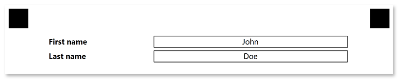

This element is used to insert personalized information, such as the respondent's name or email, into the form. **Input group** is a purely layout element which is not processed by Aspose.OMR during the recognition.

## Syntax

The element declaration begins with `?input_group=[name]` statement and ends with `&input_group` statement. These statements must be placed on separate lines.

`name` property is used as a reminder of the element's purpose; for example, "_Skype_". This is an optional property - you can use the same **name** for multiple input groups or just omit it. The name is not displayed on the form.

An input group must contain 2 [**content**](/omr/net/txt-markup/content/) elements:

- The first **content** element defines the label.
- The second **content** element defines the text in the field.


### Attributes

The **input_group** element can be customized by adding optional attributes to it.

An attribute is written as `[attribute_name]=[value]`. Each attribute must be placed on a **new line** immediately after the opening `?input_group=` statement or another attribute, and must begin with a **tab character**.

Attribute | Default value | Description | Usage example
--------- | ------------- | ----------- | -------------
**label_border** | none | Whether to draw a border around the label.<ul><li>`none` - no border.</li><li>`square` - draw a rectangular border.</li><li>`rounded` - draw a rectangular border with rounded corners.</li></ul> | `label_border=square`
**input_border** | none | Whether to draw a border around the field.<ul><li>`none` - no border.</li><li>`square` - draw a rectangular border.</li><li>`rounded` - draw a rectangular border with rounded corners.</li></ul> | `input_border=square`
**border_size** | 3 | Width of all borders. | `border_size=10`
**border_color** | black | Color of all borders. Can be picked from one of the [supported](/omr/net/supported-colors/) values. | `border_color=red`
**border_top_style** | _inherits border_size and border_color_ | Override the width and color of the element's top border in `<border width> <border color>` format. Specify `none` to remove the top border. | `border_top_style=10 red`
**border_bottom_style** | _inherits border_size and border_color_ | Override the width and color of the element's bottom border in `<border width> <border color>` format. Specify `none` to remove the bottom border. | `border_bottom_style=10 red`
**border_left_style** | _inherits border_size and border_color_ | Override the width and color of the element's left border in `<border width> <border color>` format. Specify `none` to remove the left border. | `border_left_style=10 red`
**border_right_style** | _inherits border_size and border_color_ | Override the width and color of the element's right border in `<border width> <border color>` format. Specify `none` to remove the right border. | `border_right_style=10 red`

## Allowed child elements

- [content](/omr/net/txt-markup/content/)

## **Example**

```
?input_group=First name
	input_border=square
?content=First name
	font_style=bold
?content=John
	align=center
&input_group
?input_group=Last name
	input_border=square
?content=Last name
	font_style=bold
?content=Doe
	align=center
&input_group
```


