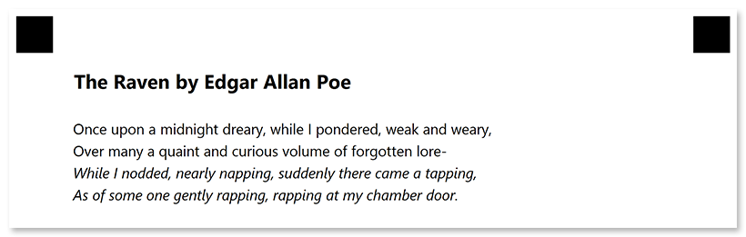

This element is used to combine [text](/omr/net/txt-markup/content/) and [images](/omr/net/txt-markup/image/). **Paragraph** elements can only be nested within other elements and cannot be used at the top level of the form hierarchy.

## Syntax

The element declaration begins with `?paragraph=[name]` statement and ends with `&paragraph` statement. These statements must be placed on separate lines.

`name` property is used as a reminder of the paragraph's purpose; for example, "_Important notice_". This is an optional property - you can use the same **name** for multiple paragraphs or just omit it. The name is not displayed on the form.

{} 

Never add empty lines after the opening `?paragraph=` statement. Doing so will result in an error when rendering a form.

{}

### Attributes

The **paragraph** element can be customized by adding optional attributes to it.

An attribute is written as `[attribute_name]=[value]`. Each attribute must be placed on a **new line** immediately after the opening `?paragraph=` statement or another attribute, and must begin with a **tab character**.

Attribute | Default value | Description | Usage example
--------- | ------------- | ----------- | -------------
**type** | normal | Set this attribute to `multiple` so that text can wrap around the image.<br />Omitting this attribute or setting it to `normal` will cause the text to overlay the image. | `type=multiple`

## Image wrapping

To allow the text to wrap around an image:

1. Set the **width**, **height**, **x** and **y** attributes of the [**image**](/omr/net/txt-markup/image/) element.
2. Set the **type** attribute of the **paragraph** element to `multiple`.

## Allowed child elements

- [content](/omr/net/txt-markup/content/)
- [image](/omr/net/txt-markup/image/)
- [empty_line](/omr/net/txt-markup/empty_line/)

## **Examples**

Check out the code examples to see how **paragraph** elements can be used.

### Multi-line paragraph

```
?container=Example
?block=
?paragraph=Raven
?content=The Raven by Edgar Allan Poe
	font_style=Bold
	font_size=16
?empty_line=
?content=Once upon a midnight dreary, while I pondered, weak and weary,
?content=Over many a quaint and curious volume of forgotten lore-
?content=While I nodded, nearly napping, suddenly there came a tapping,
	font_style=italic
?content=As of some one gently rapping, rapping at my chamber door.
	font_style=italic
&paragraph
&block
&container
```



### Text with image

```
?container=Example
?block=
?paragraph=
	type=multiple
?image=logo.jpg
	x=1000
	y=200
	height=175
	width=200
?content=Aspose.OMR for .NET
	font_family=Arial
	font_style=Bold
	font_size=16
?content=is an easy-to-use, versatile, and cost-effective API for designing, rendering and recognizing hand-filled forms.
&paragraph
&block
&container
```


