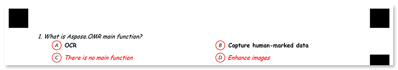

This element generates a question with a fixed number of answers. The respondent picks an answer by filling in the bubble next to it or by choosing a score on the rating scale.

## Syntax

The element declaration begins with `?choicebox=[question]` statement and ends with `&choicebox` statement. These statements must be placed on separate lines.

`question` property is displayed on the form and used as an element’s identifier in recognition results.

### Attributes

The **choicebox** element can be customized by adding optional attributes to it.

An attribute is written as `[attribute_name]=[value]`. Each attribute must be placed on a new line immediately after the opening `?choicebox=` statement or another attribute, and must begin with a tab character.

Attribute | Default value | Description | Usage example
--------- | ------------- | ----------- | -------------
**font_family** | Segoe UI | The font family for the element's text (affects both question and answers). | `font_family=Courier New`
**font_style** | regular | The font style for the element's text (affects both question and answers): `bold`, `italic` or `underline`.<br />Several font styles can be combined by listing them separated by commas. | `font_style=bold, italic`
**font_size** | 12 | Font size for the element's text (affects both question and answers). | `font_size=16`
**color** | black | Color of question and answer texts. Can be picked from one of the [supported](/omr/net/supported-colors/) values. | `color=red`
**align** | left | Horizontal alignment of question and answer texts: `left`, `center` or `right`. | `align=center`
**display_number** | true | Set to `true` to show a sequence number before the question. Set to `false` to show the question text only. | `display_number=false`

### Answers

Each answer is declared with `?option=[name]` statement. This statement must be placed on a separate line.

`name` property is used as an element’s identifier in recognition results and is displayed as an answer text on the form.

The **option** element can be customized by adding optional attributes to it.

An attribute is written as `[attribute_name]=[value]`. Each attribute must be placed on a new line immediately after the opening `?option=` statement or another attribute, and must begin with a tab character.

Attribute | Default value | Description | Usage example
--------- | ------------- | ----------- | -------------
**bubble_value** | _n/a_ | The symbol to be placed inside the answer bubble. You can either use a single character or `yes` / `no` aliases which are rendered as "**Y**" / "**N**" symbols in the form. <br />If this attribute is omitted, the letters **A** through **Z** will be used. | `bubble_value=Yes`
**font_family** | Segoe UI | The font family for the answer's text. | `font_family=Courier New`
**font_style** | regular | The font style for the answer's text: `bold`, `italic` or `underline`.<br />Several font styles can be combined by listing them separated by commas. | `font_style=bold, italic`
**font_size** | 12 | Font size for the answer's text. | `font_size=16`
**color** | black | Color of the answer's texts. Can be picked from one of the [supported](/omr/net/supported-colors/) values. | `color=red`
**align** | left | Horizontal alignment of the answer texts: `left`, `center` or `right`. | `align=center`
**row_index** | _next row_ | Used to place the answer on a new line or on an existing line. | `row_index=2`

## Simplified syntax

Alternatively, the element can be declared with `#` shorthand statement immediately followed by a question text. This statement must be placed on a separate line.

It produces exactly the same result as the full syntax and support the same [attributes](/omr/net/txt-markup/choicebox/#attributes).

### Answers

Answers are provided on new lines after the opening `#` statement and continue until an empty line or another element declaration is found. Each line must begin with a **tab character**. 

The answer is declared in the form `([character]) {Answer text}`, where `character` specifies the symbol to be placed inside the answer bubble. For example, `(α) Alpha Centauri`. The character is optional; if it is omitted, the letters A through Z will be used.

Multiple answers can be placed one after the other or on new lines starting with a **tab character**. If the answer is placed on a new line, it will be displayed on a new line in the generated form. For example:

```
	(α) Alpha Centauri (β) Beta Geminorum
	(γ) Gamma Cassiopeiae
```


#### Answer style

Each answer can be customized by adding optional attributes to it. An attribute is written as `[attribute_name]=[value]`. Each attribute must be placed on a new line immediately after the string with answers or another attribute, and must begin with a tab character.

Attribute | Default value | Description | Usage example
--------- | ------------- | ----------- | -------------
**font_family** | Segoe UI | The font family for the answer's text. | `font_family=Courier New`
**font_style** | regular | The font style for the answer's text: `bold`, `italic` or `underline`.<br />Several font styles can be combined by listing them separated by commas. | `font_style=bold, italic`
**font_size** | 12 | Font size for the answer's text. | `font_size=16`
**color** | black | Color of the answer's texts. Can be picked from one of the [supported](/omr/net/supported-colors/) values. | `color=red`
**align** | left | Horizontal alignment of the answer texts: `left`, `center` or `right`. | `align=center`

If the preceding string contains more than one answer, the attributes are applied to all of them:

```
#What is Aspose.OMR main function?
	() OCR () Capture human-marked data
	font_style=bold
	() There is no main function () Enhance images
	color=red
```



#### Rating scale

You can omit the answer text and use `([character])` syntax alone to create rating scales. For example, `(5) (4) (3) (2) (1)`.


## Examples

Check out the code examples to see how questions can be used.

### Closed-ended question

```
?container=example
?block=choicebox
	column=1
?choicebox=Which Aspose.OMR features do you consider the most valuable?
	font_size=15
	color=black
	?option=Recognition accuracy
	?option=Wide range of supported file formats
	row_index=1
	?option=Form generation
	?option=QR codes and barcodes support
	row_index=2
&choicebox
&block
&container
```


### Yes / no options

```
#Would you recommend Aspose.OMR to your colleagues?
	(Yes) Yes, sure! (No) Unlikely
```


### Question with a rating scale

```
#On a scale of 5 to 1, how do you feel?
	(5)(4)(3)(2)(1)
```


