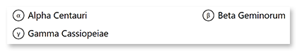
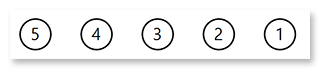
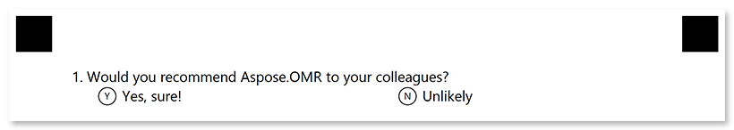

This element generates a question with a fixed number of answers. The respondent picks an answer by filling in the bubble next to it or by choosing a score on the rating scale.

## Syntax

The element is declared with `?choicebox=[question]` statement. This statement must be placed on a separate line.

`question` property is displayed on the form and used as an element’s identifier in recognition results.

### Answers

Answers are provided as element's attributes in the form `([character]) {Answer text}`, where `character` specifies the symbol to be placed inside the answer bubble. For example, `(α) Alpha Centauri`. The character is optional; if it is omitted, the letters A through Z will be used.

Multiple answers can be placed one after the other or on new lines starting with a **tab character**. If the answer is placed on a new line, it will be displayed on a new line in the generated form. For example:

```
?choicebox=Choose the brightest star from the list:
	(α) Alpha Centauri (β) Beta Geminorum
	(γ) Gamma Cassiopeiae
```




#### Rating scale

You can omit the answer text and use `([character])` syntax alone to create rating scales. For example, `(5) (4) (3) (2) (1)`.



### Optional attributes

The style of the `choicebox` element can be customized by adding optional attributes to it. An attribute is written as `[attribute_name]=[value]`. Each attribute must be placed on a **new line** immediately after the opening `?choicebox=` statement or another attribute, and must begin with a **tab character**.

Attribute | Default value | Description | Usage example
--------- | ------------- | ----------- | -------------
**font_family** | Segoe UI | The font family for the element's text (affects both question and answers). | `font_family=Courier New`
**font_style** | regular | The font style for the element's text (affects both question and answers): `bold`, `italic` or `underline`.<br />Several font styles can be combined by listing them separated by commas. | `font_style=bold, italic`
**font_size** | 12 | Font size for the element's text (affects both question and answers). | `font_size=16`
**color** | black | Color of question and answer texts. Can be picked from one of the [supported](/omr/net/supported-colors/) values. | `color=red`
**align** | left | Horizontal alignment of question and answer texts: `left`, `center` or `right`. | `align=center`
**display_number** | true | Set to `true` to show a sequence number before the question. Set to `false` to show the question text only. | `display_number=false`

## Simplified syntax

Alternatively, the element can be declared with `#` shorthand statement immediately followed by a question text. This statement must be placed on a separate line.

It produces exactly the same result as the full syntax, but cannot be inserted into other elements and does not allow any customization.

### Answers

Answers are provided on new lines after the opening `#` statement and continue until an empty line or another element declaration is found. Each line must begin with a **tab character**. 

The answer is declared in the form `([character]) {Answer text}`, where `character` specifies the symbol to be placed inside the answer bubble. For example, `(α) Alpha Centauri`. The character is optional; if it is omitted, the letters A through Z will be used.

Multiple answers can be placed one after the other or on new lines starting with a **tab character**. If the answer is placed on a new line, it will be displayed on a new line in the generated form. For example:

```
	(α) Alpha Centauri (β) Beta Geminorum
	(γ) Gamma Cassiopeiae
```


#### Rating scale

You can omit the answer text and use `([character])` syntax alone to create rating scales. For example, `(5) (4) (3) (2) (1)`.


## Examples

Check out the code examples to see how questions can be used.

### Closed-ended question

```
?block=choicebox
	column=2
?choicebox=Which Aspose.OMR features do you consider the most valuable?
	font_size=15
	color=black
	() Recognition accuracy () Wide range of supported file formats
	() Form generation () QR codes and barcodes support
&block
```


### Yes / no options

```
#Would you recommend Aspose.OMR to your colleagues?
	(Yes) Yes, sure! (No) Unlikely
```



### Question with a rating scale

```
#On a scale of 5 to 1, how do you feel?
	(5)(4)(3)(2)(1)
```


